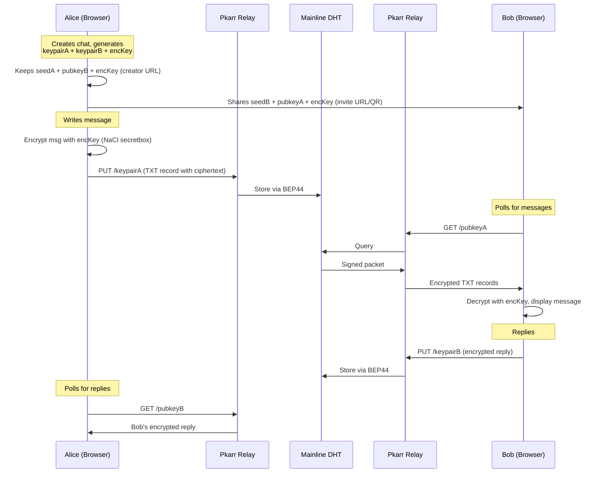

# Pkarr Dead Drop - Ephemeral Encrypted Chat

## Concept

A "dead drop" is a method of espionage tradecraft: two parties communicate through a secret location without ever meeting. This app recreates that concept digitally using Pkarr -- messages are published as encrypted DNS TXT records to the Mainline DHT (10M+ nodes), and expire naturally when not republished. No server, no accounts, no trace.

## Architecture




## Two-Channel Design

Each chat session uses **two Pkarr keypairs** (one per direction) and one **shared encryption key**:

- **keypairA**: Alice writes, Bob reads
- **keypairB**: Bob writes, Alice reads  
- **encKey**: 256-bit symmetric key for NaCl secretbox encryption

When creating a chat, the app generates all three and encodes them into two URLs:

- Creator URL: `/#/chat/<seedA_b64>/<pubkeyB_b64>/<encKey_b64>` (write to A, read from B)
- Invite URL: `/#/chat/<seedB_b64>/<pubkeyA_b64>/<encKey_b64>` (write to B, read from A)

The URL fragment (`#`) never leaves the browser -- it is never sent to any server.

## Message Format (DNS TXT Records)

Each message is a single DNS packet (~1000 byte limit) containing:

- `_msg` TXT = `base64url(nonce[24] + ciphertext)` -- the encrypted message
- `_ts` TXT = Unix timestamp in ms -- for ordering/dedup
- `_nick` TXT = `base64url(nonce[24] + encrypted_nickname)` -- optional sender name

Effective message capacity: ~700-800 characters per message (after DNS overhead, encryption nonce, and MAC).

Since each key only holds one DNS packet at a time (latest overwrites previous), the **DHT is used as a transport layer**. Full chat history is persisted in `localStorage` on each client.

## Tech Stack

- **Vite + React 19 + TypeScript** -- fast dev, modern tooling
- **TailwindCSS v4** -- utility-first styling, dark mode support
- `**@synonymdev/pkarr`** (`0.1.4-rc.2` on npm) -- WASM bindings for Pkarr (Keypair, SignedPacket builder, Client with relay support)
- `**tweetnacl`** + `**tweetnacl-util`** -- NaCl secretbox (XSalsa20-Poly1305) for message encryption
- `**qrcode.react**` -- QR code generation for sharing invite links
- **React Router** -- hash-based routing for chat URLs
- **No backend** -- 100% client-side, communicates only with public Pkarr relays (`relay.pkarr.org`, `pkarr.pubky.org`)

## Key Pkarr JS API (from `@synonymdev/pkarr`)

```typescript
// Keypair management
const keypair = new Keypair();
const restored = Keypair.from_secret_key(seedBytes); // restore from 32-byte seed
keypair.public_key_string(); // 52-char z-base32
keypair.secret_key_bytes();  // Uint8Array(32)
keypair.public_key_bytes();  // Uint8Array(32)

// Build and sign DNS packet
const builder = SignedPacket.builder();
builder.addTxtRecord("_msg", base64Ciphertext, 300);
builder.addTxtRecord("_ts", timestamp, 300);
const signedPacket = builder.buildAndSign(keypair);

// Publish and resolve via relays
const client = new Client(); // uses default relays
await client.publish(signedPacket);
const resolved = await client.resolve(publicKeyString);
// resolved.records[i].rdata.data -> TXT value
```

## Project Structure

```
pkarr-website/
  src/
    main.tsx                 -- Entry point, router setup
    App.tsx                  -- Root layout component
    pages/
      Home.tsx               -- Landing: create drop or paste invite
      Chat.tsx               -- Chat view: messages + input
      Share.tsx              -- Show invite link + QR code
    lib/
      pkarr.ts               -- Pkarr client wrapper (init WASM, publish, resolve)
      crypto.ts              -- Encryption/decryption (NaCl secretbox)
      url.ts                 -- Encode/decode chat params from URL fragment
      storage.ts             -- localStorage persistence (keypair, chat history)
      types.ts               -- TypeScript interfaces
    components/
      MessageBubble.tsx      -- Single message display
      MessageInput.tsx       -- Text input + send button
      QRCode.tsx             -- QR code with copy button
      StatusIndicator.tsx    -- Connection/polling status
      Header.tsx             -- App header with nav
    hooks/
      useChat.ts             -- Core hook: manages send/receive/poll loop
      usePkarr.ts            -- Pkarr client initialization
  index.html
  package.json
  tsconfig.json
  vite.config.ts
  tailwind.config.ts
```

## UI Design

### Home Page

- Dark, minimal, "spy-themed" aesthetic
- Large title: "Dead Drop" with subtitle about ephemeral messaging
- Two actions: "Create a Drop" button and "Paste an invite link" input
- Brief explanation of how it works (3 bullet points)

### Share/Invite Page (after creating)

- Shows the invite URL (truncated, with copy button)
- Large QR code for the invite
- "Your link" (the creator link) also shown separately
- Warning: "Save your link -- it contains your private key and cannot be recovered"
- "Enter Chat" button

### Chat Page

- Clean chat interface with message bubbles (left = received, right = sent)
- Subtle timestamp on each message
- Text input at bottom with send button
- Status bar showing: polling interval, last sync time, connection status
- "Burn" button in header: stops republishing, lets messages expire
- Character counter showing remaining capacity (~800 chars)
- Visual indicator when a new message arrives

## Key Behaviors

- **Polling**: Resolve peer's key every 5 seconds; backoff to 15s when idle
- **Republishing**: Republish own latest message every 30 minutes (keeps it alive on DHT)
- **History**: All received messages stored in localStorage, keyed by chat session ID
- **Expiration**: Messages naturally expire from DHT after a few hours if not republished
- **Burn**: User can stop republishing at any time; message disappears from DHT within hours
- **Offline resilience**: If relay is unreachable, queue message and retry with exponential backoff

