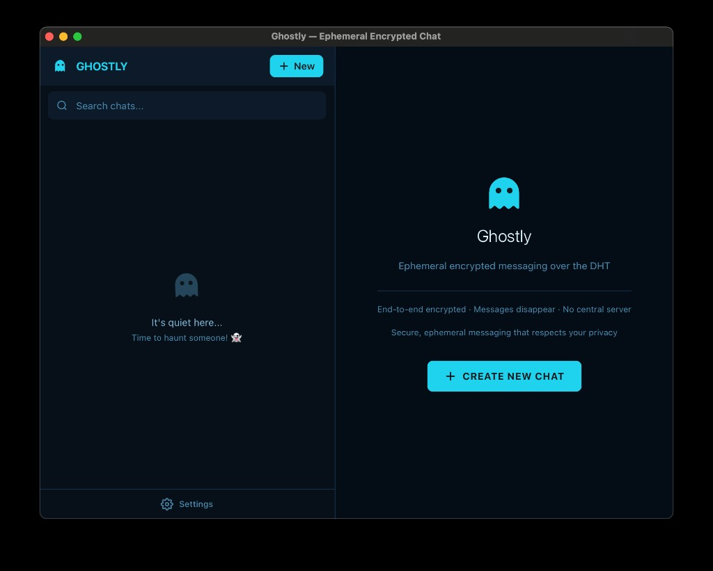
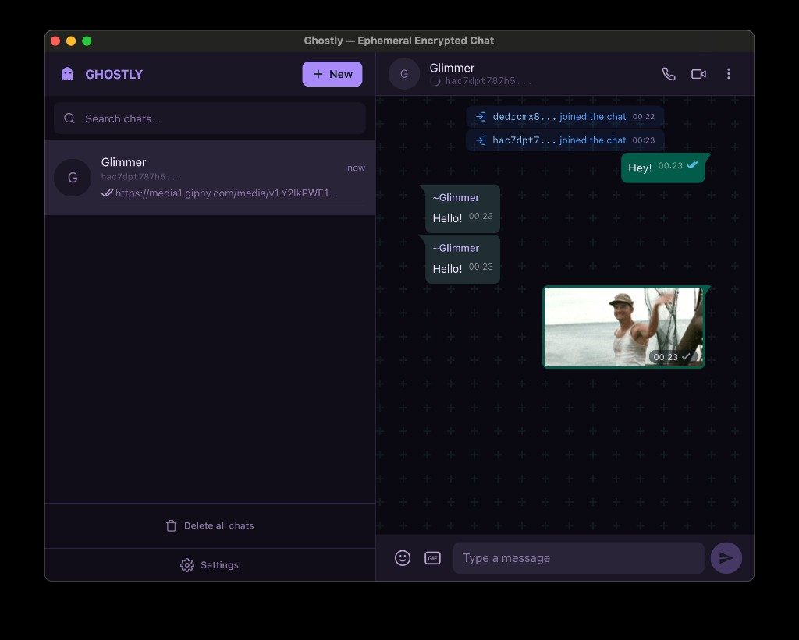
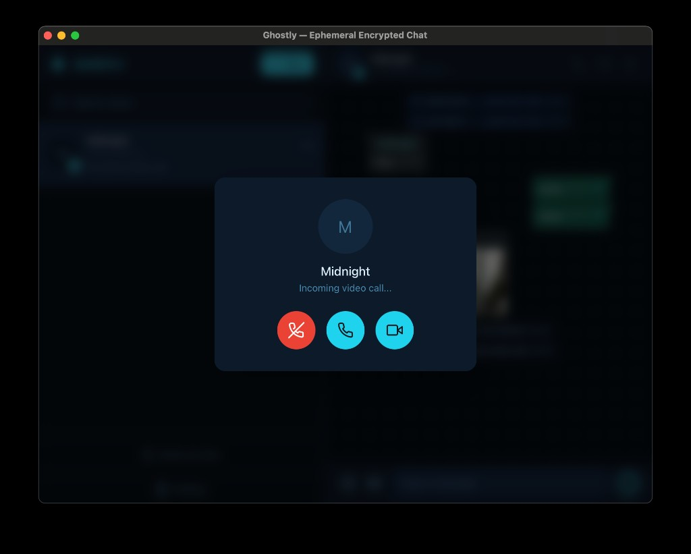
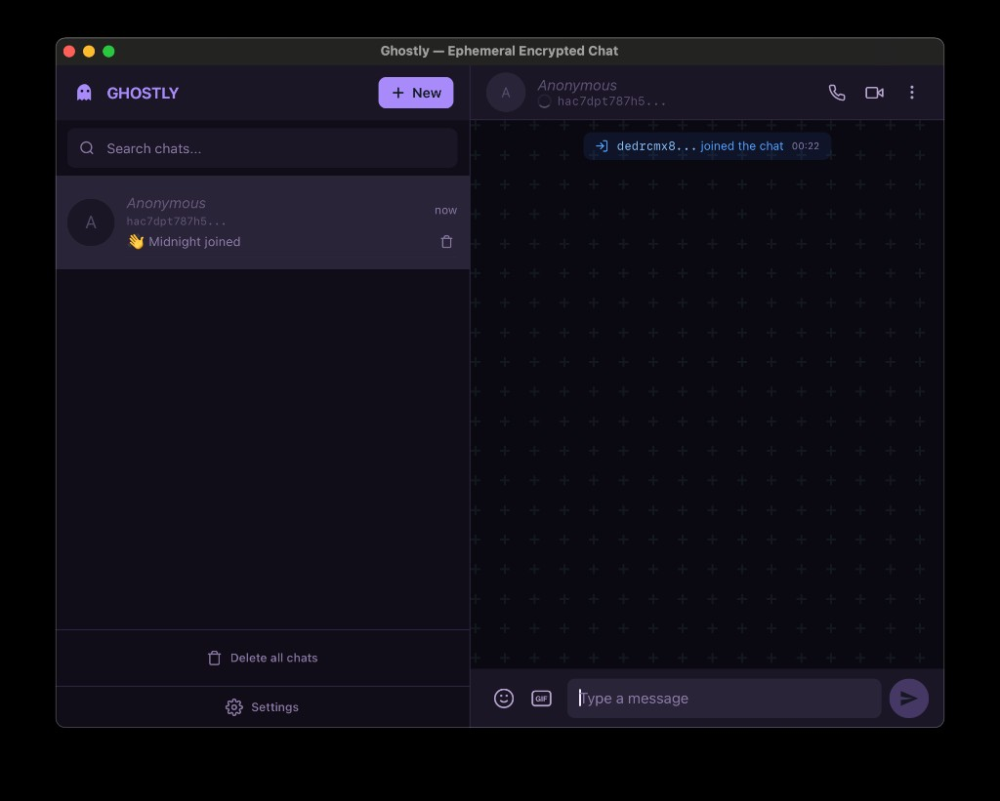
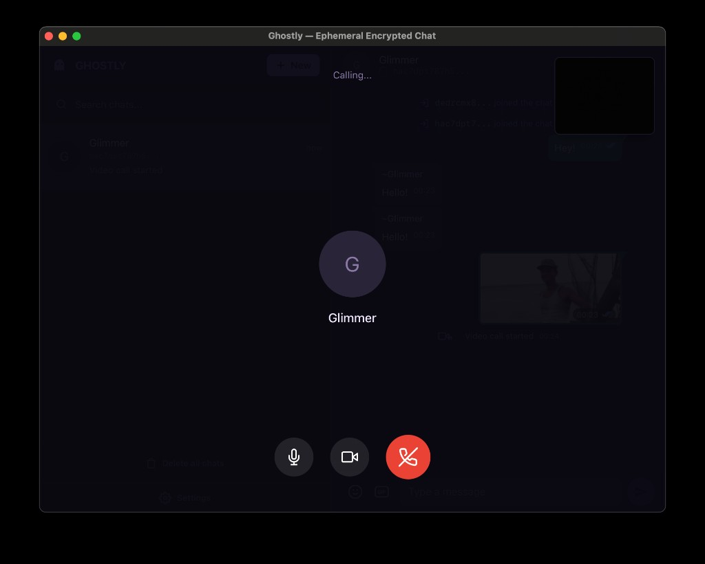
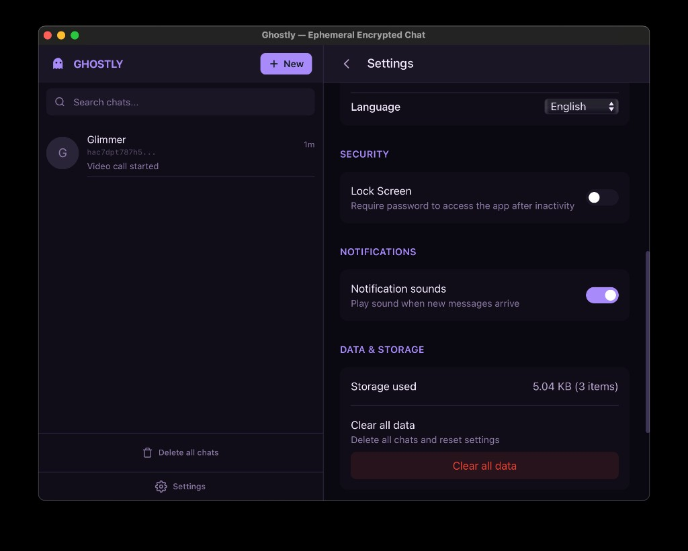
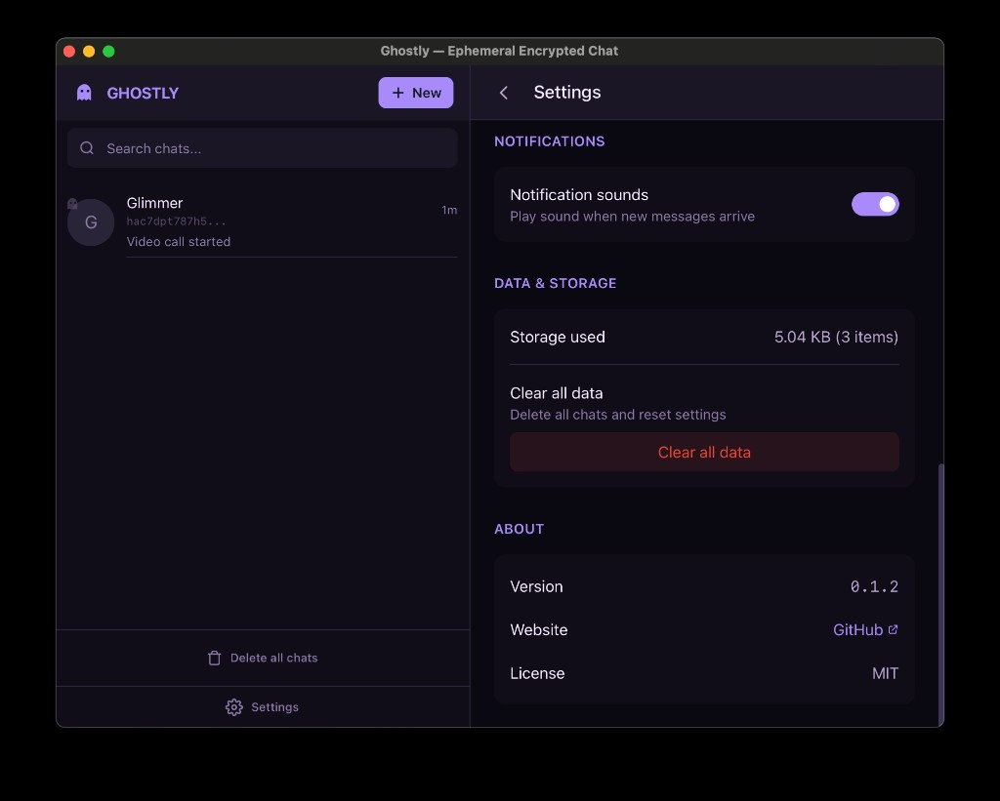

<p align="center">
  
</p>

<p align="center">
  <strong>Boo! Your chats float through 10M+ nodes and vanish without a trace.</strong><br>
  <em>No servers. No accounts. Just pure, spooky privacy.</em>
</p>

<p align="center">
  <a href="https://ghostly.tools">Website</a> •
  <a href="#download">Download</a> •
  <a href="#features">Features</a> •
  <a href="#documentation">Docs</a> •
  <a href="#troubleshooting">Troubleshooting</a> •
  <a href="CONTRIBUTING.md">Contributing</a>
</p>

<p align="center">
  
  
  
  
</p>

---

## 📥 Download

[](https://github.com/MiguelMedeiros/ghostly/releases)

Available for macOS, Windows and Linux. See [Installation Guide](docs/INSTALLATION.md) for all options.

**CLI:**

```bash
cargo install ghostly-cli
```

<details>
<summary><strong>Verifying Downloads (SHA256)</strong></summary>

Each release includes SHA256 checksums to verify file integrity. After downloading:

**macOS / Linux:**

```bash
shasum -a 256 Ghostly_x.x.x_aarch64.dmg
# Compare with the checksum in the release notes
```

**Windows (PowerShell):**

```powershell
Get-FileHash Ghostly_x.x.x_x64-setup.exe -Algorithm SHA256 | Format-List
# Compare the Hash value with the checksum in the release notes
```

The generated hash should match exactly with the one published in the release notes.

</details>

---

## What is Ghostly?

**Ghostly** is a messenger from the spirit realm. Your messages are encrypted on your device, float through the DHT as ghostly whispers, and fade away when you close the app — leaving no trace behind, just like a proper ghost.

## Features

- **E2E Encrypted** — 256-bit NaCl secretbox encryption
- **Ephemeral** — Messages vanish from the DHT in ~5 hours
- **Serverless** — No servers, no infrastructure
- **Video & Voice Calls** — WebRTC peer-to-peer communication
- **Open Source** — All code is open for audit

## Screenshots

<p align="center">
  
  
</p>

<p align="center">
  
  
</p>

<details>
<summary><strong>More screenshots</strong></summary>

| Theme Variants | Chat Flow |
|:---:|:---:|
|  |  |
|  |  |

| Video Calls | Settings |
|:---:|:---:|
|  |  |
|  |  |

</details>

## Documentation

- [Installation](docs/INSTALLATION.md) — Download links, CLI install, build from source
- [Architecture](docs/ARCHITECTURE.md) — How it works, tech stack, security model
- [CLI Guide](docs/CLI.md) — Command reference and usage examples
- [AI Agents](docs/AI-AGENTS.md) — Integration with OpenClaw, Cursor, bot examples
- [Contributing](CONTRIBUTING.md) — How to contribute to the project

## Troubleshooting

### macOS: "Ghostly.app is damaged and can't be opened"

This error occurs because macOS quarantines apps downloaded from outside the App Store. To fix it, run the following command in Terminal:

```bash
sudo xattr -cr /Applications/Ghostly.app
```

Enter your password when prompted, then try opening the app again.

---

<p align="center">
  <strong>Built with 👻 by <a href="https://github.com/miguelmedeiros">@miguelmedeiros</a></strong>
</p>

<p align="center">
  <em>"The end. Now go haunt someone!"</em>
</p>

<p align="center">
  <a href="https://ghostly.tools">Website</a> •
  <a href="https://github.com/MiguelMedeiros/ghostly/issues">Issues</a> •
  <a href="https://github.com/MiguelMedeiros/ghostly/releases">Releases</a>
</p>
