<p align="center">
  
</p>

<p align="center">
  <strong>Boo! Your chats float through 10M+ nodes and vanish without a trace.</strong><br>
  <em>No servers. No accounts. Just pure, spooky privacy.</em>
</p>

<p align="center">
  <a href="https://ghostly.tools">Website</a> •
  <a href="#download">Download</a> •
  <a href="#features">Features</a> •
  <a href="#documentation">Docs</a> •
  <a href="#troubleshooting">Troubleshooting</a> •
  <a href="CONTRIBUTING.md">Contributing</a>
</p>

<p align="center">
  
  
  
  
</p>

---

## 📥 Download

[](https://github.com/MiguelMedeiros/ghostly/releases)

Nothing to install: **[app.ghostly.tools](https://app.ghostly.tools)**, on a computer or a phone. Or the desktop app for macOS, Windows and Linux, or the browser extension: see the [Installation Guide](docs/INSTALLATION.md).

**CLI:**

```bash
cargo install ghostly-cli
```

<details>
<summary><strong>Verifying Downloads (SHA256)</strong></summary>

Each release includes SHA256 checksums to verify file integrity. After downloading:

**macOS / Linux:**

```bash
shasum -a 256 Ghostly_x.x.x_aarch64.dmg
# Compare with the checksum in the release notes
```

**Windows (PowerShell):**

```powershell
Get-FileHash Ghostly_x.x.x_x64-setup.exe -Algorithm SHA256 | Format-List
# Compare the Hash value with the checksum in the release notes
```

The generated hash should match exactly with the one published in the release notes.

</details>

---

## What is Ghostly?

**Ghostly** is a messenger from the spirit realm. Your messages are encrypted on your device, float through the DHT as ghostly whispers, and fade away when you close the app — leaving no trace behind, just like a proper ghost.

## Your services exist while you are online

Ghostly started as a messenger and is growing into an ephemeral peer-to-peer service layer: a peer advertises what it offers right now (chat, voice, video, a local web app) under its Ghostly identity, and linked peers reach it over WebRTC. Close Ghostly and it is all gone. No server, by design.

```
expose localhost:3400   →   your peer clicks "Open"   →   HTTP over WebRTC   →   your localhost
```

This works today in **[Ghostly Browser](docs/BROWSER.md)**, a Chromium extension that speaks the same protocol as the desktop app.

## Features

- **E2E Encrypted** — 256-bit NaCl secretbox encryption
- **Ephemeral** — Messages vanish from the DHT in ~5 hours; everything else exists only while you are online
- **Serverless** — No servers, no accounts
- **Calls** — Voice, video and screen sharing, peer to peer, in a window you can put aside
- **Share localhost** — A contact opens a web app running on your machine, while you are online
- **Files** — Up to 100 MiB, straight to your contact
- **Sats** — An ecash wallet with Lightning in and out; pasted invoices and tokens become cards you can pay or redeem
- **Everywhere** — Desktop, browser extension and [a web app](https://app.ghostly.tools) that installs on a phone like a native one
- **Open Source** — All code is open for audit

## Screenshots

<p align="center">
  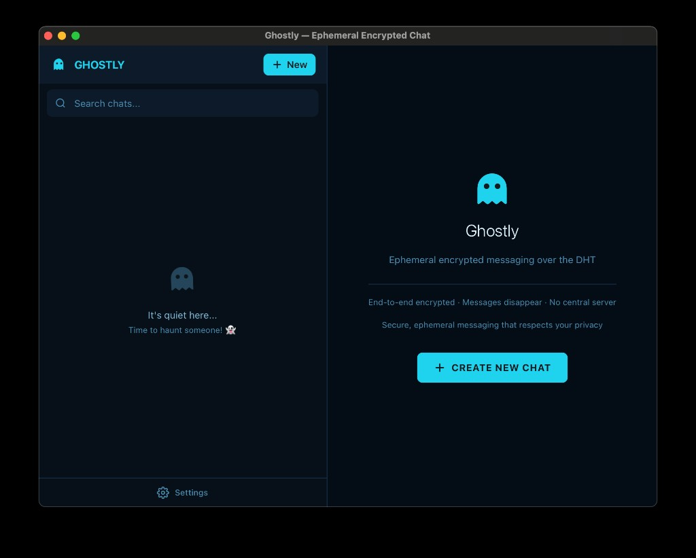
  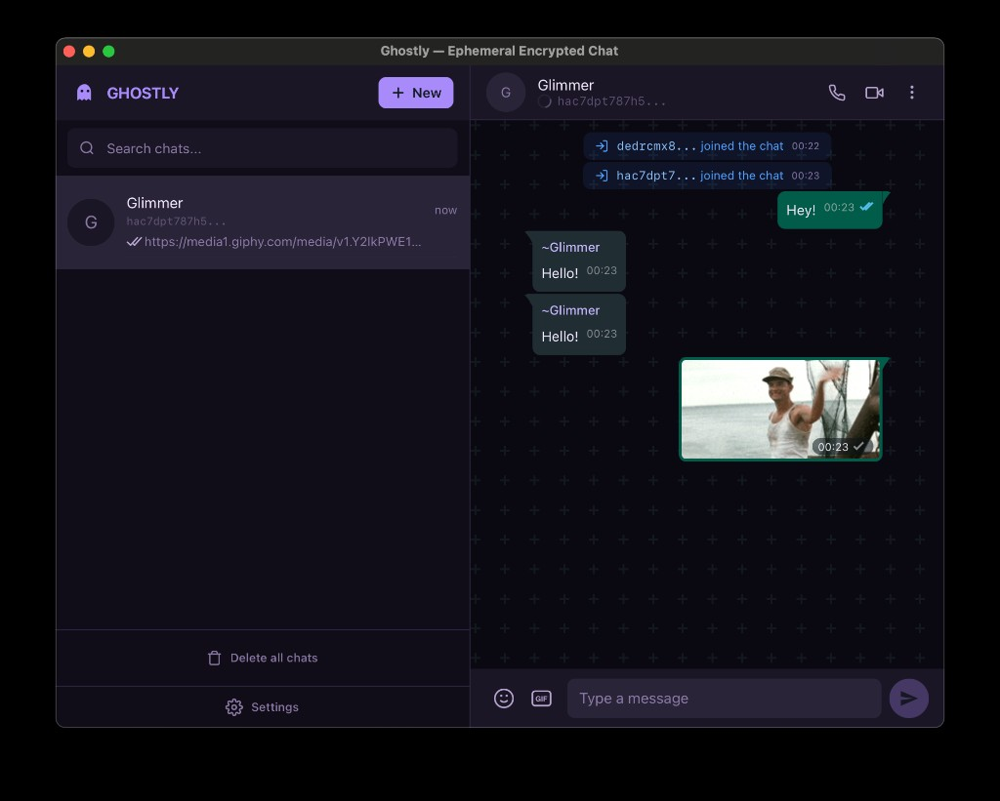
</p>

<p align="center">
  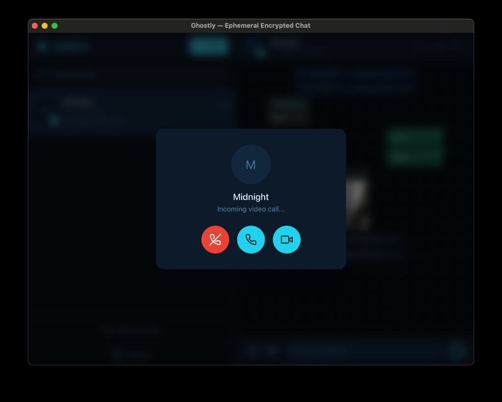
  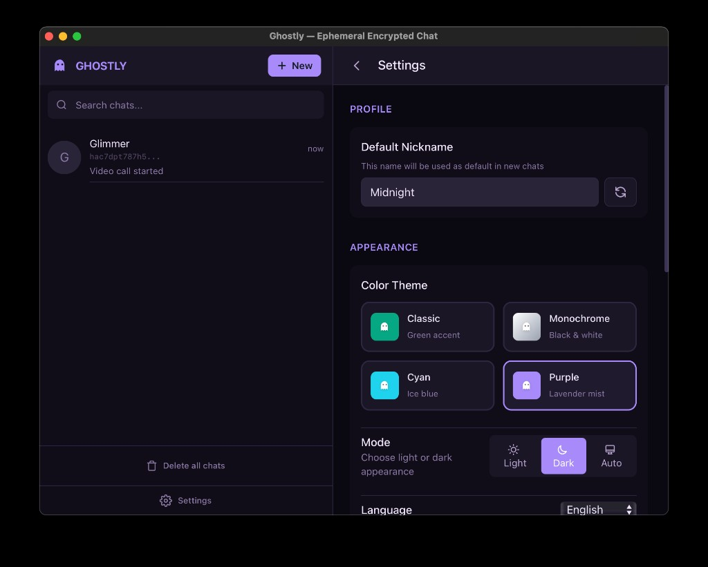
</p>

<details>
<summary><strong>More screenshots</strong></summary>

| Theme Variants | Chat Flow |
|:---:|:---:|
| 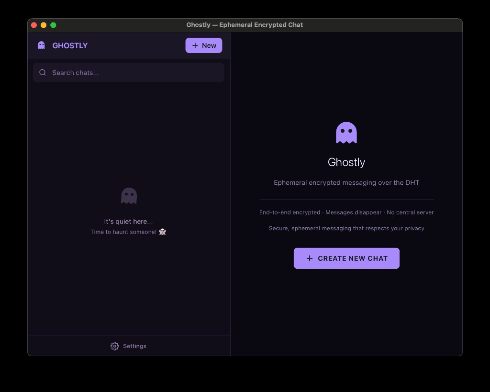 | 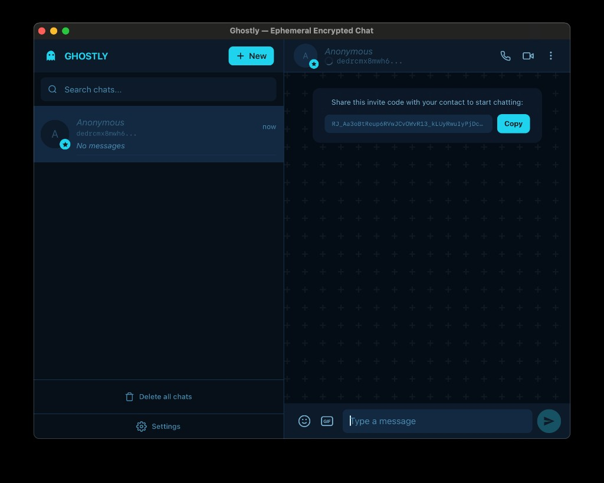 |
| 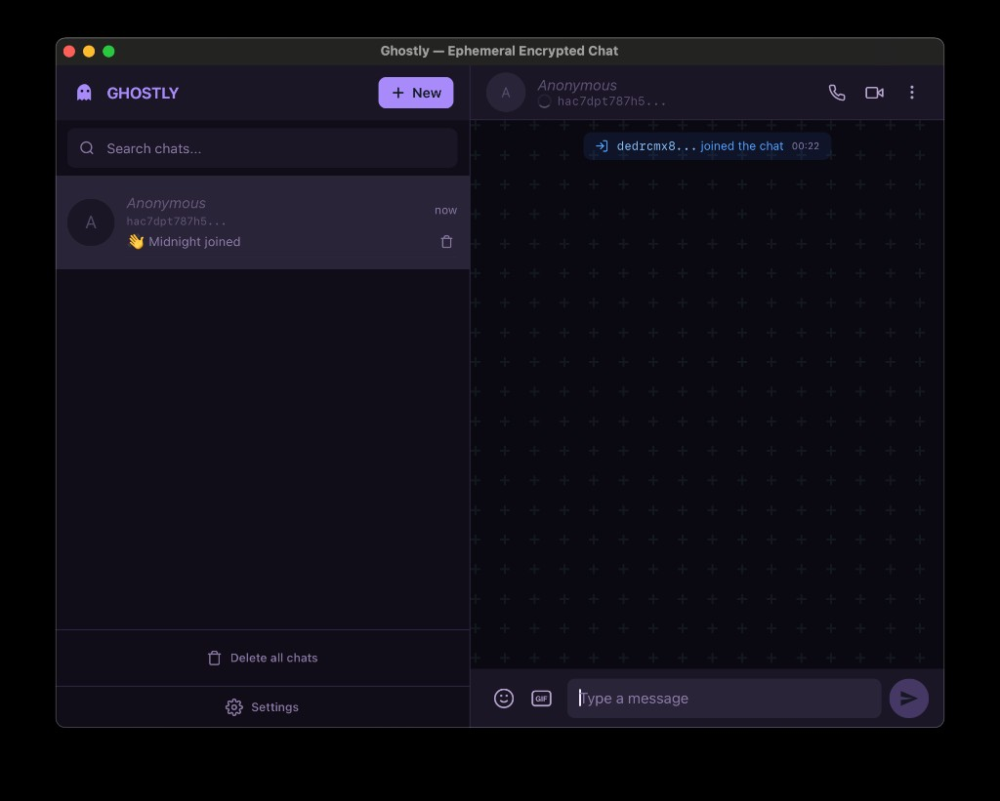 | 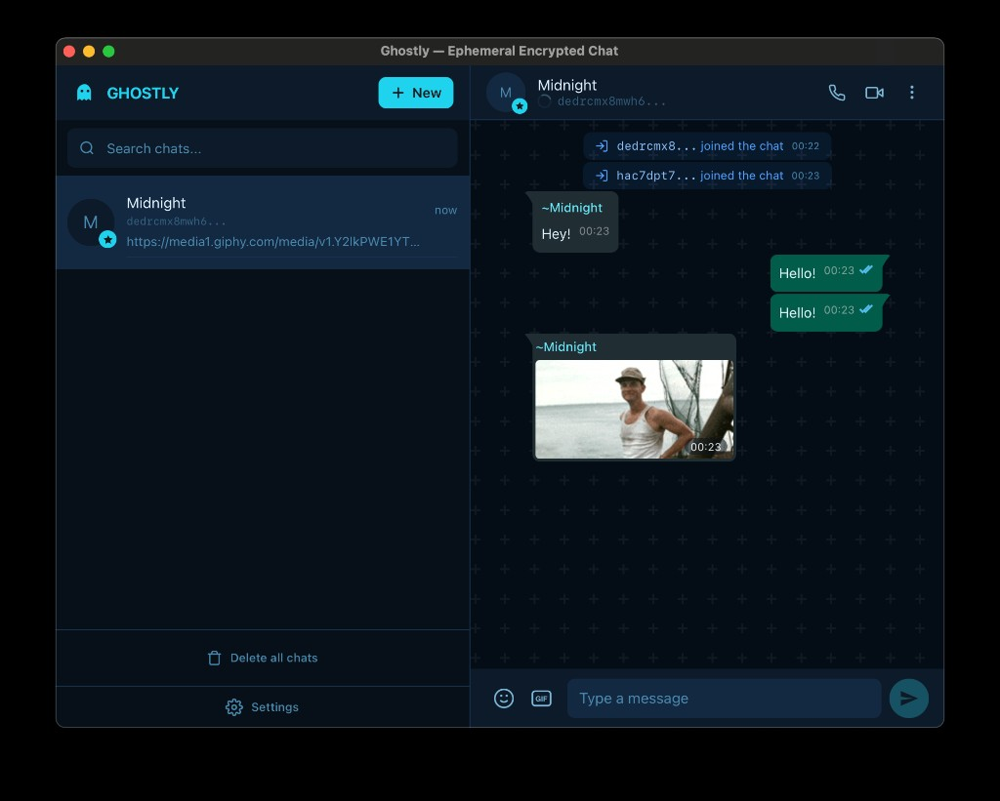 |

| Video Calls | Settings |
|:---:|:---:|
| 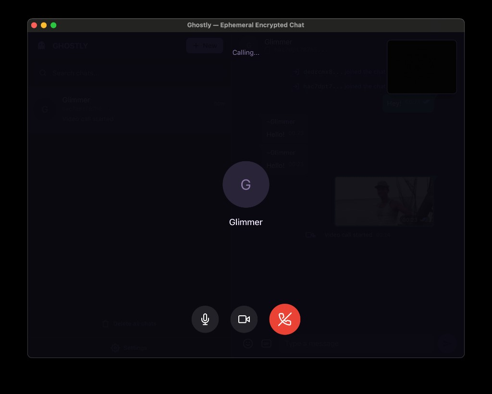 | 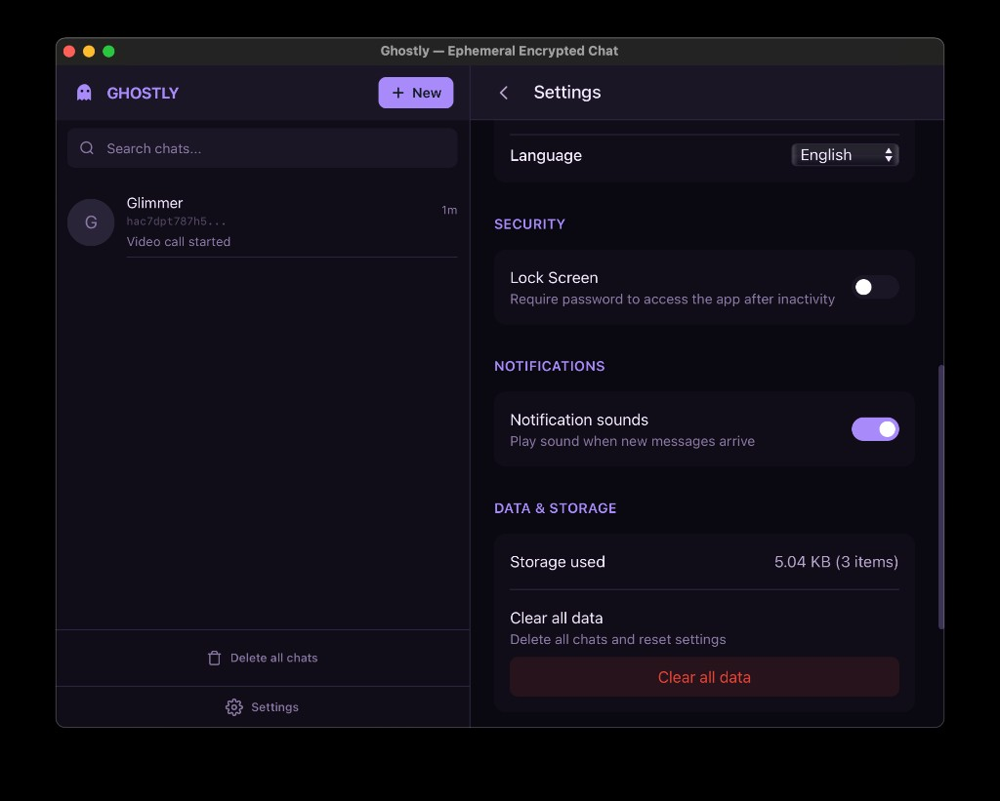 |
|  | 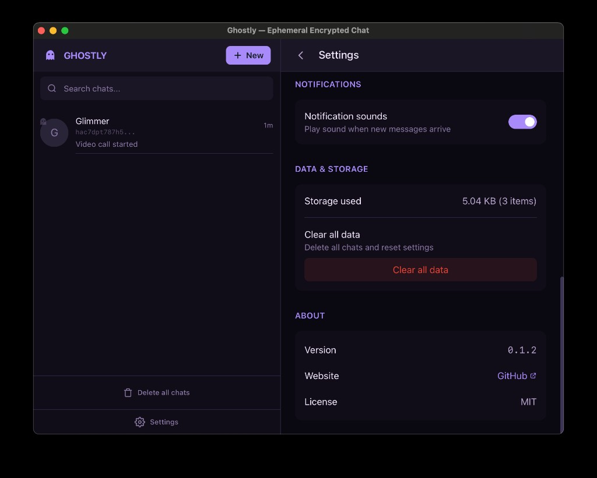 |

</details>

## Documentation

- [Installation](docs/INSTALLATION.md) — Web app, extension, desktop downloads, CLI, build from source
- [Architecture](docs/ARCHITECTURE.md) — How it works, tech stack, security model
- [Protocol](docs/PROTOCOL.md) — Records, service advertisements, WebRTC data link, HTTP over WebRTC
- [Ghostly Browser](docs/BROWSER.md) — Run the extension, share a local app, limitations
- [Ghostly on the web](docs/WEB.md) — The same client in a tab or on a phone: `docker compose up`
- [Releasing](docs/RELEASING.md) — Version, tag, publish, deploy
- [CLI Guide](docs/CLI.md) — Command reference and usage examples
- [AI Agents](docs/AI-AGENTS.md) — Integration with OpenClaw, Cursor, bot examples
- [Contributing](CONTRIBUTING.md) — How to contribute to the project

## Troubleshooting

### macOS: "Ghostly.app is damaged and can't be opened"

This error occurs because macOS quarantines apps downloaded from outside the App Store. To fix it, run the following command in Terminal:

```bash
sudo xattr -cr /Applications/Ghostly.app
```

Enter your password when prompted, then try opening the app again.

---

<p align="center">
  <strong>Built with 👻 by <a href="https://github.com/miguelmedeiros">@miguelmedeiros</a></strong>
</p>

<p align="center">
  <em>"The end. Now go haunt someone!"</em>
</p>

<p align="center">
  <a href="https://ghostly.tools">Website</a> •
  <a href="https://github.com/MiguelMedeiros/ghostly/issues">Issues</a> •
  <a href="https://github.com/MiguelMedeiros/ghostly/releases">Releases</a>
</p>
