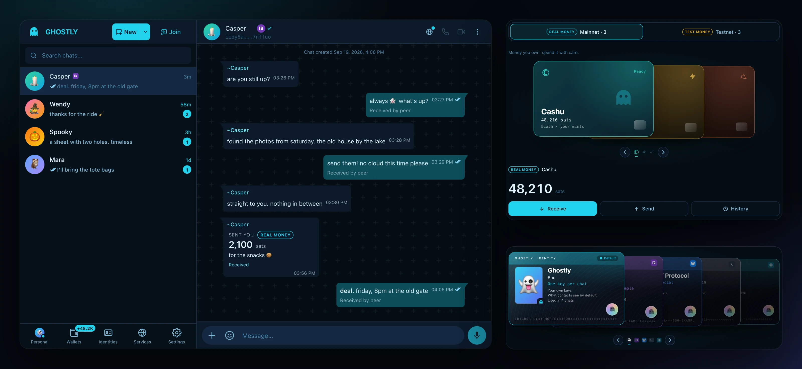

  

<h1 align="center">Ghostly</h1>

An end-to-end encrypted, peer-to-peer messenger with a wallet and verifiable identities built in. No Ghostly server, no account.

**Download:** the [latest release](https://github.com/MiguelMedeiros/ghostly/releases/latest) (macOS, Windows, Linux, browser extension, CLI), or open [app.ghostly.tools](https://app.ghostly.tools). Step by step: [Installation](docs/INSTALLATION.md).

- [Chat](docs/CHAT.md): one invite, live over WebRTC, Iroh or HyperDHT, with the DHT as the fallback.
- [Wallets](docs/WALLETS.md): Cashu, Lightning, Ark, Fedimint, on-chain and more, on Mainnet and Testnet.
- [Identities](docs/IDENTITIES.md): prove your Nostr, Bluesky, Pubky, DID or domain to a contact.
- [Transports](docs/TRANSPORTS.md): meet on the Mainline DHT, then talk peer to peer.
- [CLI](docs/CLI.md): the app's engine without a screen, for bots and scripts.
- [Everything else](docs/FEATURES.md): files, calls, groups, shared apps.

**Docs:**
[Installation](docs/INSTALLATION.md) ·
[Architecture](docs/ARCHITECTURE.md) ·
[Protocol](docs/PROTOCOL.md) & [WISPs](docs/wisps/README.md) ·
[Building from source](docs/INSTALLATION.md#build-from-source) ·
[Testing](docs/TESTING.md) ·
[Contributing](CONTRIBUTING.md) ·
[Security](SECURITY.md) ·
[All docs](docs/README.md)

**License:** [MIT](LICENSE). Built with 👻 by [@miguelmedeiros](https://github.com/miguelmedeiros).
