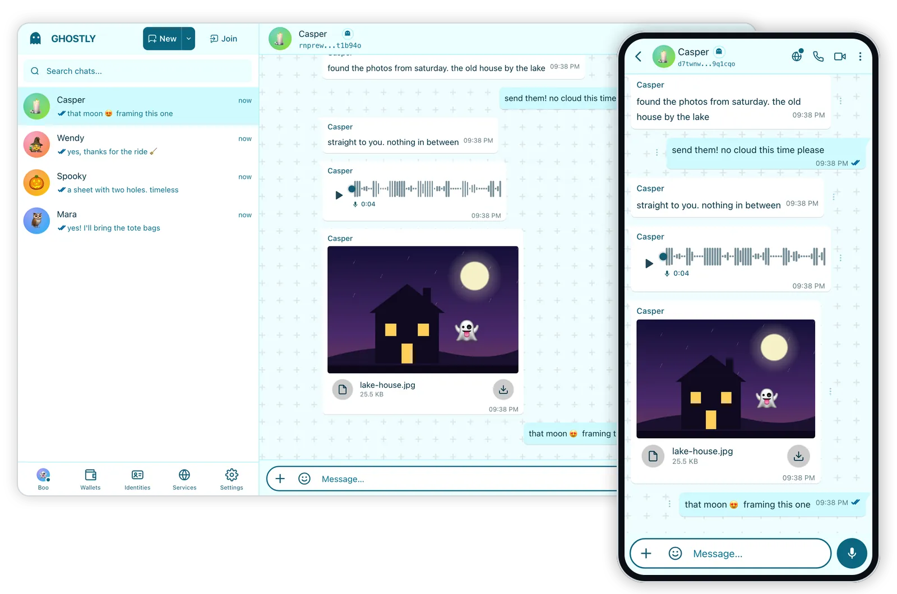

  <a href="https://ghostly.tools">
    <picture>
      <source media="(prefers-color-scheme: dark)" srcset="docs/assets/readme/logo-dark.svg">
      
    </picture>
  </a>

<h1 align="center">Ghostly</h1>

  An end-to-end encrypted, peer-to-peer messenger with a wallet and verifiable identities built in. 
  No Ghostly server, no account.

  <a href="https://app.ghostly.tools"><b>Open in your browser</b></a> ·
  <a href="#get-it">Download</a> ·
  <a href="https://ghostly.tools">Website</a> ·
  <a href="docs/README.md">Docs</a> ·
  <a href="https://ghostly.tools/wisps">Protocol</a>

  
  
  

<picture>
  <source media="(max-width: 600px) and (prefers-color-scheme: dark)" srcset="docs/assets/readme/hero-phone-dark.webp">
  <source media="(max-width: 600px)" srcset="docs/assets/readme/hero-phone-light.webp">
  <source media="(prefers-color-scheme: dark)" srcset="docs/assets/readme/hero-dark.webp">
  
</picture>

## Features

-  **[Chat](docs/CHAT.md)**: one invite, as a code, link or QR. Replies, edits, reactions, forwards, voice messages.
-  **[Calls](docs/CHAT.md#calls-and-shared-services)**: voice and video, peer to peer. Pick your mic, camera and speaker.
-  **[Files](docs/CHAT.md#files)**: any size, resumable, checked by digest. Videos and audio play in the chat.
-  **[Groups](docs/CHAT.md#groups)**: private groups of up to 32, communities of up to 256, joined by a link.
-  **[Wallets](docs/WALLETS.md)**: Cashu, Lightning, Ark, Spark, Fedimint, on-chain and USDT. Pay in a chat. Mainnet is experimental.
-  **[Identities](docs/IDENTITIES.md)**: prove your Nostr, Pubky, domain, PGP, SSH, Bitcoin address or DID. Your contact's app checks it.
-  **[Shared apps](docs/CHAT.md#calls-and-shared-services)**: share a web app on your `localhost` with a contact, over the chat's live connection.
-  **[CLI](docs/CLI.md) and [AI agents](docs/AI-AGENTS.md)**: the app's engine without a screen, for bots, scripts and agents.

## See it

https://github.com/user-attachments/assets/38824bb2-0e73-4066-93e2-0850ccd15c2e

A short narrated intro (it plays on github.com). The site has more: <a href="https://ghostly.tools">ghostly.tools</a>.

## Get it

- **Web:** open [app.ghostly.tools](https://app.ghostly.tools) in any modern browser. Install it as an app on a computer, Android or iPhone.
- **Desktop:** macOS, Windows and Linux, from the [latest release](https://github.com/MiguelMedeiros/ghostly/releases/latest).
- **Browser extension:** [Chrome Web Store](https://chromewebstore.google.com/detail/ghostly/nbedaagicniejlmfcncndfjcejaidbcf) (Chrome, Brave, Edge), or the zip on the latest release.
- **CLI:** `npm install -g @ghostlytools/cli` (Node 22.12 or newer).

Every platform, step by step: [Installation](docs/INSTALLATION.md).

## How it works

Your app finds your contact's app on a public network, then the two talk directly, encrypted end to end. No Ghostly server sits in the middle, and there is no account to make.

Under the hood: the apps meet on the Mainline DHT, then talk over WebRTC, Iroh or HyperDHT, with the DHT as the fallback. Read the [protocol](docs/PROTOCOL.md) and the [WISPs](docs/wisps/README.md).

## Trust

- Every release has `SHA256SUMS.txt`, signed with GPG key `46A3AC8395F95A6E6D8F1E34819EDEE4673F3EBB` ([how to check a download](docs/INSTALLATION.md#desktop-app)).
- Found a flaw? Report it privately: [SECURITY.md](.github/SECURITY.md).
- The [security review log](docs/SECURITY-REVIEW.md): the threat model, what was fixed and how it was proven, what is still open.

## Docs

[Installation](docs/INSTALLATION.md) · [Build from source](docs/INSTALLATION.md#build-from-source) · [Architecture](docs/ARCHITECTURE.md) · [Testing](docs/TESTING.md) · [Contributing](.github/CONTRIBUTING.md) · [All docs](docs/README.md)

---

Built by <a href="https://github.com/MiguelMedeiros">Miguel Medeiros</a> · <a href="LICENSE">MIT License</a>

