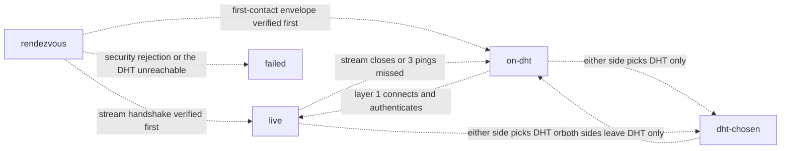
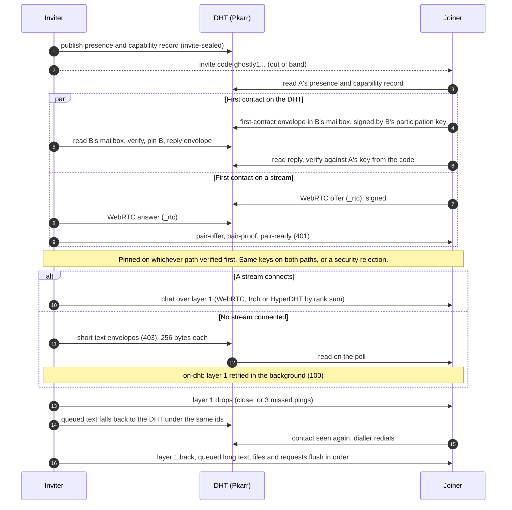

# WISP 400: Chat Messaging

| Field | Value |
|---|---|
| Candidate number | 400; pending catalogue acceptance, not an official assignment |
| Status | Draft |
| Revision | 0.2.3 |
| Updated | 2026-09-25 |
| Editors | Ghostly contributors; maintainer review pending |
| Dependencies | [01](01-ghost-core.md), [02](02-peer-keys.md), [03](03-capabilities.md), [100](100-transports.md), [800](800-invite-join.md) |
| Implementation | Existing 1:1 messages; DHT text after a live link drops. The single layered chat of revision 0.2 (decided 2026-09-25; being implemented) |

> This is a review draft. Candidate numbers and new wire formats are not registered standards. Normative language describes a candidate requirement, not a shipped guarantee. See the [catalogue](README.md), [implementation evidence](IMPLEMENTATION.md), and [interoperability plan](INTEROP.md).

## One chat, two layers (revision 0.2)

There is one kind of 1:1 chat and one invite format. Every chat has two layers:

| Layer | What it is | What it is for | Always there? |
|---|---|---|---|
| **Layer 0, the DHT** | Signed, encrypted Pkarr records on the Mainline DHT, read through HTTP relays or natively ([01](01-ghost-core.md)) | The rendezvous: the invite, the first contact and handshake, capabilities and transport descriptors. The **floor**: short text ([403](403-dht-text.md)) and the pointer to held items ([4xx](4xx-store-and-forward.md)) when nothing better connects | Yes, for as long as both sides can reach the DHT |
| **Layer 1, peer to peer** | An authenticated stream over WebRTC, Iroh or HyperDHT, chosen by the rank sum of [100](100-transports.md) | Everything: text up to 16 KiB, receipts, files, payments, names and pictures, and (once specified) calls | Only while one of those transports connects |

The DHT is always the rendezvous. After the handshake the two apps upgrade to the best peer-to-peer transport they both support and talk there. If no transport connects, or the one in use drops, the chat keeps working over the DHT alone, and layer 1 is retried in the background until it comes back. A person can also choose to keep a chat on the DHT only.

The earlier split between a "legacy" chat and a "paired" chat, and between "Live chat" and "Text only" at invite time, goes away. What those were becomes:

| Before (dev, 2026-09-25) | After (this revision) |
|---|---|
| `pair1/` invite: live streams first; the first contact needs WebRTC to connect, or pairing does not finish | The one invite, a `ghostly1…` string ([801](801-invitation-profiles.md)); the first contact happens on the DHT and on a stream in parallel, and pairing finishes on whichever works |
| `pair2d/` invite ("Text only"): DHT only from the first start, never upgrades by itself | Same first contact; the chat then upgrades by itself. "DHT only" becomes a per-chat choice made at any time, not an invite type |
| Paired chat whose stream drops: short text goes over the DHT, the stream is redialled | Unchanged in substance: this is now the rule for every chat |
| Legacy chat (prefix-less v0.4 code): timestamp `_msgs` text on the link record, legacy WebRTC link with calls, files and hosted HTTP | A **compatibility chat** ([402](402-legacy-chat.md)): kept, readable and writable, so a contact still on 0.4 can go on talking; never created for a new chat |

## States of a chat

A chat is always in exactly one of these states, on each side. The UI shows the state, not the layer names.

| State | Meaning | Text | Shown as |
|---|---|---|---|
| `rendezvous` | The invite was made or used; the contact's participation key is not pinned yet | The joiner MAY send first-contact text on the DHT ([403](403-dht-text.md)); nothing else | The pairing progress ([below](#pairing-progress-and-transport-rows)) |
| `live` | Pinned, and an authenticated layer-1 session is ready over transport *T* | Everything both apps negotiated ([401](401-paired-chat.md)) | "Live · Iroh" (the transport's name) |
| `on-dht` | Pinned, no layer-1 session, and neither side chose DHT only; layer 1 is being retried | Short text and receipts; held items where both allow them | "On DHT · retrying live" |
| `dht-chosen` | Pinned, and this side or the contact chose DHT only for this chat | As `on-dht`; layer 1 is not dialled | "DHT only · chosen by you" or "by <contact>" |

Transitions:

`failed` is reserved for a security rejection (a participation key that does not match the pin, a forged or tampered record) or for not reaching the DHT at all (every relay and the native DHT refuse or time out). A first pairing whose streams do not connect is **not** a failure: it ends in `on-dht`.

## How a chat starts, upgrades, falls back and comes back

1. **Start.** The inviter publishes its presence and a capability record on the DHT ([03](03-capabilities.md)) and hands over the invite. The joiner starts two first contacts at once: a first-contact envelope in its DHT mailbox ([403](403-dht-text.md)) and a stream attempt through `_rtc` signaling ([101](101-webrtc.md)). The joiner pins the inviter's participation key from the code itself ([801](801-invitation-profiles.md)); the inviter pins the joiner's on the first path that verifies. Both paths carry the same key; a different key on the other path is a security rejection, never a fallback.
2. **Upgrade.** Once pinned, and unless either side chose DHT only, the two apps run the transport negotiation of [100](100-transports.md): the intersection of both capability records, ranked by the rank sum. Native transports can be tried without a WebRTC session first, because their descriptors travel in the capability record (new). The first transport that authenticates wins; the chat moves to `live`.
3. **Fall back.** When the layer-1 session closes, or three pings in a row go unanswered ([401](401-paired-chat.md#liveness-and-reconnection)), the chat moves to `on-dht` at once. Unconfirmed text is sent again over the DHT under the same message ids; what the DHT cannot carry waits in the outbox, or is held ([4xx](4xx-store-and-forward.md)) where both sides allow it.
4. **Come back.** Layer 1 is retried in the background with the backoff of [100](100-transports.md#background-retry-and-upgrade). When it authenticates again, the chat moves back to `live`, everything waiting in the outbox goes in order, and the DHT stops carrying text for that chat.

## Candidate requirements for the one chat

1. A new chat MUST be created with the one invite format of [801](801-invitation-profiles.md). There is no delivery choice at invite time.
2. Every chat MUST keep layer 0 working for as long as it exists: presence, the capability record and the DHT mailbox of [403](403-dht-text.md). Layer 1 is an upgrade, not a precondition.
3. A first pairing MUST finish in `live` or in `on-dht` whenever the DHT is reachable and no security check failed. It MUST NOT report failure because a stream did not connect.
4. A chat in `on-dht` MUST keep retrying layer 1 ([100](100-transports.md#background-retry-and-upgrade)) and MUST move to `live` without any action from the person when a transport authenticates.
5. A chat in `live` MUST move to `on-dht` when layer 1 is lost, and MUST NOT lose, duplicate or reorder a message in the move: the stable message id and the outbox of [401](401-paired-chat.md) are shared by both layers, and the receiver deduplicates across them.
6. Choosing DHT only is per chat and per side. Either side's choice keeps both off layer 1; leaving it takes both ([403](403-dht-text.md#choosing-dht-only)). The choice is announced in the next envelope at once.
7. What a state cannot carry is said before it is attempted, not after a silent failure. The composer and the chat's actions show the reason ("Needs a live connection", "Up to 256 bytes on the DHT") next to the disabled action, and anything that can wait is queued rather than refused.
8. A security rejection (key mismatch, a forged record, a proof bound to another channel) MUST stop the chat on both layers until the person acts. It MUST NOT trigger a fallback.
9. The actual state and transport are reported separately from the person's preference.

## What each state can carry

| Ability | `live` | `on-dht` and `dht-chosen` | UI while on the DHT |
|---|---|---|---|
| Text up to 256 UTF-8 bytes | Yes | Yes ([403](403-dht-text.md)) | Sends; one text awaits a receipt at a time, the rest queue |
| Text of 257 bytes to 16 KiB | Yes | Held ([4xx](4xx-store-and-forward.md)) if both allow; otherwise queued for layer 1 (new) | "Sends when live" on the bubble; the byte count turns amber past 256 |
| Receipts ("Received by peer") | Yes | Yes, for DHT text and held items | Same states as live |
| Name | Yes (`paired-nick`) | Yes, in the capability record (new, at most 64 bytes) | Unchanged |
| Picture | Yes (`paired-avatar`) | No; waits for layer 1 | The last picture stays |
| Files and voice messages | Yes (`files/2`, [501](501-paired-files.md)) | Held if both allow (8 MiB each); otherwise queued for layer 1 (new) | Attach stays enabled; the bubble says "Sends when live" or "Held for <contact>" |
| Payment requests | Yes (`payments/1`) | Held if both allow (Cashu and Lightning requests); otherwise queued | As files |
| Paying (ecash, Lightning, Ark, Spark, on-chain) | Yes, per [200](200-payments.md) | No. Bearer tokens never enter the DHT or a hold, and a payment is not queued | ⚡ disabled: "Payments need a live connection" |
| Calls, voice and video | Yes (`calls/1`, [601](601-webrtc-media.md#paired-profile)): signals on the session, media on a WebRTC connection of its own | No | Call buttons disabled: "Calls need a live connection" |
| Hosted local services | Yes (`services/1`, [701](701-http-services.md#paired-profile)) | No | The chat's Services dialog says "Shared apps open while you are connected live" |
| Identity proofs shared with the contact | Yes | No; they wait for layer 1 | Unchanged |

A Lightning invoice pasted as text is text: it fits the DHT when short enough, and sending it starts no payment. Cashu tokens are refused as DHT text.

## Contract and concrete profiles

This document defines the chat's common responsibilities. Exact encodings belong to:

- [401 · Chat Session](401-paired-chat.md): the authenticated layer-1 session (`paired-chat/1`, `chat/1`), its receipts, liveness and outbox.
- [403 · DHT Text](403-dht-text.md): the floor of every chat, and its first contact.
- [4xx · Store-and-Forward](4xx-store-and-forward.md): held items for an away contact, on either layer.
- [402 · Compatibility Chat](402-legacy-chat.md): the v0.4 timestamp profile, kept for existing chats and v0.4 codes only.

Supporting a concrete profile does not establish full conformance to this Draft.

## Pairing progress and transport rows

Two surfaces show where a chat is. They are specified here so both apps say the same thing.

- **Pairing progress** (the `PairingProgress` contract of the pairing-latency work): its stages stay `publishing`, `waiting`, `resolving`, `knocking`, `answering`, `connecting`, `live`, `failed`, and gain a terminal stage **`on-dht`**: pinned over the DHT, layer 1 not connected (yet). `detail.reason` on `on-dht` is one of `no-common-transport`, `transport` (every attempt failed), `chosen` (either side chose DHT only) or `waiting` (still trying). `failed` keeps only `key-mismatch`, `security`, `publish` and `offline` (the DHT itself unreachable). A first pairing that ends in `on-dht` keeps its layer-1 attempts running; the scene gives way to the chat at `on-dht`, and the header indicator says "On DHT · retrying live".
- **Transport rows and the per-chat switch** (the transport-switch work): **DHT** is one of the transports in the chat's Connection menu: Automatic · WebRTC · Iroh · HyperDHT · **DHT only**. Choosing it is the `dht-chosen` state; Automatic leaves it. DHT only is always available; the others are offered only when both apps support them.

### Transport rows

The timeline records what matters to the people in the chat, not every reconnect. Each app derives its rows from its own engine events; nothing about them goes on the wire, and they are never messages (never sent, never unread, never the chat's preview).

1. **First connection.** "Connected over <transport>" appears once, for the chat's first live connection. After that, a live connection is a row only when its transport differs from the last one the chat's rows name. An app restart, on either side, that comes back on the same transport adds nothing.
2. **Short drops are silent.** Live coming back within 5 minutes on the same transport adds nothing. On another transport it is one row: "Switched to <transport>: <old> dropped". The 5 minutes cover an app restart and its reconnect, which took up to about 2 minutes in practice.
3. **A long outage is one row, when it ends:** "Reconnected over <transport> after 6 min", with "· <old> dropped" when it came back on another. There is never a "lost" row followed by a "back" row. While the chat is off live, including `on-dht`, the header indicator says so and the timeline adds nothing. Texts that went through the DHT meanwhile are messages in the timeline already, and the return row's details say so ("Texts went through the DHT meanwhile"); there is no separate DHT row.
4. **Choices are always rows:** "You chose <transport>", "<contact> chose <transport>", "Back to automatic", "<contact> went back to automatic", "You switched to DHT only", "<contact> switched to DHT only". When the choice moves the live session, its row becomes the switch ("You switched to Iroh", "Back to automatic · now on WebRTC"). Leaving DHT only is "Left DHT only · connecting live", then "Back live over <transport>".
5. **A switch that failed** is a row: "Couldn't switch to <transport>: <reason>. Still on <transport>".
6. **Coalescing.** Rows with no message between them show as one row, the latest, with the earlier ones listed in its details ("…and 4 more changes"). The timeline never shows a column of them.
7. **Connection history.** Every event, including what the timeline leaves out (drops it came back from, app starts, failed attempts, the round trip on each stretch), goes to the chat's connection history, shown in its connection panel, newest first.
8. **Stored rows** written under older rules are compacted by these on load: restart and short-drop rows go, a "lost" and "back" pair becomes one outage row, and the old rows seed the connection history. Messages are untouched.

## Candidate semantics

Future messages need a stable sender-scoped message ID, authenticated channel/participation context, sequence within a sender generation, content type and bounded body. Distinguish locally queued, sent, received, durably stored and read; only advertise receipts actually implemented. Retries reuse IDs. Deduplication retention must cover the declared retry window and survive restart where durable delivery is promised.

Offer per-sender order with explicit gaps; do not promise total order across peers/groups. Bind generation/epoch changes so sequence resets cannot replay old messages. DHT delivery has visible size/retention limits; report failure or truncation policy before losing user content. No group fanout over DHT mailboxes or `_msgs`; groups ([900](900-group-sessions.md)) have their own distribution and are outside this revision.

## Compatibility, security and decisions

The compatibility profile ([402](402-legacy-chat.md)) stays separate: a compatibility chat is never silently converted, and a 0.5 app never creates one. Receipts leak activity and should have declared policy. Publishing every chat's text to the DHT when layer 1 is down exposes to relays what [403](403-dht-text.md) already exposes for DHT-only chats (sizes, timing, the mailbox addresses), now for every chat; the content stays sealed.

Decisions of this revision, recorded by the maintainer on 2026-09-25 (numbered as they were raised in review):

| # | Decided (2026-09-25) | Reason |
|---|---|---|
| Q1 | Files and payment requests never ride DHT text: they ride layer 1, or a hold ([4xx](4xx-store-and-forward.md)) | A hold keeps the content in the sender's storage with only a pointer on the DHT; splitting bulk data across DHT records is what [01](01-ghost-core.md) forbids |
| Q2 | DHT text stays at 256 UTF-8 bytes ([403](403-dht-text.md)); longer text is queued or held, never fragmented | A post-pin envelope with a receipt already uses most of the 1,000-byte packet |
| Q3 | Layer 1 is retried for as long as the app runs and the chat is not `dht-chosen`, with no give-up timer ([100](100-transports.md#background-retry-and-upgrade)) | The pace (at once when the contact is seen, 20 s doubling to 3 min while it is online, nothing while it is away) already bounds the cost |
| Q4 | Texts beyond the one DHT text awaiting a receipt are queued in the outbox, in order | The one-outstanding rule stays on the wire, and nothing the person wrote is left in the composer |
| Q5 | Files and payment requests on the DHT with no hold are queued locally with a cancel; payments are never queued | They go by themselves when layer 1 or a hold can take them; a bearer token must not wait in a queue |
| Q6 | No "live only" setting in 0.5; the wire keeps it expressible (a capability record without `dht-text/1`) | The floor is the point of the model; a future setting needs no new format |
| Q7 | The DHT mailbox is read every 5 minutes while `live` (today 30 s), and at 4 s from the moment layer 1 is lost | With every chat on the floor, the relays' per-IP budget (about 50 requests a minute on pkarr.pubky.org) is the limit |

Still open, as before: message ID encoding across profiles, receipt authentication on the DHT, retry limits and retention before Proposed. Offline group catch-up is negotiated peer storage in 900, not a Core promise.

## Conformance

Exercise equal timestamps, out-of-order arrivals, duplicated messages across DHT and layer 1, disconnect after send but before storage, restart/retry and full budgets with signaling present. Verify no receipt means more than its declared stage. For revision 0.2 add: a first pairing with every stream blocked ends in `on-dht` and chats; the same pairing with streams unblocked later moves to `live` by itself; a layer-1 drop mid-conversation loses and duplicates nothing; a key mismatch on either path stops both; DHT only chosen on one side keeps both off layer 1.

## References

[LinkSession](../../packages/core/src/link.ts), [GhostLink](../../packages/core/src/ghostlink.ts), [DHT delivery](../../packages/core/src/dhtDelivery.ts), [records](../../packages/core/src/records.ts), [outbox](../../packages/browser/src/engine/outbox.ts), [local messages](../../packages/browser/src/engine/db.ts), [group sessions](900-group-sessions.md).

## Revision log

- 0.2.3 (2026-09-25): transport rows record what matters (first connection, a change of transport, choices, a failed switch, an outage when it ends), not every reconnect or restart; everything else goes to the connection history.
- 0.2.2 (2026-09-25): calls (`calls/1`) and hosted services (`services/1`) on layer 1, both live only.
- 0.2.1 (2026-09-25): hosted local services run in the chat session today; only calls are the gap. Implementation status updated.
- 0.2 (2026-09-25): one chat with a DHT layer and a peer-to-peer layer; chat states; what each state carries; the pairing-progress and transport-row wording; decisions Q1 to Q7 (decided 2026-09-25).
- 0.1 (2026-09-20): initial review draft.
