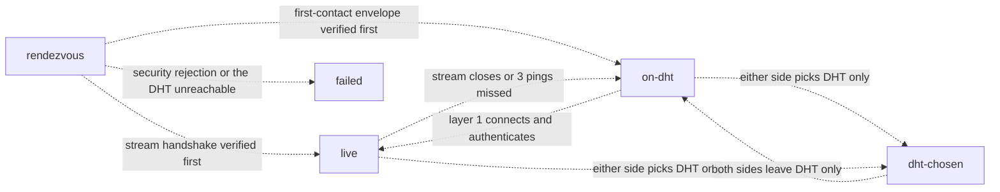
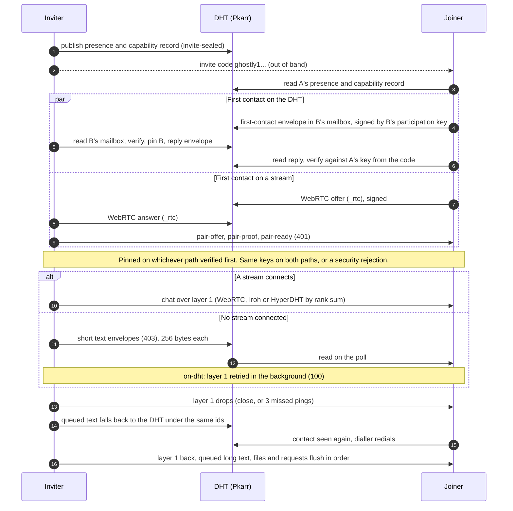

# WISP 400: Chat Messaging

| Field | Value |
|---|---|
| Candidate number | 400; pending catalogue acceptance, not an official assignment |
| Status | Draft |
| Revision | 0.2.9 |
| Updated | 2026-09-27 |
| Editors | Ghostly contributors; maintainer review pending |
| Dependencies | [01](01-ghost-core.md), [02](02-peer-keys.md), [03](03-capabilities.md), [100](100-transports.md), [800](800-invite-join.md) |
| Implementation | The single layered chat of revision 0.2 in every new chat (web, extension, desktop): first contact on the DHT and a stream in parallel, `on-dht`, self-upgrade, DHT only per chat; replies, reactions, edits and the text's display conventions; compatibility chats for v0.4 |
| Summary | One chat for everyone: the DHT to meet, a live link when one connects, the DHT again when none does. |
| Availability | Available |
| Notes | Messages with storage receipts and retries. A first pairing with no direct path starts on the DHT, short texts fall back to it when a live link drops, and every chat returns to a live link by itself. You can keep a chat on the DHT only. Replies quote a message, a text you sent can be edited in a 1:1 chat, reactions put one emoji per person on a message, and lists, quotes, headings and links show as such. |
| Feature | [Chat](https://ghostly.tools/#next) |

> This is a review draft. Candidate numbers and new wire formats are not registered standards. Normative language describes a candidate requirement, not a shipped guarantee. See the [catalogue](README.md), [implementation evidence](IMPLEMENTATION.md), and [interoperability plan](INTEROP.md).

## One chat, two layers (revision 0.2)

There is one kind of 1:1 chat and one invite format. Every chat has two layers:

| Layer | What it is | What it is for | Always there? |
|---|---|---|---|
| **Layer 0, the DHT** | Signed, encrypted Pkarr records on the Mainline DHT, read through HTTP relays or natively ([01](01-ghost-core.md)) | The rendezvous: the invite, the first contact and handshake, capabilities and transport descriptors. The **floor**: short text ([403](403-dht-text.md)) and the pointer to held items ([4xx](4xx-store-and-forward.md)) when nothing better connects | Yes, for as long as both sides can reach the DHT |
| **Layer 1, peer to peer** | An authenticated stream over WebRTC, Iroh or HyperDHT, chosen by the rank sum of [100](100-transports.md) | Everything: text up to 16 KiB, receipts, files, payments, names and pictures, calls and shared apps | Only while one of those transports connects |

The DHT is always the rendezvous. After the handshake the two apps upgrade to the best peer-to-peer transport they both support and talk there. If no transport connects, or the one in use drops, the chat keeps working over the DHT alone, and layer 1 is retried in the background until it comes back. A person can also choose to keep a chat on the DHT only.

The earlier split between a "legacy" chat and a "paired" chat, and between "Live chat" and "Text only" at invite time, goes away. What those were becomes:

| Before (dev, 2026-09-25) | After (this revision) |
|---|---|
| `pair1/` invite: live streams first; the first contact needs WebRTC to connect, or pairing does not finish | The one invite, a `ghostly1…` string ([801](801-invitation-profiles.md)); the first contact happens on the DHT and on a stream in parallel, and pairing finishes on whichever works |
| `pair2d/` invite ("Text only"): DHT only from the first start, never upgrades by itself | Same first contact; the chat then upgrades by itself. "DHT only" becomes a per-chat choice made at any time, not an invite type |
| Paired chat whose stream drops: short text goes over the DHT, the stream is redialled | Unchanged in substance: this is now the rule for every chat |
| Legacy chat (prefix-less v0.4 code): timestamp `_msgs` text on the link record, legacy WebRTC link with calls, files and hosted HTTP | A **compatibility chat** ([402](402-legacy-chat.md)): kept, readable and writable, so a contact still on 0.4 can go on talking; never created for a new chat |

## States of a chat

A chat is always in exactly one of these states, on each side. The UI shows the state, not the layer names.

| State | Meaning | Text | Shown as |
|---|---|---|---|
| `rendezvous` | The invite was made or used; the contact's participation key is not pinned yet | The joiner MAY send first-contact text on the DHT ([403](403-dht-text.md)); nothing else | The pairing progress ([below](#pairing-progress-and-transport-rows)) |
| `live` | Pinned, and an authenticated layer-1 session is ready over transport *T* | Everything both apps negotiated ([401](401-paired-chat.md)) | "Live · Iroh" (the transport's name) |
| `on-dht` | Pinned, no layer-1 session, and neither side chose DHT only; layer 1 is being retried | Short text and receipts; held items where both allow them | "On DHT · retrying live", or "On DHT · waiting for <transport>" while a chosen transport with Fallback off is not reached yet ([100](100-transports.md#a-chosen-transport-not-reached-yet-revision-04)) |
| `dht-chosen` | Pinned, and this side or the contact chose DHT only for this chat | As `on-dht`; layer 1 is not dialled | "DHT only · chosen by you" or "by <contact>" |

Transitions:


```mermaid
flowchart LR
    R["rendezvous"] -. stream handshake verified first .-> L["live"]
    R -. first-contact envelope verified first .-> D["on-dht"]
    D -. layer 1 connects and authenticates .-> L
    L -. stream closes or 3 pings missed .-> D
    D -. either side picks DHT only .-> C["dht-chosen"]
    L -. either side picks DHT only .-> C
    C -. both sides leave DHT only .-> D
    R -. security rejection or the DHT unreachable .-> F["failed"]
```

`failed` is reserved for a security rejection (a participation key that does not match the pin, a forged or tampered record) or for not reaching the DHT at all (every relay and the native DHT refuse or time out). A first pairing whose streams do not connect is **not** a failure: it ends in `on-dht`.

## How a chat starts, upgrades, falls back and comes back


```mermaid
sequenceDiagram
    autonumber
    participant A as Inviter
    participant D as DHT (Pkarr)
    participant B as Joiner
    A->>D: publish presence and capability record (invite-sealed)
    A-->>B: invite code ghostly1... (out of band)
    B->>D: read A's presence and capability record
    par First contact on the DHT
        B->>D: first-contact envelope in B's mailbox, signed by B's participation key
        A->>D: read B's mailbox, verify, pin B, reply envelope
        B->>D: read reply, verify against A's key from the code
    and First contact on a stream
        B->>D: WebRTC offer (_rtc), signed
        A->>D: WebRTC answer (_rtc)
        A->>B: pair-offer, pair-proof, pair-ready (401)
    end
    Note over A,B: Pinned on whichever path verified first. Same keys on both paths, or a security rejection.
    alt A stream connects
        A->>B: chat over layer 1 (WebRTC, Iroh or HyperDHT by rank sum)
    else No stream connected
        A->>D: short text envelopes (403), 256 bytes each
        D->>B: read on the poll
        Note over A,B: on-dht: layer 1 retried in the background (100)
    end
    A->>B: layer 1 drops (close, or 3 missed pings)
    A->>D: queued text falls back to the DHT under the same ids
    B->>D: contact seen again, dialler redials
    A->>B: layer 1 back, queued long text, files and requests flush in order
```

1. **Start.** The inviter publishes its presence and a capability record on the DHT ([03](03-capabilities.md)) and hands over the invite. The joiner starts two first contacts at once: a first-contact envelope in its DHT mailbox ([403](403-dht-text.md)) and a stream attempt through `_rtc` signaling ([101](101-webrtc.md)). The joiner pins the inviter's participation key from the code itself ([801](801-invitation-profiles.md)); the inviter pins the joiner's on the first path that verifies. Both paths carry the same key; a different key on the other path is a security rejection, never a fallback.
2. **Upgrade.** Once pinned, and unless either side chose DHT only, the two apps run the transport negotiation of [100](100-transports.md): the intersection of both capability records, ranked by the rank sum. Native transports can be tried without a WebRTC session first, because their descriptors travel in the capability record. The first transport that authenticates wins; the chat moves to `live`.
3. **Fall back.** When the layer-1 session closes, or three pings in a row go unanswered ([401](401-paired-chat.md#liveness-and-reconnection)), the chat moves to `on-dht` at once. Unconfirmed text is sent again over the DHT under the same message ids; what the DHT cannot carry waits in the outbox, or is held ([4xx](4xx-store-and-forward.md)) where both sides allow it.
4. **Come back.** Layer 1 is retried in the background with the backoff of [100](100-transports.md#background-retry-and-upgrade). When it authenticates again, the chat moves back to `live`, everything waiting in the outbox goes in order, and the DHT stops carrying text for that chat.

## Candidate requirements for the one chat

1. A new chat MUST be created with the one invite format of [801](801-invitation-profiles.md). There is no delivery choice at invite time.
2. Every chat MUST keep layer 0 working for as long as it exists: presence, the capability record and the DHT mailbox of [403](403-dht-text.md). Layer 1 is an upgrade, not a precondition.
3. A first pairing MUST finish in `live` or in `on-dht` whenever the DHT is reachable and no security check failed. It MUST NOT report failure because a stream did not connect.
4. A chat in `on-dht` MUST keep retrying layer 1 ([100](100-transports.md#background-retry-and-upgrade)) and MUST move to `live` without any action from the person when a transport authenticates.
5. A chat in `live` MUST move to `on-dht` when layer 1 is lost, and MUST NOT lose, duplicate or reorder a message in the move: the stable message id and the outbox of [401](401-paired-chat.md) are shared by both layers, and the receiver deduplicates across them.
6. Choosing DHT only is per chat and per side. Either side's choice keeps both off layer 1; leaving it takes both ([403](403-dht-text.md#choosing-dht-only)). The choice is announced in the next envelope at once.
7. What a state cannot carry is said before it is attempted, not after a silent failure. The composer and the chat's actions show the reason ("Needs a live connection", "Up to 256 bytes on the DHT") next to the disabled action, and anything that can wait is queued rather than refused.
8. A security rejection (key mismatch, a forged record, a proof bound to another channel) MUST stop the chat on both layers until the person acts. It MUST NOT trigger a fallback. After the pin, a key mismatch is proven only by a layer-1 session this side dialled, or whose connection details were signed by the pinned key: the DHT mailboxes, the link's signals and native endpoints whose address an invite could read are written under keys any copy of the invite derives. Another key there MUST be ignored, never a stop and never a replaced pin; it MAY be shown as a passive warning ("someone else is publishing on this chat's invite keys").
9. The actual state and transport are reported separately from the person's preference.

## What each state can carry

| Ability | `live` | `on-dht` and `dht-chosen` | UI while on the DHT |
|---|---|---|---|
| Text up to 256 UTF-8 bytes | Yes | Yes ([403](403-dht-text.md)) | Sends; one text awaits a receipt at a time, the rest queue |
| Text of 257 bytes to 16 KiB | Yes | Held ([4xx](4xx-store-and-forward.md)) if both allow; otherwise queued for layer 1 | "Sends when live" on the bubble; the byte count turns amber past 256 |
| Receipts ("Received by peer") | Yes | Yes, for DHT text and held items | Same states as live |
| Link previews ([401](401-paired-chat.md#link-previews)) | Yes, with the text | No; the text goes without it | The link shows as a link |
| Name | Yes (`paired-nick`) | Yes, in the capability record (at most 64 bytes) | Unchanged |
| Picture | Yes (`paired-avatar`) | No; waits for layer 1 | The last picture stays |
| Files and voice messages | Yes (`files/3`, or `files/2` with older apps, [501](501-paired-files.md)) | Held if both allow (8 MiB each); otherwise queued for layer 1 | Attach stays enabled; the bubble says "Sends when live" or "Held for <contact>" |
| Payment requests | Yes (`payments/1`) | Held if both allow (Cashu and Lightning requests); otherwise queued | As files |
| Paying (ecash, Lightning, Ark, Spark, on-chain) | Yes, per [200](200-payments.md) | No. Bearer tokens never enter the DHT or a hold, and a payment is not queued | Pay disabled in the payment sheet: "Payments need a live connection"; requests still go |
| Calls, voice and video | Yes (`calls/1`, [601](601-webrtc-media.md#paired-profile)): signals on the session, media on a WebRTC connection of its own | No | Call buttons disabled: "Calls need a live connection" |
| Hosted local services | Yes (`services/1`, [701](701-http-services.md#paired-profile)) | No | The Shared apps dialog (composer +) says "Shared services open while you are connected live" |
| Identity proofs shared with the contact | Yes | No; they wait for layer 1 | Unchanged |

A place is text too: a `geo:` URI (RFC 5870) or a Google Maps, Apple Maps or OpenStreetMap link that carries its coordinates shows as a location card, read from the text alone. Its map is not loaded until the person asks for it, because loading map tiles tells the tile server the device's address; the card says so. Short map links that hide their coordinates stay plain links.

A Lightning invoice pasted as text is text: it fits the DHT when short enough, and sending it starts no payment. Cashu tokens are refused as DHT text.

## Contract and concrete profiles

This document defines the chat's common responsibilities. Exact encodings belong to:

- [401 · Chat Session](401-paired-chat.md): the authenticated layer-1 session (`paired-chat/1`, `chat/1`), its receipts, liveness and outbox.
- [403 · DHT Text](403-dht-text.md): the floor of every chat, and its first contact.
- [4xx · Store-and-Forward](4xx-store-and-forward.md): held items for an away contact, on either layer.
- [402 · Compatibility Chat](402-legacy-chat.md): the v0.4 timestamp profile, kept for existing chats and v0.4 codes only.

Supporting a concrete profile does not establish full conformance to this Draft.

## Pairing progress and transport rows

Two surfaces show where a chat is. They are specified here so both apps say the same thing.

- **Pairing progress** (the `PairingProgress` contract of the pairing-latency work): its stages stay `publishing`, `waiting`, `resolving`, `knocking`, `answering`, `connecting`, `live`, `failed`, and gain a terminal stage **`on-dht`**: pinned over the DHT, layer 1 not connected (yet). `detail.reason` on `on-dht` is one of `no-common-transport`, `transport` (every attempt failed), `chosen` (either side chose DHT only) or `waiting` (still trying). `failed` keeps only `key-mismatch`, `security`, `publish` and `offline` (the DHT itself unreachable). A first pairing that ends in `on-dht` keeps its layer-1 attempts running; the scene gives way to the chat at `on-dht`, and the header's connection icon says "On DHT · retrying live".
- **Transport rows and the per-chat switch** (the transport-switch work): **DHT** is one of the transports in the chat's Connection menu: Automatic · WebRTC · Iroh · HyperDHT · **DHT only**. Choosing it is the `dht-chosen` state; Automatic leaves it. DHT only is always available; the others are offered only when both apps support them.

### Transport rows

The timeline records what matters to the people in the chat, not every reconnect. Each app derives its rows from its own engine events; nothing about them goes on the wire, and they are never messages (never sent, never unread, never the chat's preview).

1. **First connection.** "Connected over <transport>" appears once, for the chat's first live connection. After that, a live connection is a row only when its transport differs from the last one the chat's rows name. An app restart, on either side, that comes back on the same transport adds nothing.
2. **Short drops are silent.** Live coming back within 5 minutes on the same transport adds nothing. On another transport it is one row: "Switched to <transport>: <old> dropped". The 5 minutes cover an app restart and its reconnect, which took up to about 2 minutes in practice.
3. **A long outage is one row, when it ends:** "Reconnected over <transport> after 6 min", with "· <old> dropped" when it came back on another. There is never a "lost" row followed by a "back" row. While the chat is off live, including `on-dht`, the header's connection icon says so and the timeline adds nothing. Texts that went through the DHT meanwhile are messages in the timeline already, and the return row's details say so ("Texts went through the DHT meanwhile"); there is no separate DHT row.
4. **Choices are always rows:** "You chose <transport>", "<contact> chose <transport>", "Back to automatic", "<contact> went back to automatic", "You switched to DHT only", "<contact> switched to DHT only". When the choice moves the live session, its row becomes the switch ("You switched to Iroh", "Back to automatic · now on WebRTC"). Leaving DHT only is "Left DHT only · connecting live", then "Back live over <transport>".
5. **A switch that failed** is a row, once per choice: "Couldn't switch to <transport>: <reason>. Still on <transport>". The choice keeps waiting and is retried ([100](100-transports.md#a-chosen-transport-not-reached-yet-revision-04)); later attempts go to the connection history only. With Fallback off the chat waits on the DHT instead, which the header shows, and there is no row until it lands.
6. **Coalescing.** Rows with no message between them show as one row, the latest, with the earlier ones listed in its details ("…and 4 more changes"). The timeline never shows a column of them.
7. **Connection history.** Every event, including what the timeline leaves out (drops it came back from, app starts, failed attempts, the round trip on each stretch), goes to the chat's connection history, shown in its connection panel, newest first.
8. **Stored rows** written under older rules are compacted by these on load: restart and short-drop rows go, a "lost" and "back" pair becomes one outage row, and the old rows seed the connection history. Messages are untouched.

## Replies

A message may answer an earlier message of the same chat (revision 0.2.6). It carries a **reply**: the id both sides know the original by, a short line of it, and who wrote it. The line lets the reply read on its own when the reader no longer has the original (deleted there, or never received); the id is what the reader trusts.

| Field | Meaning |
|---|---|
| `i` | The original's id in this chat as both sides know it: a text's wire id, a payment's id or a file's wire id in a 1:1 chat ([401](401-paired-chat.md#replies)); the message id in a group ([mesh](9xx-group-mesh.md#replies), [community](9xx-group-community.md#replies)). 1 to 128 characters of `A-Z a-z 0-9 _ : . -`. |
| `s` | A line of the original: plain text on one line (line breaks and runs of spaces become one space), without control, invisible or direction characters (the rules names follow, [401](401-paired-chat.md#name-and-picture)), at most **120** code points, the last an ellipsis when it was cut. A voice message, a file or a payment is quoted by the line its chat shows for it ("🎤 Voice message (0:04)", "📎 report.pdf", "⚡ 100 sats"); a picture sent inline as "🖼️ Picture". |
| `f` | Who wrote the original: in a 1:1 chat `"sender"` (the reply's author) or `"recipient"` (its reader); in a group, the author's member key. |

A receiver MUST drop a reply that is not an object of these three strings, whose `i` does not match, whose `s` is longer than 2,048 characters, or whose `f` is not one of its chat's authors, and keep the message. It MUST clean and cut `s` again, whatever the sender did. It looks for the original **in this chat only**, by `i`:

- **Found**: the quote shows the original as this device has it (its line, its author), not what the wire said. A tap on the quote scrolls to it and marks it for a moment.
- **Found, then deleted here**: the quote says "Original message deleted".
- **Not found** (never received here, or named from another chat): the quote shows the wire's line, marked as not found in this chat. It proves nothing about the original; the app never presents it as checked.
- **Only the id came** (a reply over the DHT, [403](403-dht-text.md#replies)) and nothing here has it: "Original message not available".

A reply is started from the message's ⋮ (Reply), a reply button beside the message for a pointer, or a swipe towards the end of the line on a touch screen. The composer shows the message being answered above the field, with ✕; Escape lets go of it too, once whatever else the composer has open is closed. A message whose row only this device has (a notice, a group's payment line, an identity shared in the timeline, which is local, [300](300-peer-proofs.md)) cannot be answered. Files, voice messages and payments cannot carry a reply yet: only text does. Ghostly's message rows do not take the keyboard focus, so there is no reply shortcut; the reply button is reachable with Tab.

**Older apps.** The reply is an optional field, which an app from before this revision ignores: it shows the text alone. No quote is copied into the text for it (no "> …" prefix): a reply's text reads on its own in a conversation, as it does when people answer each other without quoting, and a prefix would be shown twice by every app that knows replies, sent to the DHT's 256 bytes, and counted against every bound.

## Reactions

Anyone in a chat may react to a message with one emoji (revision 0.2.7), as in WhatsApp: **one reaction per person per message**, and a new one replaces the old. A reaction names the message by the same id a reply does ([above](#replies)), carries the emoji, or nothing to take the reaction back, and a number of the reactor's own. For each person and message the **highest number wins**, whatever order reactions arrive in, so a late or repeated one changes nothing.

| Field | Meaning |
|---|---|
| `id` | The message's id in this chat as both sides know it (as a reply's `i`). |
| `e` | One emoji: exactly one grapheme, made only of emoji code points (a joiner, a selector, a keycap, skin tones, tags and regional indicators included) with a pictograph in it, at most **32** UTF-8 bytes. A single pictograph drawn as text by default carries the emoji selector (❤ is sent as ❤️) and one drawn as emoji by default carries none, so the same emoji from two apps is one. `""` takes the reaction back. |
| `n` | The reactor's number: a positive safe integer that only grows in this chat. Ghostly uses the clock in milliseconds, or one past its last number when the clock went back. |

A receiver MUST drop a reaction whose `id`, `e` or `n` does not hold, and one from anyone but the authenticated sender: a reaction is filed under whoever the session, the envelope or the group frame proves sent it, never under a name it claims. It keeps one reaction per person and message, the one with the highest `n`; one taken back stays as an empty reaction, so an older one arriving late does not bring it back. A reaction to a message that is not here yet (it may come a moment later, on another path) waits for it a minute, at most 64 per chat; after that it is dropped. A receiver SHOULD cap how many reactions it takes from one sender per window ([401](401-paired-chat.md#reactions): 30 in 10 seconds).

Any message both sides know by an id takes reactions: a text, a voice message, a file, a payment, a reply. What only this device has (a notice, a group's payment line, an identity shared in the timeline, [300](300-peer-proofs.md)) takes none.

**How it shows.** Chips under the bubble, one per emoji, the most chosen first, with how many chose it; mine is marked. A click on mine takes it back; on another emoji, reacts with the same. The names show on hover, on focus and on a long press (then the press is not a toggle). A reaction is started from a React button beside the message for a pointer, the message's ⋮ (React), or a long press on a touch screen, which opens a quick bar of six (👍 ❤️ 😂 😮 😢 🙏) and + for any emoji; the details are one tap under it there. A reaction is not a message: it never counts as unread and never plays the message sound. The chat list says the latest ("Ana reacted ❤️ to "…"") until something is said after it. A reaction to a message of mine may give a quiet notice (no sound) while the app is away; a muted chat gives none.

**How it travels.** A 1:1 chat on its live session once both sides say `react/1` ([401](401-paired-chat.md#reactions)), and on the DHT envelopes meanwhile ([403](403-dht-text.md#reactions)); the reactor keeps it until the contact confirms it. A private group over each member's edge ([mesh](9xx-group-mesh.md#reactions)); a community inside a sealed frame of the group ([community](9xx-group-community.md#reactions)). A compatibility chat ([402](402-legacy-chat.md)) has no room for one: it is refused, not kept here only.

**Older apps.** A reaction is a frame or a trailing element an app from before this revision does not know: it drops it, shows nothing, and nothing it shows changes. The reactor still sees its own chip.

## Message text

A text is sent exactly as typed: nothing below changes the wire, and an app that knows none of it shows the text as written. These are display conventions, so a message reads the same in every app that follows them. A receiver MUST NOT render a message's text as HTML.

| Written | Shows |
|---|---|
| `*bold*` or `**bold**`, `_italic_`, `~~strike~~`, `` `code` ``, `\|\|spoiler\|\|` | Formatting, paired within a line and only at word edges (`snake_case_name` stays text) |
| ```` ``` ```` on a line of its own, then the closing ```` ``` ```` | A code block; nothing inside code is read |
| `- `, `* ` or `• ` at the start of a line | A bullet list; a 2-space indent puts an item one level under the one before |
| `1. ` or `2) ` at the start of a line | A numbered list with the author's numbers, never redone ("1.5 kg" is not one: the marker needs a space) |
| `> ` at the start of a line | A quote the author wrote, with lists and headings inside; not a reply ([Replies](#replies)) |
| `# `, `## `, `### ` at the start of a line | A bold line, a little larger |
| `[text](https://…)` | The text as a link |

A link from `[text](…)` MUST be http or https; anything else stays text. The link's host SHOULD be shown on hover or long press. When the text names a host other than the link's (or one the link's host is not under), or holds an invisible or direction character, the receiver SHOULD show the address instead of the text, as the browser reads it (punycode for a non-ASCII host). A preview of a message on one line keeps a list's markers ("•" for any bullet, the author's numbers) and shows a link as its text.

## Edits

A person can edit a text they sent in a 1:1 chat (revision 0.2.9), and a bot can rewrite a status message in place ("Working: 2 of 5", then "Done"). An edit replaces the **whole** text; the message keeps its id, its place in the timeline and its time.

- **Who.** Only the author edits a message. The reader looks the edit's id up among the **contact's** messages of this chat only, and the edit comes on the session authenticated with the pinned contact ([401](401-paired-chat.md#edits)) or in a DHT envelope signed by it ([403](403-dht-text.md#edits)), so a contact can never change one of mine, nor a message of another chat.
- **What.** Texts only: not a file, a voice message, a payment, a notice or an identity shared in the timeline. The new text follows the rules of a message: at most 16 KiB, never empty (deleting is for that), the same checks when it is shown (mentions, the renderer's bounds, parser cards, the secret guard on the author's side before it goes).
- **Order.** Each edit of a message has a number, 1 for the first, counted by its author. The highest number wins, whatever order edits arrive in; one that is not higher is confirmed and changes nothing. A message takes at most **100** edits. There is no time limit: a bot's status can be updated for as long as its job runs.
- **History.** The reader keeps the versions an edit replaced (the newest 20, within 64 KiB of text), shown with their time in the message's details. An edit made while an earlier one had not gone yet replaces it: only the latest version goes, so the reader's history may skip versions the author made in between.
- **Attention.** An edit is not a new message: it never rings or plays a sound, never counts as unread, and never moves the chat in the list. The chat list's line shows the new text when the edited message is the last one. A quote of the message ([replies](#replies)) shows its current text; a link preview comes with the new text or goes, and parser cards read the new text.
- **Delivery.** An edit goes on the live session once both apps say `edit/1`, or, while the chat is not live, on the DHT floor to a contact whose capability record lists `edit/1` (a text of at most about 200 bytes there). It is sent again, like an unconfirmed message, until the contact confirms it (within the same week, [401](401-paired-chat.md#edits)); a sender paces them (10 in 10 seconds per chat) and a reader drops a flood unconfirmed. An edit that arrives before its message waits for it for a minute.
- **The author's side.** The new text shows at once, with an "edited" mark beside the time; until the contact confirms the latest edit the mark says it has not been shown yet. The edit is started from the message's ⋮ (Edit) or with ↑ in an empty composer (the last text of mine); the composer then shows what is being edited, Enter saves, and ✕ or Escape leaves the message as it was and gives back the draft.

**Older apps.** An app from before this revision gets nothing: it offers no `edit/1`, so no edit is sent to it, and it keeps the text it has. The edit waits on the author's side and goes once the contact's app shows edits. No second message with the new text is sent instead: a bot rewriting a status would fill an older app's chat with copies.

## Candidate semantics

Future messages need a stable sender-scoped message ID, authenticated channel/participation context, sequence within a sender generation, content type and bounded body. Distinguish locally queued, sent, received, durably stored and read; only advertise receipts actually implemented. Retries reuse IDs. Deduplication retention must cover the declared retry window and survive restart where durable delivery is promised.

Offer per-sender order with explicit gaps; do not promise total order across peers/groups. Bind generation/epoch changes so sequence resets cannot replay old messages. DHT delivery has visible size/retention limits; report failure or truncation policy before losing user content. No group fanout over DHT mailboxes or `_msgs`; groups ([900](900-group-sessions.md)) have their own distribution and are outside this revision.

## Compatibility, security and decisions

The compatibility profile ([402](402-legacy-chat.md)) stays separate: a compatibility chat is never silently converted, and a current app never creates one. Receipts leak activity and should have declared policy. Publishing every chat's text to the DHT when layer 1 is down exposes to relays what [403](403-dht-text.md) already exposes for DHT-only chats (sizes, timing, the mailbox addresses), now for every chat; the content stays sealed.

Decisions of this revision, recorded by the maintainer on 2026-09-25 (numbered as they were raised in review):

| # | Decided (2026-09-25) | Reason |
|---|---|---|
| Q1 | Files and payment requests never ride DHT text: they ride layer 1, or a hold ([4xx](4xx-store-and-forward.md)) | A hold keeps the content in the sender's storage with only a pointer on the DHT; splitting bulk data across DHT records is what [01](01-ghost-core.md) forbids |
| Q2 | DHT text stays at 256 UTF-8 bytes ([403](403-dht-text.md)); longer text is queued or held, never fragmented | A post-pin envelope with a receipt already uses most of the 1,000-byte packet |
| Q3 | Layer 1 is retried for as long as the app runs and the chat is not `dht-chosen`, with no give-up timer ([100](100-transports.md#background-retry-and-upgrade)) | The pace (at once when the contact is seen, 20 s doubling to 3 min while it is online, nothing while it is away) already bounds the cost |
| Q4 | Texts beyond the one DHT text awaiting a receipt are queued in the outbox, in order | The one-outstanding rule stays on the wire, and nothing the person wrote is left in the composer |
| Q5 | Files and payment requests on the DHT with no hold are queued locally with a cancel; payments are never queued | They go by themselves when layer 1 or a hold can take them; a bearer token must not wait in a queue |
| Q6 | No "live only" setting for now; the wire keeps it expressible (a capability record without `dht-text/1`) | The floor is the point of the model; a future setting needs no new format |
| Q7 | The DHT mailbox is read every 5 minutes while `live`, and at once when layer 1 is lost, then at the pace of [403](403-dht-text.md#poll-pace) | With every chat on the floor, the relays' per-IP budget (about 50 requests a minute on pkarr.pubky.org) is the limit |

Still open, as before: message ID encoding across profiles, receipt authentication on the DHT, retry limits and retention before Proposed. Offline group catch-up is negotiated peer storage in 900, not a Core promise.

## Conformance

Exercise equal timestamps, out-of-order arrivals, duplicated messages across DHT and layer 1, disconnect after send but before storage, restart/retry and full budgets with signaling present. Verify no receipt means more than its declared stage. For revision 0.2 add: a first pairing with every stream blocked ends in `on-dht` and chats; the same pairing with streams unblocked later moves to `live` by itself; a layer-1 drop mid-conversation loses and duplicates nothing; a key mismatch on either path stops both; DHT only chosen on one side keeps both off layer 1.

## References

[LinkSession](../../packages/core/src/link.ts), [GhostLink](../../packages/core/src/ghostlink.ts), [DHT delivery](../../packages/core/src/dhtDelivery.ts), [records](../../packages/core/src/records.ts), [outbox](../../packages/browser/src/engine/outbox.ts), [local messages](../../packages/browser/src/engine/db.ts), [group sessions](900-group-sessions.md).

## Revision log

- 0.2.9 (2026-09-27): edits: the whole new text of one of the author's texts, numbered per message (highest wins, at most 100), no time limit; never rings, never unread; nothing to older apps.
- 0.2.8 (2026-09-27): message text: the display conventions (formatting, code, lists, quotes, headings, `[text](url)` links), with the link rules; the text is still sent as typed.
- 0.2.7 (2026-09-27): reactions: one emoji per person per message, the highest number winning; checked emoji; waiting a minute for an unknown message; no unread, no sound.
- 0.2.6 (2026-09-27): replies: the original's id, a line of it and its author with a message; checked against this chat only; no text prefix for older apps.
- 0.2.5 (2026-09-26): after the pin, another key on invite-derived channels (DHT mailbox, signals, a native connection dialled in) is ignored with a passive warning, not a stop; only an authenticated session this side can trust proves a key change.
- 0.2.4 (2026-09-25): link previews ride layer 1 only; places in a text show as a location card whose map loads on request.
- 0.2.3 (2026-09-25): transport rows record what matters (first connection, a change of transport, choices, a failed switch, an outage when it ends), not every reconnect or restart; everything else goes to the connection history.
- 0.2.2 (2026-09-25): calls (`calls/1`) and hosted services (`services/1`) on layer 1, both live only.
- 0.2.1 (2026-09-25): hosted local services run in the chat session today; only calls are the gap. Implementation status updated.
- 0.2 (2026-09-25): one chat with a DHT layer and a peer-to-peer layer; chat states; what each state carries; the pairing-progress and transport-row wording; decisions Q1 to Q7 (decided 2026-09-25).
- 0.1 (2026-09-20): initial review draft.
