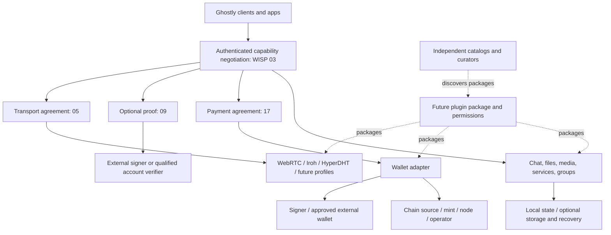

# Ghostly adapter and ecosystem roadmap

Planning and source review: **2026-09-22**. This is a living design inventory, not a specification, release announcement, integration endorsement or implementation authorization. It covers the ideas discussed for Ghostly and a bounded set of additional research suggestions; it is not an exhaustive directory of the world's protocols.

Ghostly is intended to become a coordination and interoperability layer with a small core and negotiated capabilities. The current chat application is a concrete reference client. The broader vision includes payments, optional identities, social experiences, groups, storage and recovery, plugins, apps, independent catalogs and a self-hosted GhostlyOS runtime. These remain first-class roadmap work, even where their delivery comes later.

## Public roadmap: outcomes before adapter names

The public story is **architecture → contracts → capabilities → adapters → verifiable releases**. A small coordination core lets independently built components agree on what they can do together. The reference app demonstrates those agreements in a familiar experience. More adapters should expand user choice, platform reach or resilience while reusing an existing contract; an adapter that adds none of those needs a stronger justification.

This public view summarizes the broad inventory without turning every candidate into a promise:

| Public status | Outcome / proposed commitment | Verifiable completion and dependency |
|---|---|---|
| Available locally, scoped | Reference chat with authenticated participation, supported live data methods, bounded DHT text, negotiated files and existing sats flow | Link exact release/profile/client evidence. “Available locally” does not claim the updated build is publicly deployed. Current media/service support has separate profile limits. |
| Planned — commitment proposal | An understandable site and public protocol/capability catalog, with the app as reference implementation | User-reviewed content and navigation, no unsupported feature claims, accessible user/developer pages and linked evidence. No redesign has started in this task. |
| Planned — commitment proposal | A reusable payment contract demonstrated by Cashu and a second selected payment implementation | Select Arkade or Bark after comparison; disposable-network settlement, fees, crash reconciliation and restore/exit evidence. Other rails remain candidates until scoped. |
| Planned — commitment proposal | Optional identity without forcing a global public account | No-proof sessions still work; a supported external signer path, selective binding, revocation and source-aware profile behavior pass review. Deferred code is not “in development” by default. |
| Planned — commitment proposal | Private groups and useful social composition | Admission/epochs/roles and a common distribution profile pass adversarial tests; profile, graph, content reads and publication are separately permissioned. |
| Long-term planned direction; scope not committed | Portable data, independent apps/catalogs and a self-hosted GhostlyOS runtime | Each is a staged deliverable with restoration, sandbox, provenance and operations gates below. Backup foundations begin with payments, not only at the end. |
| Exploration / candidates | Remaining named rails, proofs, hardware, transports and research suggestions | Promote individually only after source/API feasibility and a concrete user outcome are established. No implied delivery date. |
| In development | Only work with an approved bounded scope, owner and active implementation evidence belongs here | This task is researching/documenting the roadmap; it is not implementing the candidate adapters. UI switch work was completed separately. |

Before publishing a commitment, record an owner, bounded deliverable, dependencies, acceptance evidence, supported runtime, risks and the next decision. No fixed dates, final version numbers, staffing assumptions, investment return or market traction are invented here. For partners/investors, present shipped evidence and unresolved technical dependencies alongside the opportunity: reusable agreements, independent integrations and a reference experience that makes interoperability tangible.

Measure progress by independently compatible implementations, supported platform/profile combinations, successful recovery drills, independently authored adapters/apps and measured experience quality. Do not use a count of logos or Draft documents as a substitute. Resource/cost estimates and target performance budgets remain to be established before delivery commitments.

## Reading this roadmap

- [Contract and family map](#contract-and-family-map)
- [Evidence and readiness](#evidence-and-readiness)
- [Transport, discovery and delivery](#transport-discovery-and-delivery)
- [Payments and wallet composition](#payments-and-wallet-composition)
- [Identity, profiles and social data](#identity-profiles-and-social-data)
- [Hardware and signing](#hardware-and-signing)
- [Communication, groups and storage](#communication-groups-and-storage)
- [Plugins, apps, catalogs and GhostlyOS](#plugins-apps-catalogs-and-ghostlyos)
- [Delivery phases and decision gates](#delivery-phases-and-decision-gates)
- [Website and developer experience](#website-and-developer-experience)
- [Documentation gaps and decisions to record](#documentation-gaps-and-decisions-to-record)
- [Source review ledger](#source-review-ledger)

All external references below were consulted on **2026-09-22**. “Confirmed upstream” means the cited official specification, source or documentation describes that primitive; it does not mean it runs in Ghostly. Runtime columns describe an upstream route or a proposed integration target, never a tested Ghostly platform unless explicitly marked current. Pin exact releases, commits and specification revisions when an implementation is selected. Documentation and SDK surfaces can change independently.

## Contract and family map

A **WISP** describes an interoperable contract. A **capability** is a versioned ability a running client actually advertises. An **adapter** implements a contract using a particular technology. A **plugin** can package adapters, UI or apps for distribution. A **provider** operates a service or exposes a wallet/API; a **signer** authorizes a particular cryptographic operation. One provider can implement several capabilities, and one capability can have several providers.

The [working catalog](README.md) contains **22 Draft documents**, organized into the approved family ranges. See the [migration map](NUMBERING.md) for previous identifiers and compatibility. This roadmap does not create empty specifications or claim implementation merely from numbering. A new contract is justified by new interoperable semantics, not a new vendor logo.

| Family | Existing candidate contracts | Composition boundary / future question |
|---|---|---|
| Process, core, keys | [00](00-process.md), [01](01-ghost-core.md), [02](02-peer-keys.md) | Bounded rendezvous, participation and lifecycle; future recovery/root delegation requires explicit review. |
| Common negotiation | [03](03-capabilities.md) | Shared capability/version/limit intersection, authenticated selection, refusal and revocation. Avoid a separate discovery system for each family. |
| Live connectivity | [100](100-transports.md), [101](101-webrtc.md), [102](102-iroh.md), [103](103-hyperdht.md) | Transport selection and endpoint authentication; discovery, delivery, routing and storage remain separate responsibilities. |
| Optional external proofs | [300](300-peer-proofs.md), [301](301-nostr.md), [Pubky · 3xx planned](302-pubky.md), [Keet · 3xx planned](303-keet.md) | Key possession or a precisely qualified account assertion; neither authorizes spending nor proves a civil identity. |
| Conversation and services | [400](400-chat.md), [500](500-files.md), [600](600-media.md), [700](700-local-services.md) | Text, files, media and consented services can evolve independently of the chosen data transport. |
| Payments | [200](200-payments.md), [201](201-cashu.md), [203](203-lightning.md) | Payment method agreement, requests and results; wallet execution, signing, chain data and broadcast are distinct interfaces. |
| Admission and groups | [800](800-invite-join.md), [900](900-group-sessions.md), [GossipSub · 9xx planned](901-gossipsub.md) | Invitations, membership/epochs and distribution; GossipSub is optional and is not group encryption. |
| Social, recovery, applications | No new numbers allocated | Profile/graph/feed semantics, backup formats, plugin ABI, app state and catalog provenance may warrant future contracts after boundaries and independent use cases are demonstrated. |

**Design proposal:** negotiation should carry exact capability identifiers/versions, constraints, runtime availability and consent requirements, with a transcript-bound result. Installing an adapter does not make it available: a missing device, denied camera, locked signer, offline node or incompatible peer may prevent use. Keep local provider credentials and spending policy out of public discovery and peer advertisements. New logical labels in this roadmap are not assigned wire identifiers.

## Evidence and readiness

Keep three independent axes in the future catalog: **specification status**, **Ghostly implementation/release status**, and **conformance evidence**.

| Label used here | Meaning |
|---|---|
| Current, scoped | Documented in current reference implementation, within the specific client/profile limits below; not full WISP conformance. |
| Experimental / deferred | Source or past local tests exist, but the feature is not available in the release. |
| Candidate | Upstream primitive/API confirmed; Ghostly adapter remains proposed. |
| Research | The family is relevant, but API, integration or security semantics need investigation. |
| Blocked | A concrete prerequisite/API or validation gap prevents presenting a working path. |
| New suggestion | Added during this research, beyond the named ideas; optional and not implicitly prioritized. |

Current baseline sources are the [release decision](README.md), [transport increment](TRANSPORT-INCREMENT.md), [paired capabilities](PAIRED-CAPABILITIES.md), [DHT delivery](../DHT-DELIVERY.md) and [protocol](../PROTOCOL.md). They take precedence over older baseline tables:

- Ghostly participation keys, contact pins and comparison codes are active. **External identities and external profile lookup are deferred together**, including Nostr, Pubky, Keet, imports and Ring UI. Preserved code/data is not released functionality.
- Native paired data adapters exist for WebRTC, Iroh and HyperDHT; browser/extension availability is narrower. Do not infer a media adapter from a byte stream.
- Paired `files/2` and `payments/1` are mutually negotiated. The paired increment explicitly excludes calls and hosted HTTP. Legacy 1:1 media/services exist with their own client/profile gates; do not advertise them for every paired transport.
- DHT-only is bounded short text, with a 256 UTF-8-byte ceiling that can be lower after complete packet encoding, one outstanding text per direction and a five-minute acceptance/retry window. Stream fallback is separate. DHT publication is not a receipt or guaranteed delivery. Expiry does not erase packets retained elsewhere or local history.
- Web, extension and Tauri are the reference client surfaces considered here. Native React Native and a universal CLI/daemon capability set are future targets. Existing CLI/PWA references do not demonstrate parity with modern paired sessions or every roadmap capability.

### Promotion gates (proposed evidence levels, not new WISP statuses)

| Gate | Evidence needed before the next claim |
|---|---|
| Source reviewed | Official API/spec/source link, review date, license, responsible maintainer, unresolved questions and explicit trust assumptions. This roadmap mostly reaches this gate for candidates. |
| Adapter experiment | Pinned dependency and runtime, documented interface, disposable keys/data, local test or sandbox; no production-ready claim. |
| Interoperability demonstrated | Exact profile and independently produced vectors/peer implementation; negative negotiation, replay, wrong network/domain/key and downgrade tests. Two apps sharing one core are not independent implementations. |
| Release eligible | Real platform/device matrix, cancellation/restart/recovery, permission boundaries, dependency review, accessible UI, failure evidence and maintainer sign-off. Payment methods need settlement and no-double-spend recovery evidence, not only frame delivery. |
| Maintained | Versioned compatibility, reproducible CI/release evidence, migration/rollback, vulnerability response, tested backup restoration and deprecation policy. |

No candidate is promoted merely because it has a GitHub repository, a familiar signature curve, an SDK quickstart or an upstream “self-custodial” claim.

## Transport, discovery and delivery

| Candidate / capability | Provider or primitive; confirmed upstream source | Signer / authentication | Runtime/platform route | Ghostly status and next gate |
|---|---|---|---|---|
| Pkarr / Mainline DHT | Signed small DNS records, native DHT and HTTP relays: [Pkarr](https://github.com/pubky/pkarr) | Ed25519 records plus Ghostly participation/content authentication | Native UDP; browser/extension HTTP relay | **Current, scoped**: rendezvous and bounded short text. Validate UDP separately from relay tests, packet budget, stale records and retry limits. No general file/history store. |
| WebRTC | Data channels and media APIs: [W3C](https://www.w3.org/TR/webrtc/) | DTLS/session binding plus Ghostly peer authentication | Browser/extension; native WebView features vary | **Current, scoped**. Test ICE/STUN/TURN paths, WebKit permissions, suspend/resume and media capability separately. A TURN relay is infrastructure. |
| Iroh | Endpoint connectivity: [official docs](https://docs.iroh.computer/) | Iroh endpoint identity bound to Ghostly participation/transcript | Current Ghostly native Rust adapter; other targets need independent validation | **Current native**, Draft 102. Keep **Iroh** as the name. Generic QUIC peers do not automatically speak Iroh. Measure relay use and runtime availability. |
| HyperDHT / Hyperswarm | Hole punching and encrypted Noise streams: [HyperDHT](https://github.com/holepunchto/hyperdht) | Transport key plus Ghostly transcript binding | Current native bundled runtime; browser UDP is not assumed | **Current native**, Draft 103. Validate bootstrap, platform packaging, network changes and endpoint-key mismatch. |
| Tor | Onion/SOCKS integration based on [Tor specifications](https://spec.torproject.org/) | Onion/service authentication plus Ghostly identity; not the same key | Proposed native daemon/embedded route; browser requires an explicitly supported path | **Research**. Specify leak policy, DNS/discovery path, latency, dependency distribution and fail-closed behavior. Do not send UDP or silently fall back to direct IP under a Tor-only policy. |
| Local discovery / broadcast | Opt-in LAN discovery; mDNS candidate: [RFC6762](https://www.rfc-editor.org/rfc/rfc6762.html) | Advertisements are hints; authenticate before joining | Proposed native networking; browser needs supported bridge/API | **Candidate**. Multicast vs custom broadcast must be chosen; scope to interface/LAN, expire advertisements, never broadcast secrets or social identity by default. QR discovery is a separate route. |
| QR / explicit invitation | Current invite parser and [admission draft 800](800-invite-join.md) | Bearer bootstrap vs authenticated admission are distinct | Current camera/image/paste where permissions allow | **Current scoped UX**, future admission semantics proposed. QR carries a bounded invitation; it is neither a live transport nor proof of the person who displayed it. |
| GossipSub | [libp2p GossipSub 1.1 specification](https://raw.githubusercontent.com/libp2p/specs/master/pubsub/gossipsub/gossipsub-v1.1.md) | Group-authenticated envelope above mesh; topic is not authorization | JS/Rust/Go libp2p profiles require a selected common stack | **Planned 9xx**, number to be defined. Needs 900 membership/epochs, limits, scoring, abuse resistance, churn tests. No automatic durable history or total ordering. |
| Pear / Holepunch components | [Pear runtime](https://docs.pears.com/), [Hypercore](https://github.com/holepunchto/hypercore), [Autobase](https://github.com/holepunchto/autobase) | Append-only data signatures, writer authority and group keys require composition | Pear/Bare/Node or native bindings; each module differs | **Research** for distribution, storage and multiwriter state. Keet is a product; these libraries do not establish a supported Keet app API or redistribution right for its private internals. |
| Generic QUIC profile | [RFC9000](https://www.rfc-editor.org/rfc/rfc9000.html) | TLS identity and Ghostly binding must be specified | Proposed native QUIC library; browser WebTransport is a different API/profile | **Candidate**, conditional value beyond Iroh. Define ALPN, framing, endpoint discovery, certificates, flow control and NAT behavior before assigning a profile. No Iroh rename. |
| libp2p connectivity profile | [official stack](https://docs.libp2p.io/) and selected transport specifications | libp2p peer identity plus explicit Ghostly binding | Candidate JS/native implementation; per-transport availability | **New suggestion / research**. Could reuse relay/muxing infrastructure; choose an exact profile and avoid duplicating discovery blindly. Do not claim all implementations support all transports. |
| WebSocket relay profile | [RFC6455](https://www.rfc-editor.org/rfc/rfc6455.html) | E2E Ghostly envelope above authenticated service connection | Browser, extension, native, server | **New suggestion / candidate** for constrained networks. Server sees metadata; quota, retention, offline receipts and operator policy need explicit contracts. |

**Routing/service layer proposals:** distinguish a relay forwarding ciphertext, a store retaining it, a bridge translating protocols, and a multi-hop route. Specify what each intermediary can read, which authentication survives translation, loop prevention/hop budgets, replay IDs, quotas, provenance, custody of content keys, retention and cancellation. A bridge that decrypts is a different trust boundary from an opaque relay. None is automatic interoperability between arbitrary transports.

Offline delivery and reconciliation need durable IDs, ordered scope where necessary, storage receipts distinct from recipient receipts, expiry semantics, deduplication across paths, corruption detection and backpressure. A running Raspberry Pi can provide availability but cannot guarantee the recipient reconnects or remote data disappears.

## Payments and wallet composition

Ghostly coordinates a payment intent and mutually supported method; it need not operate the user's wallet. Manual external-wallet approval and explicitly authorized automated policy are both product directions. Split responsibilities:

| Interface proposal | Responsibility | Must not imply |
|---|---|---|
| Payment agreement | Asset/network, amount, payee, methods, expiry, fee ceiling and result evidence | Permission to spend merely because a peer advertised a method |
| Wallet adapter | Quote, create request, execute authorized intent, inspect status, recover/reconcile | Access to every wallet key or account |
| Signer | Sign a supported transaction or domain-separated proof, with appropriate confirmation | Generic arbitrary signing on every hardware wallet |
| Chain source / observer | UTXOs, fees, confirmations, reorg/status information | Signing or custody |
| Broadcaster | Submit already authorized signed transaction and return submission status | Final settlement or a unique spend on timeout |
| Policy broker | Per-app/payee/asset budgets, expiry, approval, revocation and audit | Automatic cross-asset conversion or spending from a mini-app |

### Rails and wallet adapters

| Rail / candidate | Provider / signer route | Runtime and platform route | Confirmed evidence, Ghostly status, restriction / next decision |
|---|---|---|---|
| Cashu | Cashu SDK + chosen mint; wallet controls bearer proofs, mint backs redemption | Current app integration; upstream TS/Rust/Python options | **Current, scoped**, [Draft 201](201-cashu.md), [NUTs](https://github.com/cashubtc/nuts), [libraries](https://docs.cashu.space/). Mint trust/custody must be visible. Verify mint/unit allowlist, quote states, duplicate redemption, keysets and recovery; NUT07/09 availability is not universal seed recovery. |
| Lightning BOLT11 | Current invoice flow through wallet/mint; future external node/wallet providers below | Current app subset; provider/runtime determines expansion | **Current subset**, [Draft 203](203-lightning.md). Advertise exact create/pay/lookup methods; validate invoice signature/network/amount/expiry in executing wallet. A displayed invoice or peer receipt is not settlement evidence. |
| Ark via Arkade | Arkade TypeScript SDK, operator and wallet signer | TypeScript SDK 0.4.74 selected for the in-development browser adapter; native parity unverified | **In development**: [wallet docs](https://docs.arkadeos.com/wallets/getting-started/introduction), [security model](https://docs.arkadeos.com/learn/core-concepts/security-and-trust-model). Preserve exit transaction data, measure operator/chain dependencies and exit costs. Selected second implementation; local regtest send/receive, HD return spend and receipt reconciliation verified. Shared Cashu/Ark review flow is implemented; encrypted local backup restore verified; exits and broader platform/UI coverage remain incomplete. Not release-ready. See [Draft 202](202-arkade.md). |
| Ark via Bark | Second's Bark SDK (WebAssembly build `@secondts/bark` 0.24.0, bark 0.7.1) and Second's server; wallet signer in the SDK | Web/WASM selected for the in-development browser adapter (one path for web, extension offscreen page and Desktop WebView); Rust crate, Barkd REST daemon and UniFFI bindings upstream | **In development, Testnet only**: [Web SDK](https://second.tech/docs/bark-sdk/wasm), [connection details](https://second.tech/docs/connection-details), [backups](https://second.tech/docs/backups). Checked 2026-09-23: **not wire compatible with Arkade** (Bark refuses Arkade addresses; out-of-round payments only reach the same server), so it is its own method `bark` / `payments-bark/1`. Signet server `ark.signet.2nd.dev` (faucet needs a GitHub login); local regtest send/receive, on-chain board, chat Send/Request and payee-side receipt verification verified; Mainnet not enabled although Second runs one. Seed-only recovery is server-dependent; exits, Lightning via Bark and funded signet remain open. See [Draft 204](204-bark.md). |
| Bitcoin on-chain | Wallet adapter + BDK/Core/other wallet + chosen signer and chain observer | Native library/node first; explicit external wallet/PSBT route for browser | **Candidate**: [BDK](https://bitcoindevkit.org/), [Core RPC](https://bitcoincore.org/en/doc/), [PSBT](https://github.com/bitcoin/bips/blob/master/bip-0174.mediawiki). Coin selection, fees, change, RBF/reorg, broadcast ambiguity and confirmation policy must be specified. |
| Fedimint | Federation client, mint/wallet/Lightning modules and gateway | Upstream Rust client with desktop/mobile/WASM routes | **Candidate**: [technical reference](https://docs.fedimint.org/). Federation/guardian and gateway assumptions differ from Cashu; do not treat tokens as interchangeable. Gate on operation log, federation identity, restore and gateway failure tests. |
| Spark | Spark wallet SDK or separately selected Breez SDK; operator/service dependencies | Upstream TS/RN; Breez Rust bindings documented | **Candidate**: [SDK overview](https://docs.spark.money/wallets/overview). Pin network and trust/exit model; test transfer states, receive, exit, recovery and Lightning route. Token support does not establish a particular USDT issuer/asset or chain. |
| Liquid | Elements/Liquid wallet integration, chosen signer and network service | Native wallet/node candidate; browser through an explicitly supported wallet API | **Candidate**: [Liquid developer docs](https://docs.liquid.net/docs/welcome-to-liquid-developer-documentation-portal). Separate L-BTC and issued assets; validate asset IDs, confidential-transaction/blinding support, fees and federation/peg assumptions. Not equivalent to Bitcoin L1. |
| USDT through Tether WDK | `@tetherto/wdk-wallet-evm` 1.0.0-beta.19; separate encrypted seed, configured EVM RPC, ETH for gas | Shared browser/Tauri adapter; local Anvil transaction tests; native financial runtime not verified | **Experimental implementation**: Ethereum chain 1 canonical USDT, six decimals; send/receive/review/reconcile implemented. Signed TEST-USDT transactions on Anvil chain 31337 validate recovery but are not Tether-issued USDT. No mainnet funds were used. Issuer controls, gas costs, RPC trust, two-block confirmation and operational limitations remain explicit. See [implementation scope](../USDT-INTEGRATION.md). |
| Manual external wallet | Approved invoice/address/payment URI; return to Ghostly for status | Cross-platform copy/QR/deep link, wallet-dependent callback | **Proposal** extending current invoice UX. “Opened wallet” and user “done” are not confirmed settlement. Track unknown outcomes and independently reconcile where possible. |

### Providers, chain data and signer boundaries

| Candidate | Capability / provider contract | Signer and runtime restrictions | Gate and official source |
|---|---|---|---|
| LND | Invoice creation, payment execution/status through node API | Node controls keys; scoped credentials/macaroons, authenticated connection; native/server adapter or constrained bridge, never expose admin credential to apps | **Candidate**. Test timeout/TrackPayment recovery and node availability. [LND docs](https://docs.lightning.engineering/lightning-network-tools/lnd). |
| Core Lightning | Node RPC/payment/invoice integration | Node signer; local RPC or explicitly configured authenticated service; provider permission model must be pinned | **Candidate**. Separate node implementation from rail; failure/status and least-privilege tests. [Official API](https://docs.corelightning.org/reference). |
| NWC | Delegated remote-wallet request/response via Nostr relays | Per-connection wallet authorization, **not** a social identity proof; wallet may be custodial or self-hosted | **Candidate**. Negotiate supported commands, budgets and revocation; do not require Nostr identity feature to use NWC. [NIP47](https://raw.githubusercontent.com/nostr-protocol/nips/master/47.md). |
| WebLN | Browser/provider integration for Lightning requests | Injected/approved wallet provider; capabilities differ and native support needs bridge | **Candidate**, not a separately numbered WISP. [WebLN guide](https://www.webln.guide/). Test provider missing, approval canceled and ambiguous execution. |
| Bitcoin Core RPC | Wallet operations, chain observation and broadcast, separately permissioned | Personal node/server; RPC credentials stay in privileged backend; wallet may be watch-only/external-signer | **Candidate**. Never proxy arbitrary node RPC through a public shared app. [RPC reference](https://bitcoincore.org/en/doc/). |
| Electrum protocol | History/UTXO/status/broadcast service | Server observes wallet queries; protocol endpoint is not a wallet signer | **Candidate**. Verify headers/proofs as applicable, server/network identity and privacy policy. [Protocol](https://electrum-protocol.readthedocs.io/en/latest/). |
| Esplora | HTTP chain query, fee and transaction broadcast API | Indexer observes queried addresses; no signer | **Candidate**. Bound responses and distinguish accepted broadcast from confirmation. [API](https://github.com/Blockstream/esplora/blob/master/API.md). |
| BDK | Wallet construction/synchronization primitives with selected backends | Rust/library integration; descriptors and signing strategy selected separately | **Candidate**. Bind a wallet instance/network to its observer and signer; not a hosted payment rail. [BDK](https://bitcoindevkit.org/). |
| PSBT exchange | Standard unsigned/partially signed transaction handoff | Hardware/software signers, files or QR; format/version/script support varies | **Candidate**. Validate every returned input/output/change/fee against authorized intent. [BIP174](https://github.com/bitcoin/bips/blob/master/bip-0174.mediawiki). |
| Personal wallet / Umbrel | User-selected LND/CLN/Bitcoin/Bark or another installed provider | Self-hosted service with explicit pairing; remote connectivity, uptime, credential isolation | **Candidate deployment composition**, not a new rail. [Umbrel app packaging](https://github.com/getumbrel/umbrel-apps), [Bark Wallet installation](https://second.tech/docs/bark-wallet/install.md). No personal service connected in this research. |

### Payment execution and recovery requirements (proposal)

An intent binds request ID, authenticated payee context, asset/network, exact units, amount, selected provider/method, expiry and fee ceiling. Use integer/decimal-string units; never float conversion for settlement. Negotiate common methods and preferences without leaking wallet balance or credentials.

Persist intent and attempt identity before calling a provider. Track at least offered, approved, submitting, pending, succeeded, failed, canceled and **unknown**; map these to provider-specific evidence rather than flattening them. Cancellation after broadcast may be impossible. A transport reconnect resends status or the same authorized operation only when idempotency is established; it must not create a new spend. A silent/timeout provider is an unknown result to reconcile, not permission to select another rail. Changing asset, chain, payee, amount or fee outside the approved policy needs a new authorization. Refunds/reclaims are separate operations, not erasure of a paid request.

Before release, use real disposable **regtest/signet/testnet/sandbox** services as appropriate: successful send/receive; independent settlement check; duplicate request; crash before/after provider response; expired quote; unknown outcome; canceled signer; unavailable mint/node/operator; insufficient liquidity/gas; restart with pending operation; fee cap; wrong asset/network; reorg; restore and exit where supported. Record exact versions and limitations. Unit tests or fixture payment frames do not replace this evidence. No funds are operated by this roadmap task.

**Second-adapter decision:** evaluate Arkade and Bark against the same intent/status/recovery contract, minimum supported client set, maintained SDK/license, exit-data backup, resource use and signer coupling. Prototype the smaller verified path only after the website stage and a recorded implementation decision. Keep both in the long-term catalog; do not imply a generic Ark adapter handles both.

## Identity, profiles and social data

Ghostly participation is the default. An optional future Ghostly root could delegate to per-contact/ephemeral participation keys, with explicit lifetime, revocation, key loss and recovery rules. That is a **proposal**, not a current global account. Avoid public linkage by default: proof sharing is selected per contact, and withdrawing a proof cannot delete copies a peer retained.

“Social negotiation” is an exploratory product phrase. Model these as separate capabilities negotiated through 03:

| Layer | Data / action | Trust and permission boundary |
|---|---|---|
| Proof | Context-bound evidence of a key or qualified account authorization | Nonce, audience/domain, participation binding, lifetime and independent verification; no automatic login/publication permission |
| Profile | Name, avatar, bio and source metadata | Self-described content; local cache, provenance and manual nickname precedence; fetching is not proof |
| Social graph | Follows/followers, memberships, links between identities | Direction, source, visibility and freshness; no inference that every edge is reciprocal or trusted |
| Content read/search | Posts, replies/comments, reactions, feeds and query results | Pagination, content limits, moderation, ranking source and cache policy; index results may disagree |
| Publication | Create/edit/delete content, follow/unfollow, react | Separate explicit authorization/scope; network propagation and deletion limits |

### Identity and social candidate matrix

| Ecosystem | Confirmed upstream primitive / source | Signer, runtime and trust distinction | Ghostly status / next gate |
|---|---|---|---|
| Nostr | Signed events; [NIP07](https://github.com/nostr-protocol/nips/blob/master/07.md), [NIP46](https://github.com/nostr-protocol/nips/blob/master/46.md) | Browser external signer or remote bunker; event signature verification separate from relay delivery | **Experimental/deferred** proof and profile code. Revalidate scoped event format, replay/expiry and actual signers. Profile/graph/feed/write adapters require separate event schemas and permissions. |
| NsecBunker | Remote signer implementation: [upstream repository](https://github.com/kind-0/nsecbunkerd) | NIP46 provider; user key can differ from remote signer key; hosting and approval policies matter | **Candidate signer**, not a new identity rail. Check maintenance, current NIP compatibility, refusal/timeouts/revocation; no deployment assumed. |
| Pubky / Ring | [AuthToken protocol](https://github.com/pubky/pubky-homeserver/blob/main/docs/AUTH.md), [Ring routes](https://github.com/pubky/pubky-ring) | Ring documents scoped homeserver authorization, not a general Ghostly arbitrary-message signing API | **Experimental/deferred; standard storage proof unfinished**. A temporary homeserver commitment is a research path, with server trust, independent fetch, freshness and cleanup to validate. Do not modify Ring or expose auth tokens as peer proofs. |
| Pubky profiles / graph / content | Existing local [profile experiment](PUBLIC-PROFILES.md), upstream homeserver/indexer separation | Cached indexed metadata must identify source; an indexer response is not automatically a user-signed payload | **Deferred**, broader social adapters **research**. Separate source data, indexes, publication permissions and multiple-indexer disagreement. |
| Keet | [keet-identity-key](https://github.com/holepunchto/keet-identity-key) supplies derivation primitives | Compatible key material does not prove control of an existing Keet account or expose a supported signer/profile API | **Compatible-import experiment deferred; existing-app bridge blocked**. Need public supported signing/export/API and license evidence; do not ask for a seed or infer compatibility from Ed25519. |
| OpenPGP / PGP | [RFC9580](https://www.rfc-editor.org/rfc/rfc9580.html) signatures, key/subkey formats | Native agent or vetted library; hardware-backed OpenPGP possible | **Candidate**. Define detached signature/canonical bytes, permitted algorithms, signing subkey, revocation/expiry and trust display. Key possession is not trust in a UID/name. |
| SSH | `ssh-keygen -Y` signing/verification and namespaces: [OpenSSH manual](https://man.openbsd.org/ssh-keygen) | Native agent/key or supported hardware security key; browser needs bridge | **Candidate**. Specify namespace/principals/allowed signers; no silent reuse of SSH auth authority as app consent. |
| Bitcoin address proof | Legacy signmessage and [BIP322](https://bips.dev/322/) are different formats | Wallet/device-specific message signing; script/address validation, not merely same secp256k1 curve | **Candidate**. Pin BIP revision/variant and test vectors; no proof of current balance, historical sender or willingness to spend. Old BIP322 draft formats may differ from current specification. |
| DID | [DID Core](https://www.w3.org/TR/did/) verification relationships | Select a concrete DID method, resolver and proof suite; rotation/resolution may be network-dependent | **Research family**, not one adapter. Method-specific trust, service endpoints and recovery must be chosen. A resolved document alone is not a fresh proof of possession. |
| Farcaster | [Auth client](https://raw.githubusercontent.com/farcasterxyz/auth-monorepo/main/packages/auth-client/README.md) requests/verifies sign-in; separate [Mini Apps](https://miniapps.farcaster.xyz/) | Wallet signature and account/FID binding with relevant chain queries; auth relay and domain/nonce handling | **Candidate auth/proof route**, social graph/feed/publishing **research**. Sign-in does not automatically grant publication or validate all profile data. |
| AT Protocol / Bluesky | [protocol overview](https://atproto.com/guides/overview), [OAuth profile](https://atproto.com/specs/oauth) | DID/account resolution and OAuth/DPoP authorization; an app's DPoP key is not the user's repository identity key | **Candidate account integration**, portable peer proof **research**. Separate PDS/repository data from AppView/feed/search indexes, scopes and handle changes. |
| Secure Scuttlebutt | [SSB protocol guide](https://ssbc.github.io/scuttlebutt-protocol-guide/) signed feeds and replication | Feed author keys; runtime and chosen feed format matter | **Research**. Feed replication is not a generic challenge signer; establish fresh context binding, forks, migration and supported maintained implementation before adapter selection. |
| ActivityPub / Mastodon | [ActivityPub](https://www.w3.org/TR/activitypub/), [Mastodon client API](https://docs.joinmastodon.org/client/intro/) | Federated actor/server relationships and client OAuth are different from user-held key signatures | **Candidate account/profile/social integration**, key-possession proof **unproven**. Select server/client API, instance discovery and scopes; never label OAuth account access as a hardware-backed peer proof. |
| GitHub | [OAuth authorization](https://docs.github.com/en/apps/oauth-apps/building-oauth-apps/authorizing-oauth-apps) | Provider-authenticated account access; separate from SSH key control or a signed commit | **Candidate qualified account assertion**. Define audience/nonce and whether peers trust GitHub or an attestation service. Public profile fetch alone proves nothing about contact ownership. |

Profile cache design should retain source URL/provider, subject ID, verification category, signed-object ID when available, fetched/checked/expiry time and stale state. Normalize text and images; bound bytes/dimensions, refuse active content and unsafe fetch destinations. Fetching can reveal IP/query relationships. No unrequested publication or import of other contacts' social graphs. Loss of proof validity must not silently merge contacts or replace their pinned participation key.

## Hardware and signing

Hardware wallet support is a composition axis across payments and optional proofs, not a guarantee that a device can sign every domain. Keep transaction signing, address-control proof and arbitrary-message signing separate in capability discovery. A common curve does not establish compatible derivation, hash, serialization or approval semantics.

| Candidate | Confirmed official capability/source | Runtime / physical route | Restriction and Ghostly gate |
|---|---|---|---|
| Trezor | Current [Bitcoin messages](https://raw.githubusercontent.com/trezor/trezor-firmware/main/common/protob/messages-bitcoin.proto) include message/transaction operations; [THP transport](https://docs.trezor.io/trezor-firmware/common/thp/specification.html) | Connect/device integration candidate; WebUSB or native transport depends on model/firmware/browser | **Candidate**. Pin device/firmware and exact method/script; do not infer BIP322 or arbitrary Ed25519/Nostr signing. Test on-device readable intent, cancel/disconnect, derivation path and result verification. |
| YubiKey: WebAuthn/FIDO | [WebAuthn](https://www.w3.org/TR/webauthn-3/), [Yubico](https://developers.yubico.com/) | Browser/OS authenticator, USB/NFC or platform mechanism as supported | **Candidate authentication**, portable Ghostly root **research**. RP ID/origin/challenge and user presence/verification are essential; credentials may be device-bound or synced. Not a general raw-signature oracle or Bitcoin signer. |
| YubiKey: OpenPGP / PIV / SSH | [OpenPGP](https://developers.yubico.com/PGP/), [PIV](https://developers.yubico.com/PIV/Introduction/YubiKey_and_PIV.html), OpenSSH route above | Native agent/smartcard middleware; device/firmware/slot-specific algorithms | **Candidate signer profiles**. These applets have different policies and formats from FIDO. Check supported curves, PIN/touch, subkeys and revocation; no blanket secp256k1 assumption. |
| Ledger | [Bitcoin Signer Kit](https://developers.ledger.com/docs/device-interaction/dmk-ts/references/signers/btc) documents messages, PSBT and transactions | Device Management Kit and installed Bitcoin app; USB/Bluetooth route must be checked per device/platform | **New suggestion / candidate**. Pin app/device policy support and descriptor/PSBT versions, confirm outputs and fees; message support does not automatically imply Ghostly/Nostr/BIP322 compatibility. |
| COLDCARD | [PSBT signing](https://coldcard.com/docs/ready-to-sign/), [BIP322 support](https://coldcard.com/docs/bip322/) | USB/file/MicroSD/NFC or Q QR, model-dependent | **New suggestion / candidate**. Current BIP322 docs distinguish completed vs older draft flow and firmware requirements. Validate exact format, message limits, QR reassembly and device review; no funds/signatures requested now. |
| Blockstream Jade | [official firmware/source](https://raw.githubusercontent.com/Blockstream/Jade/master/README.md), [device documentation](https://help.blockstream.com/blockstream-jade) | Candidate native/hardware or QR integration; select exact device transport/API | **New suggestion / research** for Bitcoin/Liquid. Need supported signing/message matrix, firmware pin, blinding-data and authorization review. Do not assume parity with Trezor or generic PSBT transport. |

A signer broker should return only public descriptors, approved signatures and bounded results. Seeds, private keys, node credentials and bearer payment secrets never become mini-app APIs. A user-selected hot wallet can retain keys inside its privileged wallet component; hardware/remote integration must not require exporting them. Distinguish local device unlock from peer authentication and spending approval. Recovery must account for lost devices, passkey synchronization, wallet descriptors, counters/state and provider-specific exit data, not promise one mnemonic restores every layer.

## Communication, groups and storage

These families remain explicit parts of the vision. The following are proposed expansions unless scoped as current.

| Family / candidate | Composition and provider/runtime options | Dependencies and criteria for readiness |
|---|---|---|
| Text, presence and typing | Current 400 chat; transient presence/typing should be separately advertised with TTL and privacy preferences | Authenticated session, per-sender sequence/limits, reconnect semantics and no durable typing log by default. “Online” is a hint, not proof a person is available. |
| Files and attachments | Current 500 / paired files/2; future disk streaming, range resume and storage adapters | Integrity digest, byte limits, receiver consent and durable receipt; current retry restarts the file, not a range resume. File delivery need not imply permanent backup. |
| Voice/video/screenshare | Existing 600 legacy media; WebRTC capture/codec profile; native and mobile variants to validate | Permissions, device lifecycle, media encryption and capability negotiation; test each profile/runtime. Group mesh/SFU and recording are separate decisions, including who can decrypt. |
| Private groups | 800 admission + 900 membership, roles/policies, epochs, welcome/remove, one chosen distribution profile | Define membership authority and recovery; rekey on removal, concurrent invites, offline members, rollback/replay. Initial eight-member test cap is a proposal, not measured product capacity. |
| Group crypto | **New suggestion / research:** evaluate established [MLS RFC9420](https://www.rfc-editor.org/rfc/rfc9420.html) and maintained implementations | No automatic MLS adoption. Resolve credentials, authentication service, delivery service, forks, multi-device membership and tested epoch recovery. GossipSub alone provides none of these. |
| Channels / topics / forums | Group or public content schemas, threading, replies, moderation and history policy | Not every topic is a separate transport/group key. Define audience, post authority, deletion/moderation semantics, indexing and spam quotas. |
| Password / payment-gated access | Admission policy above 800/900 and 200; user-defined roles and expiring entitlements | Password is not a shared permanent group key; resist guessing with appropriate reviewed protocol/rate policy. Payment confirmation can authorize admission but does not cryptographically erase past content after expiry/removal. Refund/dispute policy explicit. |
| Local state | Current IndexedDB/history; future native database/filesystem abstraction | Transactional persistence, quotas, encryption-at-rest policy and schema migrations. [IndexedDB standard](https://www.w3.org/TR/IndexedDB/) is a storage API, not a backup guarantee. |
| Remote encrypted storage | User's own service, scoped Pubky homeserver, object storage or consented peer provider | **Candidate family**: encrypt before upload, define keys/retention/size/integrity, provider deletion limits, quotas and independent restore. Pick exact API before claiming cross-provider compatibility. |
| Distributed storage | Hypercore/Autobase research; **new suggestion** IPFS/content addressing | [IPFS persistence](https://docs.ipfs.tech/concepts/persistence/) requires retention/pinning; [privacy](https://docs.ipfs.tech/concepts/privacy-and-encryption/) needs separate encryption. Signed logs/content hashes do not mean confidentiality, availability or guaranteed erasure. |
| Backup / export / import / migration | Versioned encrypted archive + optional remote replication, selective per-layer export | First-class requirement, beginning with payment recovery. Define included secrets/history/files/provider state, authenticated format, KDF, rollback detection, restore drill, incompatible versions and stolen-device revocation. Migrate without merging unrelated identities or replaying spent tokens. |
| Store-forward / offline sync | Peer or service mailboxes, retained protected envelopes, reconciliation over any approved transport | Consent, quotas, expiry, dedup, sender/recipient receipts and anti-abuse; policies per conversation. Preserve DHT-only's bounded behavior rather than silently adding a server store. |
| Local HTTP / Bitcoin / Lightning services | Existing 700 HTTP subset; future explicit service schemas for node query or payment request | Name-based allowlist, request/response bounds, local permission and client capabilities. Read-only chain query and wallet administration are separate authorities. Never expose broad node RPC or credentials through generic proxy by default. |

## Plugins, apps, catalogs and GhostlyOS

| Family / candidate | Proposed deliverable | Dependencies / trust boundary |
|---|---|---|
| SDK and manifests | Stable adapter interface, exact capability versions, runtime requirements, permissions, resources, licenses, publisher identity and dependency constraints | Separate discovery metadata from executable code. Versioned host ABI and conformance vectors; no undocumented private engine access. |
| Plugin sandbox | Restrict filesystem/network/UI/CPU/memory; broker sensitive APIs | **Research**: browser sandboxed origins/workers and **new suggestion** [WASI](https://wasi.dev/) components where suitable. A worker or WASM module alone is not a complete security boundary. Native plugins need process isolation/OS permissions. |
| Package authenticity and updates | Signed package hashes/manifests, publisher key rotation, lockfiles, review provenance, rollback protection and uninstall/export behavior | **New suggestion**: evaluate [TUF](https://theupdateframework.io/docs/overview/) for update metadata. A valid signature identifies a publisher; it does not certify a safe app. Permissions must be re-reviewed when expanded. |
| Mini-apps and games | Chess, a racing game, shared tools and payment-request UI | App-specific shared state and authority; realtime routing may use transport 100. **New suggestion:** [Automerge](https://automerge.org/docs/hello/) for suitable collaborative state, not authoritative payment settlement or automatic anti-cheat. Chess turn order and racing latency need different models. |
| Marketplaces / hosting example | Discovery, offers, negotiated service terms and approved payments for hosting | Product composition, not a mandatory new WISP. Define delivery evidence, duration, availability, dispute/refund and moderation before paid deployment. |
| Multiple indexers | Query several independently chosen providers, provenance, freshness and disagreement display | Indexers rank/omit data differently. Preserve source assertions separately, avoid collapsing them into one “true” reputation score, and allow self-hosted/local sources. |
| Catalogs / curator stores | Family/capability search, publisher pages, runtime compatibility, reviews and warnings | Independent stores can curate differently. Installation permissions and package verification remain local; a catalog listing is not proof of conformance. |
| Reputation / trust | User-controlled source selection, signed reviews where appropriate, context-specific reputation | Identity linkage and Sybil resistance require explicit policy; do not infer personal trust from a payment or social follower count. Show conflicts and evidence origin. |
| Paid plugins / indexers | Optional licensing/access/subscriptions and payments through 200 | Non-paying core remains composable as a design objective; expiry, offline license verification, refunds, cancellation and key loss require review. Paid ranking must be identified as such. |
| GhostlyOS | Long-term headless/runtime composition of adapters, apps, policies, local data and UI clients | Start with a service runtime rather than assume a new kernel/distribution. Process supervision, encrypted persistence, remote admin, upgrades, logs and backups need their own threat model. |
| Self-hosted 24h | Raspberry Pi/ARM64, x86 host, Docker and Umbrel packaging candidates | [Umbrel packaging](https://github.com/getumbrel/umbrel-apps) is an upstream route, not an installed Ghostly app. Test boot/crash recovery, disk full, resource limits, key custody and remote access; relay/listener exposure is explicit. |
| Future clients | React Native, improved PWA behavior, CLI/daemon tooling and plugin hosts | Each advertises what it actually supports. Native SDK availability is not proof of a Ghostly mobile integration, background delivery, battery performance or App Store acceptance. |

Applications should call narrow host capabilities such as requesting an approved payment or opening an explicitly shared service. A mini-game must not receive a wallet object, raw signing function, seed, native shell or unrestricted HTTP proxy. Plugin dependency resolution and revocation must preserve a user's ability to export data when a store or publisher disappears.

## Delivery phases and decision gates

The phases preserve the requested order while allowing earlier layers to improve every release. They are not promised dates, release versions or fixed staffing estimates. “Ready” below is acceptance evidence, not automatic authorization to build or deploy.

| Phase | Scope and output | Depends on / exit gate |
|---|---|---|
| UI closure | Connection switches and honest availability; preserve conversations, consent and Iroh naming | Completed local UI work is separate from protocol conformance. Keep accessibility/native/mobile evidence and known test gaps visible. |
| Website and catalog | Explain user experience and coordination vision; preserve Ghostly authorship, ghosts/personality; current vs future tags; WISP/adapter pages | Agree published-site vs local-story base with user; audit claims against release/profile evidence; review navigation and scroll narrative before broad redesign. No deployment in this roadmap. |
| Payment foundation + second implementation | 17 provider interface; maintain Cashu; compare Arkade/Bark for second implementation; manual external wallet and policy model | No-double-spend state machine, network/asset precision, sandbox settlement, **backup/restore and exit-data foundation already here**, platform spike and implementation selection recorded. |
| Payment breadth | LND/CLN/NWC/WebLN, Bitcoin chain/signing composition, then Fedimint/Spark/Liquid/WDK lanes as evidence permits | Per-provider credentials, explicit trust/custody, real test environments, fee/finality/recovery matrix. Hardware transaction signing can land here independently of social identity. |
| Optional identity |09 proof lifecycle, no-proof sessions, external signers, source-qualified profiles; revisit deferred Nostr/Pubky and blocked Keet | Domain-bound challenges, replay/rotation/revocation, selective sharing; actual supported signer/device path. Root identity/recovery reviewed; no re-enable-by-flag shortcut. |
| Groups, profiles and graph |20/21 admission/epochs, selected distribution, source-aware profiles/graph; channels/topics and content schemas | Group crypto/topology and offline membership tested; read/publication permissions separate. Expand text/files/media/payment capabilities only where each group profile supports them. |
| Durable services and app platform | Storage providers, richer backup/migration, store-forward, local services, SDK/manifest/sandbox; early mini-apps | Restore drills, quota/abuse controls, package/host isolation; independently authored adapter and app. Storage/recovery work begins earlier and expands here. |
| Catalog economy and GhostlyOS | Multiple stores/indexers, contextual trust, optional paid apps/indexers, long-running self-hosted runtime | Maintained plugin ABI/update trust, data portability, permission revocation, service ops and reproducible platform evidence. No single mandatory store, identity or payment provider. |

Cross-cutting work in every phase: accessibility, localization, provenance, dependency pinning, threat modeling, interoperability tests, bounded resources, diagnostics without secrets, export/recovery and accurate website status. Media/transport improvements need not wait for social proofs. Groups need authenticated participation, but not a mandatory external identity. App/plugin distribution is orthogonal to whether a feature is bundled first.

### Concrete research tickets to turn into scoped work later

| Decision | Required artifact before implementation selection |
|---|---|
| Arkade vs Bark first | Same test intent on supported disposable network; API/status/recovery/backup comparison; dependency/license and target-client matrix; explicit choice and reason. |
| Payment interface | State diagram including unknown settlement; schema for amounts/network/fees/evidence; provider conformance tests and manual-wallet semantics. |
| Signer broker | Device/API/firmware grid with transaction, message and proof formats separated; approval/cancel/disconnect tests; no secret export route. |
| Pubky standard flow | Document exactly what auth/storage access proves, challenge binding, independent reader, cleanup and server trust; confirm supported Ring without modifications. |
| Keet app integration | Public supported API/export/signing contract and redistribution/license evidence; otherwise keep blocked rather than importing secrets as a substitute. |
| Group profile | Select membership authority, crypto implementation, transport/distribution and membership recovery; adversarial churn/removal/partition tests. |
| Recovery | Layer-by-layer data inventory and restore drill; identify what is recoverable from seed alone, database, signer or external provider. |
| Plugin host | Minimal ABI and permissions threat model, malicious-plugin test, dependency/update policy, independently authored example. |
| Indexer/store federation | Provenance schema, query merge/disagreement behavior, signed package discovery, privacy and moderation policy; payment is optional. |
| GhostlyOS host | Supported hardware/resources, headless lifecycle, secure pairing/admin, failure/reboot/upgrade/restore evidence. |

## Website and developer experience

The website presents the **Ghostly protocol/ecosystem and its capabilities**, with the app as a reference implementation. It offers two connected perspectives of the same project; it must not force a visitor to choose “user or developer” before seeing anything useful. Preserve Ghostly branding and Miguel Medeiros authorship. Upstream brands indicate compatibility or research, not affiliation.

### User homepage and technical landing

Route names below are **proposed information architecture**, not routes created by this document.

| Surface | Audience, narrative and content | Main action / evidence |
|---|---|---|
| `/` | First serve a nontechnical visitor: meet a contact, talk, share, and use supported payments; explain the useful experience in plain language before implementation details | Try the app, then download if appropriate. No QUIC/DHT jargon required in hero text; availability linked to the actual client/profile. |
| `/developers` | Visible “For developers” navigation with its own shareable URL; reveal coordination, common negotiation, contracts and interchangeable implementations | Read contracts, build an adapter, inspect the reference app and contribute. The developer page is a landing page, not an obscure footnote. |
| Developer capability/WISP catalog | Family tags, existing candidate numbers and distinct specification/implementation/conformance/platform fields | Discover by capability or problem. Family grouping never renumbers WISPs or invents reserved ranges. |
| Individual WISP pages | Purpose, boundary, dependency map, format/version, refusal/failure behavior, examples, security limits, implementations and tests | Read source or run a labeled demo; reserved space for Miguel's future short video lesson with captions/transcript. |
| Public roadmap | The outcome-based table above, supported by detailed family inventory | Show available, in-development, planned/commitment-proposed and exploration separately; include last review and exit evidence. |
| Docs and contribution | WISP author guide, adapter guide, setup, conformance vectors, runnable examples and reference client architecture | An independent implementer should be able to contribute without private engine knowledge. |

A WISP guide should cover existing-contract fit, encodings, versioning, downgrade/refusal behavior, trust assumptions, vectors and review. An adapter guide should cover runtime detection, bounded APIs, permissions, packaging and independent interop. Demos must say whether they use fixtures, a disposable test network or an actual release capability; they must not simulate settlement or a connection as if it happened.

### Main explainer video and WISP lessons

Record a future, well-produced **main Ghostly explainer video** using the same recognizable ghost characters and plain visual language as the site. Its job is to connect the useful experience to the larger ecosystem, while distinguishing current capabilities from the roadmap. It complements the short developer lessons per WISP; it does not replace readable documentation or accessible page content.

A roughly one-minute runtime and a chapter storyboard were discussion suggestions, **not approved requirements**. Before production, agree audience, script, claims, narration, visual continuity, captions/transcript, formats and placement. Reuse the site story where appropriate, with clearly illustrative scenes rather than fabricated product activity. No video generation or production is authorized by this documentation task.

### Requested visual direction: Three.js chapters

The user wants a **mini-scene in the background of each section of both landing pages**, transformed by scroll and coordinated with the content. This is a recorded visual direction for future design, **not authorization to implement particular scenes in this research task**. One continuous scene with chapter transitions is a proposed implementation strategy; the final scene architecture remains a design/performance decision.

| Narrative chapter | User-page scene proposal | Technical-page scene proposal |
|---|---|---|
| Find each other | Simple expressive ghosts approach and acknowledge one another | Discovery hints arrive; identity/authentication is revealed as a distinct step |
| Agree and connect | A clear connection forms only when the story reaches that step | Common capability intersection selects a compatible adapter; unsupported pieces remain visibly unavailable |
| Do something together | Messages, a shared file and a separately approved payment illustrate useful actions | Contract remains stable while a supported adapter changes; payment provider and signer remain separate components |
| Expand the experience | Groups/apps appear in an explicitly marked future chapter where not released | Layer map reveals proposed storage, social, plugin and runtime dependencies, with roadmap status |
| Start or build | Ghosts guide attention to the actual CTA | Reference app, source, WISPs and contribution actions become the focus |

Keep sections distinct and naturally scrollable. Motion should explain a sequence, not compete with text, trap scrolling, require mouse movement or disguise planned features as released ones. The ghosts keep their simple recognizable faces; expression and coordinated motion carry the personality. Section copy remains readable over the scene and all controls work by keyboard/touch.

**Loading proposal:** deliver semantic HTML, text, navigation and CTAs before any 3D initialization. Load the renderer/assets progressively near relevant sections; use lightweight/static fallback for failed/unsupported graphics, low-resource devices and reduced-motion preference. Reuse assets where useful, bound canvas resolution/resources, stop unnecessary offscreen work and release GPU resources. Do not block the entire page on a loading screen. Measure download weight, initial content/action readiness, layout stability, frame time, memory and battery/thermal behavior on representative mobile/desktop devices before promising speed. Exact budgets and renderer strategy require a prototype; no load-time guarantee is made here. Official Three.js guidance on [responsive drawing buffers](https://threejs.org/manual/pages/responsive.html) and [rendering on demand](https://threejs.org/manual/pages/rendering-on-demand.html) supports those implementation options, not a performance claim for this unbuilt design.

Published landing at `https://ghostly.tools/` and local `website/app/page.tsx` currently differ. The public page emphasizes localhost and an older protocol presentation; the checkout uses GhostStory/FeatureLedger/GhostFinale. Website development is separate from chat preview 4190 (`website/`, Next/React/Motion). Choose the visual/content base together before replacing it; Three.js is a proposed addition, not a dependency inferred to be in that stack already.

Claims to avoid: universal anonymity, guaranteed erasure, guaranteed delivery, all transports on all clients, “no servers” across every provider, universal self-custody, or all 22 Drafts implemented. DHT can carry bounded short text; transport/frame acceptance is not final storage or financial settlement.

## Documentation gaps and decisions to record

| Gap | Required follow-up (not a rewrite in this task) |
|---|---|
| MAP versus later increments | MAP still calls some adapters proposed while later transport docs record native implementations. Add dated implementation links when refreshing it. |
| IMPLEMENTATION baseline | Its 2026-09-20 baseline and later appendices describe different snapshots. Preserve historical evidence but add a clearly dated current matrix rather than overwrite history. |
| External proofs and profiles | Historical experiments coexist with Ghostly-only release. Release scope wins. Update docs/UI together only after the deferred integrations pass their gates. |
| Paired versus legacy features | Files/payments progressed for paired sessions; media/HTTP are not universally enabled there. Catalog needs profile + client + capability, not a single green checkbox. |
| DHT vs old website copy | Five-minute application validity and bounded receipt workflow are different from old “~5h/no trace” claims. Explain application expiry, network retention and local history independently. |
| Candidate numbers | No acceptance/Final decision has been established; no new numbering or reserved family ranges in this roadmap. |
| UI QA follow-up | The switch task ran 17 existing delivery UI/DHT tests: 16 passed; the camera test failed because an exact `Join chat` button locator matched two elements (`e2e/web/delivery-ui.spec.ts:25`). Disambiguate that test and rerun its camera assertions; do not report the full suite as green. All five DHT tests passed. |
| Evidence | Platform smoke tests with shared core are useful but do not meet the independent-implementation criterion in 01. Native UI, relay tests, UDP propagation and actual wallet settlement are separate evidence categories. |
| Upstream moving targets | Some URLs redirect (Pubky core → homeserver, Tether WDK domain, Second docs). API index pages are not a substitute for pinning exact method/firmware tests before implementation. |
| Trust display | Need consistent categories for key proof, provider-authenticated account, self-described metadata, indexer assertions, settlement evidence and publisher authenticity. They must not share an undifferentiated “verified” badge. |

## Source review ledger

**Consulted 2026-09-22; official sources only for technical claims.** Links in candidate rows are the supporting sources for that row, not endorsements. Library/runtime presence is documented; the proposed Ghostly contract mapping, phases and selection gates are design judgments. No external account, credential, payment, service connection or hardware operation was performed for this research.

Additional reviewed references useful for implementation tickets:

| Family | Primary source | What it supports / limit of this review |
|---|---|---|
| Cashu state/recovery | [NUT07](https://github.com/cashubtc/nuts/blob/main/07.md), [NUT09](https://github.com/cashubtc/nuts/blob/main/09.md) | Spend-state and restoration primitives; not a claim that all mints support every NUT or current Ghostly recovery is complete. |
| Arkade | [Documentation](https://docs.arkadeos.com/), [security/exit model](https://docs.arkadeos.com/learn/core-concepts/security-and-trust-model) | SDK/operator route and exit-data/cost considerations. SDK and operator releases still need pinning. |
| Bark | [Official SDK/API index](https://second.tech/docs/llms.txt), [Second](https://second.tech/) | Distinct Rust/SDK/daemon routes, VTXO/status/backup operations and signet path. No Arkade compatibility test performed. |
| Spark | [Official SDK docs](https://docs.spark.money/wallets/overview), [documentation index](https://docs.spark.money/llms.txt) | TS/RN and Breez routes; candidate needs exact trust/exit and recovery profile review. |
| Trezor | [Current message schema](https://raw.githubusercontent.com/trezor/trezor-firmware/main/common/protob/messages-bitcoin.proto), [transport specification](https://docs.trezor.io/trezor-firmware/common/thp/specification.html) | Message/transaction primitives and transport detail; older migrated workflow guide warns it may be obsolete, so it is not used as universal support evidence. |
| Nostr | [NIP46](https://github.com/nostr-protocol/nips/blob/master/46.md), [NIP47](https://raw.githubusercontent.com/nostr-protocol/nips/master/47.md) | Remote identity signing and delegated wallet operations are different protocols/authorities, even though both can use Nostr relays. |
| Pubky | [Auth specification](https://github.com/pubky/pubky-homeserver/blob/main/docs/AUTH.md), [Ring](https://github.com/pubky/pubky-ring), [release decision](README.md) | Standard scoped auth exists; arbitrary Ghostly signing and validated storage proof remain unestablished. |
| Social | [Farcaster Auth](https://raw.githubusercontent.com/farcasterxyz/auth-monorepo/main/packages/auth-client/README.md), [AT OAuth](https://atproto.com/specs/oauth), [ActivityPub](https://www.w3.org/TR/activitypub/), [SSB](https://ssbc.github.io/scuttlebutt-protocol-guide/) | Different account/signature/content models; no blanket social adapter or shared proof format inferred. |
| Website graphics | [Three.js responsive guide](https://threejs.org/manual/pages/responsive.html), [on-demand rendering](https://threejs.org/manual/pages/rendering-on-demand.html) | Rendering/load strategy options for the requested future scenes; no prototype or performance measurement in this task. |
| Group/storage/plugin | [MLS](https://www.rfc-editor.org/rfc/rfc9420.html), [IPFS](https://docs.ipfs.tech/concepts/persistence/), [WASI](https://wasi.dev/), [TUF](https://theupdateframework.io/docs/overview/) | Optional research building blocks; no adoption or end-to-end security claim. |

Unresolved questions remain intentionally visible: exact Ark profile/client choice; each hardware wallet's current BIP322/message compatibility; supported existing-account Keet bridge; Pubky storage-proof trust; portable passkey/root semantics; group crypto/authority; social publication formats and indexer trust; paid-app entitlement/recovery policy. Resolving them is scoped future work, not a reason to remove the long-term vision.
