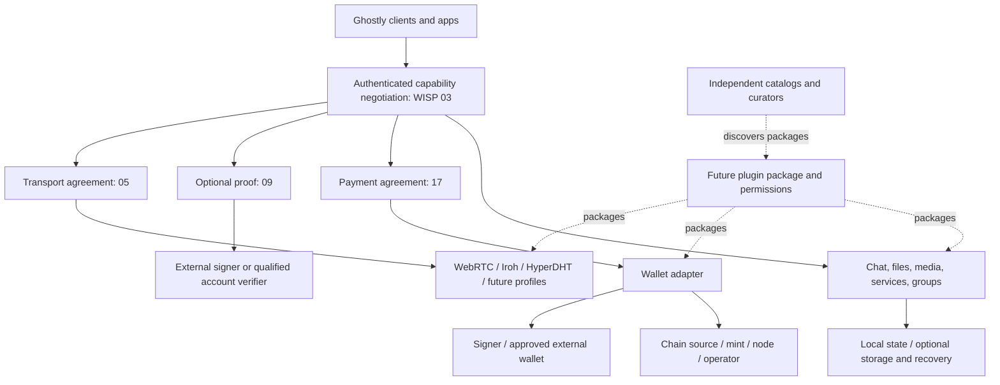

# Ghostly adapter and ecosystem roadmap

Planning and source review: **2026-09-22**; implementation status reviewed against `dev` on **2026-09-25** ([how statuses are set](#evidence-and-readiness)). This is a living design inventory, not a specification, release announcement, integration endorsement or implementation authorization. It covers the ideas discussed for Ghostly and a bounded set of additional research suggestions; it is not an exhaustive directory of the world's protocols.

Ghostly is intended to become a coordination and interoperability layer with a small core and negotiated capabilities. The current chat application is a concrete reference client. The broader vision includes payments, optional identities, social experiences, groups, storage and recovery, plugins, apps, independent catalogs and a self-hosted GhostlyOS runtime. These remain first-class roadmap work, even where their delivery comes later.

## Public roadmap: outcomes before adapter names

The public story is **architecture → contracts → capabilities → adapters → verifiable releases**. A small coordination core lets independently built components agree on what they can do together. The reference app demonstrates those agreements in a familiar experience. More adapters should expand user choice, platform reach or resilience while reusing an existing contract; an adapter that adds none of those needs a stronger justification.

This public view summarizes the broad inventory without turning every candidate into a promise:

| Public status | Outcome / proposed commitment | Verifiable completion and dependency |
|---|---|---|
| Available on `dev` | One chat ([400](400-chat.md)) with authenticated participation: first contact on the DHT and a live link at once, DHT text as its floor, self-upgrade to a live link, one `ghostly1` invite, calls and shared apps in every chat while it is live, files of any size with resume, voice messages, a per-chat transport switch and the pairing progress | Evidence per row below (merged pull requests, `e2e/features.json`, tests). `dev` is what the website presents as 0.5.0; it is not publicly deployed until that release. Media and shared apps have client limits (no WebRTC on Linux Desktop; the web app cannot share apps). |
| Available on `dev` | The site and public protocol/capability catalog, with the app as reference implementation | Home, developers, catalog and this roadmap on `dev`, statuses read from this document; published at ghostly.tools with the 0.5.0 release. |
| Available on `dev` | A reusable payment agreement carried by several rails: Cashu and Lightning (the mints or the person's own NWC, LND, Core Lightning or WebLN source), Arkade, Bark, Spark, Fedimint, on-chain bitcoin and USDT, plus paying from another wallet and Lightning addresses | Mainnet limits per rail are in the rows below: Fedimint, BDK and Breez are test networks only; Bark runs on Second's Bitcoin server with no exit button yet; Spark's Mainnet needs the person's own Breez API key; Arkade has no unilateral exit yet. The settlement tests run on disposable networks; none moves real money. |
| Available on `dev` | Optional identity without a global public account: proofs made once per profile and shared per contact (Nostr, Pubky, a domain, OpenPGP, SSH, a Bitcoin address, a DID), the Nostr social layer, and a did:dht per profile | No-proof sessions still work. OpenID accounts are blocked on Ghostly's OAuth client registrations; Bluesky ([#248](https://github.com/MiguelMedeiros/ghostly/pull/248)) is built and blocked on its OAuth client-metadata file being live on ghostly.tools. |
| Available on `dev` | Private groups of up to eight and communities of up to 256, with a picture and payments between members; profiles, sealed backups and messages held for an away contact | Admission, epochs and roles tested in multi-browser e2e and a 256-member load test. Files and calls in groups, more than one admin and channels are planned. |
| Long-term planned direction; scope not committed | Portable data, independent apps/catalogs and a self-hosted GhostlyOS runtime | Each is a staged deliverable with restoration, sandbox, provenance and operations gates below. Backup foundations begin with payments, not only at the end. |
| Planned and research | Remaining named rails, proofs, hardware, transports and research suggestions | Promote individually only after source/API feasibility and a concrete user outcome are established. No implied delivery date. |

Before publishing a commitment, record an owner, bounded deliverable, dependencies, acceptance evidence, supported runtime, risks and the next decision. No fixed dates, final version numbers, staffing assumptions, investment return or market traction are invented here. For partners/investors, present shipped evidence and unresolved technical dependencies alongside the opportunity: reusable agreements, independent integrations and a reference experience that makes interoperability tangible.

Measure progress by independently compatible implementations, supported platform/profile combinations, successful recovery drills, independently authored adapters/apps and measured experience quality. Do not use a count of logos or Draft documents as a substitute. Resource/cost estimates and target performance budgets remain to be established before delivery commitments.

## Reading this roadmap

- [Contract and family map](#contract-and-family-map)
- [Evidence and readiness](#evidence-and-readiness)
- [Transport, discovery and delivery](#transport-discovery-and-delivery)
- [Payments and wallet composition](#payments-and-wallet-composition)
- [Identity, profiles and social data](#identity-profiles-and-social-data)
- [Hardware and signing](#hardware-and-signing)
- [Communication, groups and storage](#communication-groups-and-storage)
- [Plugins, apps, catalogs and GhostlyOS](#plugins-apps-catalogs-and-ghostlyos)
- [Delivery phases and decision gates](#delivery-phases-and-decision-gates)
- [Website and developer experience](#website-and-developer-experience)
- [Documentation gaps and decisions to record](#documentation-gaps-and-decisions-to-record)
- [Source review ledger](#source-review-ledger)

All external references below were consulted on **2026-09-22**. “Confirmed upstream” means the cited official specification, source or documentation describes that primitive; it does not mean it runs in Ghostly. Runtime columns describe an upstream route or a proposed integration target, never a tested Ghostly platform unless explicitly marked current. Pin exact releases, commits and specification revisions when an implementation is selected. Documentation and SDK surfaces can change independently.

## Contract and family map

A **WISP** describes an interoperable contract. A **capability** is a versioned ability a running client actually advertises. An **adapter** implements a contract using a particular technology. A **plugin** can package adapters, UI or apps for distribution. A **provider** operates a service or exposes a wallet/API; a **signer** authorizes a particular cryptographic operation. One provider can implement several capabilities, and one capability can have several providers.

The [working catalog](README.md) contains **22 Draft documents**, organized into the approved family ranges. See the [migration map](NUMBERING.md) for previous identifiers and compatibility. This roadmap does not create empty specifications or claim implementation merely from numbering. A new contract is justified by new interoperable semantics, not a new vendor logo.

| Family | Existing candidate contracts | Composition boundary / future question |
|---|---|---|
| Process, core, keys | [00](00-process.md), [01](01-ghost-core.md), [02](02-peer-keys.md) | Bounded rendezvous, participation and lifecycle; future recovery/root delegation requires explicit review. |
| Common negotiation | [03](03-capabilities.md) | Shared capability/version/limit intersection, authenticated selection, refusal and revocation. Avoid a separate discovery system for each family. |
| Live connectivity | [100](100-transports.md), [101](101-webrtc.md), [102](102-iroh.md), [103](103-hyperdht.md) | Transport selection and endpoint authentication; discovery, delivery, routing and storage remain separate responsibilities. |
| Optional external proofs | [300](300-peer-proofs.md), [301](301-nostr.md), [Pubky · 3xx planned](302-pubky.md), [Keet · 3xx planned](303-keet.md), [SSH · 3xx planned](3xx-ssh.md), [DID · 3xx planned](3xx-did.md) | Key possession or a precisely qualified account assertion; neither authorizes spending nor proves a civil identity. |
| Conversation and services | [400](400-chat.md), [500](500-files.md), [600](600-media.md), [700](700-local-services.md) | Text, files, media and consented services can evolve independently of the chosen data transport. |
| Payments | [200](200-payments.md), [201](201-cashu.md), [203](203-lightning.md) | Payment method agreement, requests and results; wallet execution, signing, chain data and broadcast are distinct interfaces. |
| Admission and groups | [800](800-invite-join.md), [900](900-group-sessions.md), [GossipSub · 9xx planned](901-gossipsub.md) | Invitations, membership/epochs and distribution; GossipSub is optional and is not group encryption. |
| Social, recovery, applications | [Nostr social · 3xx planned](3xx-nostr-social.md) | Profile/graph/feed/publication semantics as separate capabilities on top of a proof (Nostr first, experimental); backup formats, plugin ABI, app state and catalog provenance may warrant future contracts after boundaries and independent use cases are demonstrated. |

**Design proposal:** negotiation should carry exact capability identifiers/versions, constraints, runtime availability and consent requirements, with a transcript-bound result. Installing an adapter does not make it available: a missing device, denied camera, locked signer, offline node or incompatible peer may prevent use. Keep local provider credentials and spending policy out of public discovery and peer advertisements. New logical labels in this roadmap are not assigned wire identifiers.

## Evidence and readiness

Keep three independent axes in the future catalog: **specification status**, **Ghostly implementation/release status**, and **conformance evidence**.

Status review: **2026-09-25**, item by item against `dev` (what the app does there is what the website presents as 0.5.0), its merged pull requests, [e2e/features.json](../../e2e/features.json) and the tests. Every row of the inventory tables below carries exactly one implementation status, in bold, at the start of its status column. The website's roadmap and catalogue read it from here and nowhere else ([roadmap-candidates.mjs](../../website/scripts/roadmap-candidates.mjs) refuses a row with none or two), so change a status here, then run `npm run sync:references` in `website/`.

| Status | Meaning | Website level |
|---|---|---|
| **Available** | Merged on `dev`, wired into the app, usable there and tested. A condition that limits it follows the colon, for example `**Available: test networks only**`. Code that exists but cannot be used does not count, and neither does a card, a draft pull request or unmerged code. | Available |
| **In implementation: #N** | An open pull request is building it now; the note names the pull request. | Planned, with the note |
| **Blocked: …** | It needs something outside the code first; the note says exactly what: a registration, a hosting decision, a key or a partner feature. | Planned, with the note |
| **Planned** | The upstream primitive or API is confirmed, or a design is proposed; there is no usable Ghostly implementation on `dev`. | Planned |
| **Research** | The family is relevant, but API, integration or security semantics need investigation first. | Research |

"Scoped", "experimental", "candidate" and "new suggestion" (an idea added during this research, beyond the named ones, optional and not implicitly prioritized) qualify a row after its status; none of them is a status. An experimental feature usable on `dev` is **Available** and says what is experimental about it. The notes after a status are plain text; links follow them.

Current baseline sources are the [release decision](README.md), [transport increment](TRANSPORT-INCREMENT.md), [paired capabilities](PAIRED-CAPABILITIES.md), [DHT delivery](../DHT-DELIVERY.md) and [protocol](../PROTOCOL.md). They take precedence over older baseline tables:

- Ghostly participation keys, contact pins and comparison codes are active. **Identity proofs** (2026-09-23, [WISP 300](300-peer-proofs.md#implementation-2026-09-23-identity-proofs)) are optional, made once per profile and shared per contact by choice, through one provider contract ([PROOFS.md](../../packages/browser/src/proofs/PROOFS.md)): Nostr, domain, OpenPGP, SSH (with GitHub/GitLab through a published key), Bitcoin address and DID are offered; OpenID waits for client registrations. The older Pubky and Keet imports and Ring UI stay off (`EXTERNAL_IDENTITIES_ENABLED = false`); preserved code/data is not released functionality. A public profile (Nostr kind-0) is fetched only on request.
- Paired data adapters exist for WebRTC, Iroh and HyperDHT: natively on Desktop; in the web app and extension WebRTC, Iroh through n0's public relays by default, and HyperDHT only through a relay the person configures. Linux Desktop has no WebRTC. Do not infer a media adapter from a byte stream.
- `files/2`, `files/3`, `payments/1`, `calls/1` and `services/1` are mutually negotiated in the chat session; hosted HTTP runs there as `ph` frames, and calls as `calls/1` while the chat is live. Compatibility chats ([402](402-legacy-chat.md)) keep their older files and calls. Do not advertise media for every transport.
- DHT text ([403](403-dht-text.md), the floor of every chat and the DHT only choice) is bounded short text, with a 256 UTF-8-byte ceiling that can be lower after complete packet encoding, one outstanding text per direction and a five-minute acceptance/retry window. Stream fallback is separate. DHT publication is not a receipt or guaranteed delivery. Expiry does not erase packets retained elsewhere or local history.
- Web, extension and Tauri are the reference client surfaces considered here. Native React Native and a universal CLI/daemon capability set are future targets. The CLI is a compatibility client (older DHT records, no `ghostly1` codes, no paired chats); it does not demonstrate parity with paired sessions or every roadmap capability.

### Promotion gates (proposed evidence levels, not new WISP statuses)

| Gate | Evidence needed before the next claim |
|---|---|
| Source reviewed | Official API/spec/source link, review date, license, responsible maintainer, unresolved questions and explicit trust assumptions. This roadmap mostly reaches this gate for candidates. |
| Adapter experiment | Pinned dependency and runtime, documented interface, disposable keys/data, local test or sandbox; no production-ready claim. |
| Interoperability demonstrated | Exact profile and independently produced vectors/peer implementation; negative negotiation, replay, wrong network/domain/key and downgrade tests. Two apps sharing one core are not independent implementations. |
| Release eligible | Real platform/device matrix, cancellation/restart/recovery, permission boundaries, dependency review, accessible UI, failure evidence and maintainer sign-off. Payment methods need settlement and no-double-spend recovery evidence, not only frame delivery. |
| Maintained | Versioned compatibility, reproducible CI/release evidence, migration/rollback, vulnerability response, tested backup restoration and deprecation policy. |

No candidate is promoted merely because it has a GitHub repository, a familiar signature curve, an SDK quickstart or an upstream “self-custodial” claim.

## Transport, discovery and delivery

| Candidate / capability | Provider or primitive; confirmed upstream source | Signer / authentication | Runtime/platform route | Ghostly status and next gate |
|---|---|---|---|---|
| Pkarr / Mainline DHT | Signed small DNS records, native DHT and HTTP relays: [Pkarr](https://github.com/pubky/pkarr) | Ed25519 records plus Ghostly participation/content authentication | Native UDP; browser/extension HTTP relay | **Available**: rendezvous, the capability record and bounded DHT text, the floor of every chat ([403](403-dht-text.md), `chat.dht.*`, `chat.caps-record`). Desktop reaches the DHT over UDP and relays; web and extension through HTTP relays. No test reaches the DHT over real UDP yet (`core.dht-direct` is allowed untested): validate UDP separately from relay tests, packet budget, stale records and retry limits. No general file/history store. |
| WebRTC | Data channels and media APIs: [W3C](https://www.w3.org/TR/webrtc/) | DTLS/session binding plus Ghostly peer authentication | Browser/extension; native WebView features vary | **Available: not on Linux Desktop**: web, extension and macOS Desktop (`transport.webrtc`); Linux Desktop's WebKitGTK has no `RTCPeerConnection`, so its chats go live over Iroh or HyperDHT. The first pairing between two browsers is WebRTC. Test ICE/STUN/TURN paths, WebKit permissions, suspend/resume and media capability separately. A TURN relay is infrastructure (one can be set in Settings). |
| Iroh | Endpoint connectivity: [official docs](https://docs.iroh.computer/) | Iroh endpoint identity bound to Ghostly participation/transcript | Native Rust adapter on Desktop; relay-only WebAssembly in the web app and extension | **Available: Desktop native, browsers through relays**, Draft 102 (`transport.iroh`, `transport.iroh-web`, #225). Web and extension start Iroh by default, relay only (a page cannot send UDP), through n0's public relays unless the person sets others in Settings, Network; it ranks after every direct transport, so it carries a chat only when WebRTC cannot connect. Keep Iroh as the name. Generic QUIC peers do not automatically speak Iroh. Measure relay use and runtime availability. |
| HyperDHT / Hyperswarm | Hole punching and encrypted Noise streams: [HyperDHT](https://github.com/holepunchto/hyperdht) | Transport key plus Ghostly transcript binding | Native sidecar on Desktop; browser only through a dht-relay | **Available: Desktop; browsers only with a relay URL**, Draft 103 (`transport.hyperdht`, `transport.hyperdht-relay`, #231). The web app and extension reach HyperDHT only through a non-custodial dht-relay the person enters in Settings, Network; there is none by default because nobody runs a public one for Ghostly yet (hosting one is an open decision). Validate bootstrap, platform packaging, network changes and endpoint-key mismatch. |
| Tor | Onion/SOCKS integration based on [Tor specifications](https://spec.torproject.org/) | Onion/service authentication plus Ghostly identity; not the same key | Proposed native daemon/embedded route; browser requires an explicitly supported path | **Research**, no code on `dev`. Specify leak policy, DNS/discovery path, latency, dependency distribution and fail-closed behavior. Do not send UDP or silently fall back to direct IP under a Tor-only policy. |
| Local discovery / broadcast | Opt-in LAN discovery; mDNS candidate: [RFC6762](https://www.rfc-editor.org/rfc/rfc6762.html) | Advertisements are hints; authenticate before joining | Proposed native networking; browser needs supported bridge/API | **Planned**, no code on `dev`. Multicast vs custom broadcast must be chosen; scope to interface/LAN, expire advertisements, never broadcast secrets or social identity by default. QR discovery is a separate route. |
| QR / explicit invitation | Current invite parser and [admission draft 800](800-invite-join.md) | Bearer bootstrap vs authenticated admission are distinct | Current camera/image/paste where permissions allow | **Available**: one bech32m `ghostly1` invite code ([801](801-invitation-profiles.md), #210), shown as a QR and as a ghostly.tools link that opens the app, typo-checked, pinning the inviter's participation key (`invite.code`, `invite.qr.*`, `invite.link`, `invite.pin`); older formats still read. The CLI does not read `ghostly1` codes. Future admission semantics are proposed. A QR carries a bounded invitation; it is neither a live transport nor proof of the person who displayed it. |
| GossipSub | [libp2p GossipSub 1.1 specification](https://raw.githubusercontent.com/libp2p/specs/master/pubsub/gossipsub/gossipsub-v1.1.md) | Group-authenticated envelope above mesh; topic is not authorization | JS/Rust/Go libp2p profiles require a selected common stack | **Planned**, 9xx, number to be defined; no adapter on `dev`. Needs 900 membership/epochs, limits, scoring, abuse resistance, churn tests. No automatic durable history or total ordering. |
| Pear / Holepunch components | [Pear runtime](https://docs.pears.com/), [Hypercore](https://github.com/holepunchto/hypercore), [Autobase](https://github.com/holepunchto/autobase) | Append-only data signatures, writer authority and group keys require composition | Pear/Bare/Node or native bindings; each module differs | **Research** for distribution, storage and multiwriter state. Keet is a product; these libraries do not establish a supported Keet app API or redistribution right for its private internals. |
| Generic QUIC profile | [RFC9000](https://www.rfc-editor.org/rfc/rfc9000.html) | TLS identity and Ghostly binding must be specified | Proposed native QUIC library; browser WebTransport is a different API/profile | **Planned**, a candidate whose value beyond Iroh is conditional. Define ALPN, framing, endpoint discovery, certificates, flow control and NAT behavior before assigning a profile. No Iroh rename. |
| libp2p connectivity profile | [official stack](https://docs.libp2p.io/) and selected transport specifications | libp2p peer identity plus explicit Ghostly binding | Candidate JS/native implementation; per-transport availability | **Research**, new suggestion. Could reuse relay/muxing infrastructure; choose an exact profile and avoid duplicating discovery blindly. Do not claim all implementations support all transports. |
| WebSocket relay profile | [RFC6455](https://www.rfc-editor.org/rfc/rfc6455.html) | E2E Ghostly envelope above authenticated service connection | Browser, extension, native, server | **Planned**, new suggestion, for constrained networks. The Iroh relays and the HyperDHT dht-relay above belong to their transports; this would be a Ghostly profile of its own. Server sees metadata; quota, retention, offline receipts and operator policy need explicit contracts. |

**Routing/service layer proposals:** distinguish a relay forwarding ciphertext, a store retaining it, a bridge translating protocols, and a multi-hop route. Specify what each intermediary can read, which authentication survives translation, loop prevention/hop budgets, replay IDs, quotas, provenance, custody of content keys, retention and cancellation. A bridge that decrypts is a different trust boundary from an opaque relay. None is automatic interoperability between arbitrary transports.

Offline delivery and reconciliation need durable IDs, ordered scope where necessary, storage receipts distinct from recipient receipts, expiry semantics, deduplication across paths, corruption detection and backpressure. A running Raspberry Pi can provide availability but cannot guarantee the recipient reconnects or remote data disappears.

## Payments and wallet composition

Ghostly coordinates a payment intent and mutually supported method; it need not operate the user's wallet. Manual external-wallet approval and explicitly authorized automated policy are both product directions. Split responsibilities:

| Interface proposal | Responsibility | Must not imply |
|---|---|---|
| Payment agreement | Asset/network, amount, payee, methods, expiry, fee ceiling and result evidence | Permission to spend merely because a peer advertised a method |
| Wallet adapter | Quote, create request, execute authorized intent, inspect status, recover/reconcile | Access to every wallet key or account |
| Signer | Sign a supported transaction or domain-separated proof, with appropriate confirmation | Generic arbitrary signing on every hardware wallet |
| Chain source / observer | UTXOs, fees, confirmations, reorg/status information | Signing or custody |
| Broadcaster | Submit already authorized signed transaction and return submission status | Final settlement or a unique spend on timeout |
| Policy broker | Per-app/payee/asset budgets, expiry, approval, revocation and audit | Automatic cross-asset conversion or spending from a mini-app |

### Rails and wallet adapters

| Rail / candidate | Provider / signer route | Runtime and platform route | Confirmed evidence, Ghostly status, restriction / next decision |
|---|---|---|---|
| Cashu | Cashu SDK + chosen mint; wallet controls bearer proofs, mint backs redemption | Current app integration; upstream TS/Rust/Python options | **Available**, [Draft 201](201-cashu.md): Mainnet mints by default, a test mint on a Testnet wallet (`payments.cashu.send`, `wallet.cashu.*`), [NUTs](https://github.com/cashubtc/nuts), [libraries](https://docs.cashu.space/). Mint trust/custody must be visible. Verify mint/unit allowlist, quote states, duplicate redemption, keysets and recovery; NUT07/09 availability is not universal seed recovery. |
| Lightning BOLT11 | One active `LightningProvider` source per profile and mode; the Cashu mints are the default source; NWC, LND, Core Lightning, WebLN, Breez and a Fedimint federation (rows below and above) plug into the same contract | Current app subset; provider/runtime determines expansion | **Available**, [Draft 203](203-lightning.md), [provider guide](../../packages/browser/src/engine/paymentAdapters/PROVIDERS.md). Sources declare create/pay/lookup capabilities; payments are journaled before spending and an unknown outcome is only reconciled. Validate invoice signature/network/amount/expiry in executing wallet. A displayed invoice or peer receipt is not settlement evidence. |
| Ark via Arkade | Arkade TypeScript SDK, operator and wallet signer | TypeScript SDK 0.4.74 in the browser engine (web, extension offscreen page, Desktop WebView); native parity unverified | **Available: no unilateral exit yet**, experimental, [Draft 202](202-arkade.md): a wallet is made with no setup, on Bitcoin mainnet through the pinned operator by default (mutinynet on a Testnet wallet); payments were tested on regtest only: send/receive, HD return spend, receipt reconciliation, the shared Cashu/Ark review flow and sealed backup restore (`payments.arkade.*`, `wallet.ark.*`). [Wallet docs](https://docs.arkadeos.com/wallets/getting-started/introduction), [security model](https://docs.arkadeos.com/learn/core-concepts/security-and-trust-model). Preserve exit transaction data, measure operator/chain dependencies and exit costs; exits remain open. |
| Ark via Bark | Second's Bark SDK (WebAssembly build `@secondts/bark` 0.25.0, bark 0.7.1) and Second's servers; wallet signer in the SDK | Web/WASM, one path for web, extension offscreen page and Desktop WebView; Rust crate, Barkd REST daemon and UniFFI bindings upstream | **Available: no unilateral exit yet** (#77, Mainnet in this change): [Web SDK](https://second.tech/docs/bark-sdk/wasm), [connection details](https://second.tech/docs/connection-details), [pricing](https://second.tech/pricing), [terms](https://second.tech/terms), [backups](https://second.tech/docs/backups). Checked 2026-09-23: **not wire compatible with Arkade** (Bark refuses Arkade addresses; out-of-round payments only reach the same server), so it is its own method `bark` / `payments-bark/1`. Mainnet on Second's Bitcoin server `ark.second.tech` (open since 2026-06-09; coins live 4032 blocks and are renewed free while the app is open; 0.1 BTC per coin), checked read-only and against a mocked server with the real-money confirmation, network pinning and removal protection (`wallet.bark.mainnet`); Testnet on signet `ark.signet.2nd.dev` (faucet needs a GitHub login); local regtest send/receive, on-chain board, chat Send/Request and payee-side receipt verification verified. Seed-only recovery is server-dependent; exits, Lightning via Bark, funded signet and a real-money payment remain open. See [Draft 204](204-bark.md). |
| Bitcoin on-chain | `bitcoin` payment method through one active `OnchainProvider` source per profile and mode (none by default); BDK/Core/other wallet as provider modules | Native library/node first; explicit external wallet/PSBT route for browser | **Available: BDK on test networks, Bitcoin Core on Desktop**: [draft section](200-payments.md#on-chain-bitcoin-draft); the BDK and Bitcoin Core RPC sources (rows below) shipped in #86 and #78, and no source is set by default (`wallet.onchain.sources`); [provider guide](../../packages/browser/src/engine/paymentAdapters/PROVIDERS.md), [BDK](https://bitcoindevkit.org/), [Core RPC](https://bitcoincore.org/en/doc/), [PSBT](https://github.com/bitcoin/bips/blob/master/bip-0174.mediawiki). Address validation per network, sign-at-review/broadcast-at-approval, same-transaction reconciliation and chat Send/Request on paired chats implemented (`payments.bitcoin.send`, regtest); coin selection, fee policy, change and RBF/reorg remain to be specified. |
| Fedimint | Fedimint web SDK (`@fedimint/core` canary, pinned; WebAssembly client in Ghostly's own worker, one OPFS database per federation), v1 mint/ln modules, the federation's gateway | Web/WASM, one path for web, extension offscreen page and Desktop WebView; upstream Rust client for native | **Available: test networks only** (#192): [technical reference](https://docs.fedimint.org/), [web SDK](https://github.com/fedimint/fedimint-sdk). Its own method `fedimint` (`fedimint-ecash/1`, paired-payments list only); notes are never Cashu tokens. Checked 2026-09-24/25 on a regtest federation (fedimintd/gatewayd 0.12.1, LND gateway) in e2e/infra: join by invite after a preview, ecash in over the gateway, notes out/redeemed/taken back, a chat Send in ecash reviewed and redeemed, a request paid over the gateway's Lightning, Lightning out to another node; the `fedimint` Lightning source. Journal before spend, operation-log reconciliation, federation identity (id, network) and recovery-based restore are implemented; Mainnet joins no federation and says so (`FEDIMINT_MAINNET = false`, `wallet.fedimint.mainnet-off`); Mainnet, iroh federations, gateway refunds and multi-guardian failures remain open. See [Draft 2xx](2xx-fedimint.md). |
| Spark | Breez SDK Spark (WebAssembly `@breeztech/breez-sdk-spark` 0.26.0, nodeless), the same SDK and seed as the Breez Lightning source; Spark's operators and Lightspark's SSP | One WebAssembly path for web, extension offscreen page and Desktop WebView | **Available: Testnet, Mainnet only with a Breez API key** (#188): its own method `spark` (announced in the session's payment list only), [Draft 2xx](2xx-spark.md). Spark to Spark with Spark addresses (static: the wallet's identity) and Spark invoices (per request: amount, expiry, id), no Lightning hop. Testnet on Breez and Lightspark's hosted regtest (no API key, proven, `payments.spark.send`); Mainnet behind the person's own Breez API key, labelled real bitcoin, and never exercised with money. "Use for Lightning too" makes the same wallet the Breez source. Unilateral exit, Spark tokens and the faucet (reCAPTCHA) remain open. |
| Liquid | Elements/Liquid wallet integration, chosen signer and network service | Native wallet/node candidate; browser through an explicitly supported wallet API | **Planned**, no code on `dev`: [Liquid developer docs](https://docs.liquid.net/docs/welcome-to-liquid-developer-documentation-portal). Separate L-BTC and issued assets; validate asset IDs, confidential-transaction/blinding support, fees and federation/peg assumptions. Not equivalent to Bitcoin L1. |
| USDT through Tether WDK | `@tetherto/wdk-wallet-evm` 1.0.0-beta.19; separate encrypted seed, configured EVM RPC, ETH for gas | Shared browser/Tauri adapter; local Anvil transaction tests; native financial runtime not verified | **Available: experimental**: a wallet per mode, made with no setup, on Ethereum chain 1 canonical USDT (six decimals) in Mainnet mode; send/receive/review/reconcile implemented (`payments.usdt.send`, `wallet.usdt.*`). Signed TEST-USDT transactions on Anvil chain 31337 validate recovery but are not Tether-issued USDT. No mainnet funds were used. Issuer controls, gas costs, RPC trust, two-block confirmation and operational limitations remain explicit. See [implementation scope](../USDT-INTEGRATION.md). |
| Manual external wallet | Every request and every receive shown as QR, text and a `lightning:` / BIP 21 URI (`lightning=`, `ark=`); the payee's own source settles | Copy/QR everywhere; the link opened by the system on desktop (`open_payment_link`) and by the extension's background page | **Available** (#107, `payments.external`), [200](200-payments.md#paid-from-another-wallet), [203](203-lightning.md#paid-from-another-wallet). “Opened wallet” and “I paid” are never settlement: the payee's wallet sees the invoice, transaction or virtual output, marks the request paid and tells the payer; “I paid” only makes it look now. No wallet callback is relied on. |
| Lightning address / LNURL-pay | LUD-16/06/01/17/12/09 paying through the active Lightning source; parsing and checks in core, fetching in the engine | Same on web, extension and desktop (the service must allow CORS); a local LNURL server in e2e | **Available: paying only**, [Draft 205](205-lnurl.md) (#107, `wallet.lnurl.address`, `payments.lnurl.card`). Domain named before any fetch, bounded fetches, invoice amount and metadata commitment checked. Receiving on an address needs a server the person runs and is out of scope; LUD-18/21 and BOLT 12 open. |

### Providers, chain data and signer boundaries

Lightning and on-chain sources below are provider modules behind the shared `LightningProvider` / `OnchainProvider` contracts: one module and one registry line each, with sealed credentials, a source per network and the shared money-safety rules ([provider guide](../../packages/browser/src/engine/paymentAdapters/PROVIDERS.md)). A row is **Available** only once its module, contract tests and gated regtest e2e exist. The e2e tests run on regtest; a source that also allows Mainnet has not moved real money in a test.

| Candidate | Capability / provider contract | Signer and runtime restrictions | Gate and official source |
|---|---|---|---|
| LND | Invoice creation, payment execution/status through node API | Node controls keys; scoped credentials/macaroons, authenticated connection; native/server adapter or constrained bridge, never expose admin credential to apps | **Available**, experimental (#90): REST API, with a pinned certificate on Desktop; invoices in and out and a chat request paid node to node on regtest (`wallet.lightning.lnd.*`). Test timeout/TrackPayment recovery and node availability further. [LND docs](https://docs.lightning.engineering/lightning-network-tools/lnd). |
| Core Lightning | Node RPC/payment/invoice integration | Node signer; local RPC or explicitly configured authenticated service; provider permission model must be pinned | **Available** (#79): Commando over BOLT 8 with a restricted rune that never returns to the page; invoices in and out and a chat request paid node to node on regtest (`wallet.lightning.cln.*`). Separate node implementation from rail; failure/status and least-privilege tests. [Official API](https://docs.corelightning.org/reference). |
| NWC | Delegated remote-wallet request/response via Nostr relays | Per-connection wallet authorization, **not** a social identity proof; wallet may be custodial or self-hosted | **Available** (#82): a wallet connected by its URI, a Mainnet wallet refused in Testnet; receive, pay and a chat request on regtest (`wallet.lightning.nwc.*`). Negotiate supported commands, budgets and revocation; it does not require the Nostr identity feature. [NIP47](https://raw.githubusercontent.com/nostr-protocol/nips/master/47.md). |
| WebLN | Browser/provider integration for Lightning requests | Injected/approved wallet provider; capabilities differ and native support needs bridge | **Available: web app only**, not a separately numbered WISP (#88): invoices in, payments out reviewed first, a chat request between two browser wallets (`wallet.lightning.webln.*`). [WebLN guide](https://www.webln.guide/). Test provider missing, approval canceled and ambiguous execution. |
| Bitcoin Core RPC | Wallet operations, chain observation and broadcast, separately permissioned | Personal node/server; RPC credentials stay in privileged backend; wallet may be watch-only/external-signer | **Available: Desktop only**, experimental (#78): the wallet RPC as the on-chain source, proxied by Desktop, on any network; unit and regtest integration tests, no Playwright spec yet. Never proxy arbitrary node RPC through a public shared app. [RPC reference](https://bitcoincore.org/en/doc/). |
| Electrum protocol | History/UTXO/status/broadcast service | Server observes wallet queries; protocol endpoint is not a wallet signer | **Planned**: no Electrum backend on `dev` (BDK reads Esplora). Verify headers/proofs as applicable, server/network identity and privacy policy. [Protocol](https://electrum-protocol.readthedocs.io/en/latest/). |
| Esplora | HTTP chain query, fee and transaction broadcast API | Indexer observes queried addresses; no signer | **Available: as BDK's chain source, test networks**: a URL of the person's choice, with public fallbacks for signet and mutinynet; none on Mainnet, where BDK is not offered. Bound responses and distinguish accepted broadcast from confirmation. [API](https://github.com/Blockstream/esplora/blob/master/API.md). |
| BDK | Wallet construction/synchronization primitives with selected backends | Rust/library integration; descriptors and signing strategy selected separately | **Available: test networks only**, experimental (#86, #177): signet, mutinynet and regtest over Esplora; a new wallet's 12 words shown once; a funded Send and a chat Send/Request on regtest (`wallet.onchain.bdk.*`). Bind a wallet instance/network to its observer and signer; not a hosted payment rail. [BDK](https://bitcoindevkit.org/). |
| PSBT exchange | Standard unsigned/partially signed transaction handoff | Hardware/software signers, files or QR; format/version/script support varies | **Planned**: PSBTs are only built and signed inside the BDK and Bitcoin Core sources; there is no hand-off to an outside signer. Validate every returned input/output/change/fee against authorized intent. [BIP174](https://github.com/bitcoin/bips/blob/master/bip-0174.mediawiki). |
| Personal wallet / Umbrel | User-selected LND/CLN/Bitcoin/Bark or another installed provider | Self-hosted service with explicit pairing; remote connectivity, uptime, credential isolation | **Planned**: a deployment composition, not a new rail. A node on it can already be the LND or Core Lightning source; there is no Umbrel app or pairing. [Umbrel app packaging](https://github.com/getumbrel/umbrel-apps), [Bark Wallet installation](https://second.tech/docs/bark-wallet/install.md). No personal service connected in this research. |

### Payment execution and recovery requirements (proposal)

An intent binds request ID, authenticated payee context, asset/network, exact units, amount, selected provider/method, expiry and fee ceiling. Use integer/decimal-string units; never float conversion for settlement. Negotiate common methods and preferences without leaking wallet balance or credentials.

Persist intent and attempt identity before calling a provider. Track at least offered, approved, submitting, pending, succeeded, failed, canceled and **unknown**; map these to provider-specific evidence rather than flattening them. Cancellation after broadcast may be impossible. A transport reconnect resends status or the same authorized operation only when idempotency is established; it must not create a new spend. A silent/timeout provider is an unknown result to reconcile, not permission to select another rail. Changing asset, chain, payee, amount or fee outside the approved policy needs a new authorization. Refunds/reclaims are separate operations, not erasure of a paid request.

Before release, use real disposable **regtest/signet/testnet/sandbox** services as appropriate: successful send/receive; independent settlement check; duplicate request; crash before/after provider response; expired quote; unknown outcome; canceled signer; unavailable mint/node/operator; insufficient liquidity/gas; restart with pending operation; fee cap; wrong asset/network; reorg; restore and exit where supported. Record exact versions and limitations. Unit tests or fixture payment frames do not replace this evidence. No funds are operated by this roadmap task.

**Second-adapter decision:** evaluate Arkade and Bark against the same intent/status/recovery contract, minimum supported client set, maintained SDK/license, exit-data backup, resource use and signer coupling. Prototype the smaller verified path only after the website stage and a recorded implementation decision. Keep both in the long-term catalog; do not imply a generic Ark adapter handles both. Outcome (2026-09-25): both are integrated as separate methods, Arkade on Mainnet and Bark on test networks only; Bark on Mainnet followed on 2026-09-26 (rows above).

## Identity, profiles and social data

Ghostly participation is the default. An optional future Ghostly root could delegate to per-contact/ephemeral participation keys, with explicit lifetime, revocation, key loss and recovery rules. That is a **proposal**, not a current global account. Avoid public linkage by default: proof sharing is selected per contact, and withdrawing a proof cannot delete copies a peer retained.

“Social negotiation” is an exploratory product phrase. Model these as separate capabilities negotiated through 03:

| Layer | Data / action | Trust and permission boundary |
|---|---|---|
| Proof | Context-bound evidence of a key or qualified account authorization | **Available**: Nostr ([301](301-nostr.md)), a domain, OpenPGP, SSH (and GitHub or GitLab through it), a Bitcoin address and a DID, made once per profile and shared per contact ([PROOFS.md](../../packages/browser/src/proofs/PROOFS.md), `proofs.*`); OpenID is blocked and Pubky and Bluesky are in implementation (matrix below). Nonce, audience/domain, participation binding, lifetime and independent verification; no automatic login/publication permission. |
| Profile | Name, avatar, bio and source metadata | **Available: Nostr, Pubky and Bluesky**, on identity cards ([PUBLIC-PROFILES.md](PUBLIC-PROFILES.md), `proofs.public-profile.*`): a card of an identity with a current verified proof shows its public picture, name, bio and follower counts, read from fixed hosts once the card is on screen, kept a day, behind Settings → Load public profiles (on by default); the Nostr social layer ([3xx](3xx-nostr-social.md), `nostr.social.profile`) also loads a contact's kind 0 on request. Self-described content; local cache, provenance and manual nickname precedence; fetching is not proof. |
| Social graph | Follows/followers, memberships, links between identities | **Available: Nostr only**, experimental (`nostr.social.follows`): kind 3 on request; "follows you" / "you follow" / "you both follow" hints, each with its direction and time, computed locally. Direction, source, visibility and freshness; no inference that every edge is reciprocal or trusted. |
| Content read/search | Posts, replies/comments, reactions, feeds and query results | **Available: Nostr only**, experimental (`nostr.social.notes`): a key's kind-1 notes, newest first, paginated, hidden by the person's own kind-10000 mute list; no feed, no ranking, no search. Pagination, content limits, moderation, ranking source and cache policy; index results may disagree. |
| Publication | Create/edit/delete content, follow/unfollow, react | **Available: Nostr only, off by default**, experimental (`nostr.social.publish`): a capability off by default; note, follow/unfollow, profile update through NIP-07/NIP-46 only, each drafted by the app, confirmed and shown as public; no deletion, no reactions. Separate explicit authorization/scope; network propagation and deletion limits. |

### Identity and social candidate matrix

| Ecosystem | Confirmed upstream primitive / source | Signer, runtime and trust distinction | Ghostly status / next gate |
|---|---|---|---|
| Nostr | Signed events; [NIP07](https://github.com/nostr-protocol/nips/blob/master/07.md), [NIP46](https://github.com/nostr-protocol/nips/blob/master/46.md) | Browser external signer or remote bunker; event signature verification separate from relay delivery | **Available** proof provider (2026-09-23, `proofs.nostr`): NIP-07 and NIP-46 sign one kind-30078 event carrying the [identity statement](300-peer-proofs.md#implementation-2026-09-23-identity-proofs), never published to a relay; verified by each contact (event id recomputed, BIP-340). Profile (kind 0), follows (kind 3), notes (kind 1) and publication (kinds 1/3/0 through the person's signer) are the experimental [Nostr social layer](3xx-nostr-social.md), each a separate capability: on request or an explicit setting, from the person's own relays, bounded and self-described, publication off by default. The e2e tests sign with NIP-07; NIP-46 is tested against an in-repo bunker fixture only. |
| NsecBunker | Remote signer implementation: [upstream repository](https://github.com/kind-0/nsecbunkerd) | NIP46 provider; user key can differ from remote signer key; hosting and approval policies matter | **Planned**, a candidate signer, not a new identity rail. The Nostr proof already takes a NIP-46 `bunker://` signer (tested against an in-repo fixture); nsecbunkerd itself was never tried. Check maintenance, current NIP compatibility, refusal/timeouts/revocation; no deployment assumed. |
| Pubky / Ring / Passport | [Auth specification](https://github.com/pubky/pubky-homeserver/blob/main/docs/AUTH.md), [Ring](https://github.com/pubky/pubky-ring), [Passport integration](https://github.com/pubky/pubky-passport/blob/main/docs/integration.md) | Ring and Passport approve standard scoped grants, not arbitrary Ghostly signing | **Available** proof provider (2026-09-25, `proofs.pubky`, [302](302-pubky.md)): one grant for one proof folder, approved in Pubky Passport or Pubky Ring (the unmodified apps); the statement published there and read back by each contact through the key's own PKDNS; removal deletes it with a new approval. The pasted-secret import and the modified-Ring delegation are retired (old evidence still verifies). Homeserver operators could also write in the folder: stated in the provider's limits. |
| Pubky profiles / graph / content | Existing local [profile experiment](PUBLIC-PROFILES.md), upstream homeserver/indexer separation | Cached indexed metadata must identify source; an indexer response is not automatically a user-signed payload | **Research** for the graph and content: a verified Pubky identity's card shows its indexed profile (name, picture, bio, followers and following from nexus.pubky.app, [PUBLIC-PROFILES.md](PUBLIC-PROFILES.md)); broader social adapters are research. Separate source data, indexes, publication permissions and multiple-indexer disagreement. |
| Keet | [keet-identity-key](https://github.com/holepunchto/keet-identity-key) supplies derivation primitives | Compatible key material does not prove control of an existing Keet account or expose a supported signer/profile API | **Blocked: a supported Keet signing or export API**: the compatible-import experiment is off on `dev` (`EXTERNAL_IDENTITIES_ENABLED = false`, `proofs.keet`), and a bridge to an existing Keet account needs a public supported signing/export API and license evidence; do not ask for a seed or infer compatibility from Ed25519. |
| OpenPGP / PGP | [RFC9580](https://www.rfc-editor.org/rfc/rfc9580.html) signatures, key/subkey formats | The person's own gpg signs; OpenPGP.js 6 verifies, loaded lazily; hardware-backed OpenPGP works unchanged | **Available**, experimental: [WISP 3xx](3xx-openpgp.md), #81, `proofs.openpgp`. Signed once (clearsigned or detached) over the contract's binding of the OpenPGP key to a Ghostly proof key, then presented per chat without re-signing; v4/v6 keys, allowlisted algorithms (Ed25519, Ed448, ECDSA NIST/brainpool, RSA ≥ 2048), signing subkeys with back-signatures, expiry and hard/soft revocation checked at signing and now, strict size limits, minimal key shared. Fingerprint and user IDs shown with the warning that key possession is not trust in a UID/name; keys.openpgp.org is contacted only on request, and its email check is labelled as its own. |
| SSH | `ssh-keygen -Y sign` signatures ([PROTOCOL.sshsig](https://github.com/openssh/openssh-portable/blob/master/PROTOCOL.sshsig)), namespace `ghostly`: [OpenSSH manual](https://man.openbsd.org/ssh-keygen) | The person's own `ssh-keygen` (key file, `ssh-agent` or a FIDO security key); Ghostly never sees the private key, the pasted signature is verified locally | **Available**, experimental providers `ssh`, `ssh-github`, `ssh-gitlab` (#91, `proofs.ssh*`), [SSH · 3xx planned](3xx-ssh.md). Ed25519, ECDSA P-256/384/521, RSA (`rsa-sha2-256/512`, ≥2048 bits) and `sk-ssh-ed25519`/`sk-ecdsa` security keys (touch required), checked against real `ssh-keygen` vectors (the security-key ones made with its software authenticator, not a physical key). No principals/allowed-signers file: the subject is the key fingerprint, or a forge account (row below). The key is never used for SSH authentication. |
| Bitcoin address proof | Legacy signmessage and [BIP322](https://bips.dev/322/) are different formats | Wallet/device-specific message signing; script/address validation, not merely same secp256k1 curve | **Available**, experimental (2026-09-23, #93, `proofs.bitcoin`): identity-proof provider `bitcoin`, BIP-322 pinned to 2.0.0 (bitcoin/bips@4061a54) with its official vectors; simple/full for P2WPKH and P2TR key path, full for P2SH-P2WPKH and P2PKH; legacy signmessage for P2PKH only; multisig/script paths inconclusive, proof of funds refused. Paste-back from the person's wallet; "sign with my Ghostly wallet" waits for an on-chain source that signs messages. No proof of current balance, historical sender or willingness to spend. [Draft](3xx-bitcoin.md). |
| Profile DID (did:dht) | [did:dht](https://did-dht.com/) (DIF): a DID document written as DNS records into the Pkarr packet of an Ed25519 key, stored in the Mainline DHT | A key of the profile's own, never a chat's participation key; any did:dht resolver reads it, with no Ghostly server | **Available**, experimental, [3xx](3xx-did-dht.md) (#247, `did.dht.*`): every profile has one, published while online and put again every hour; its document lists only the key unless the person turns on an identity, one switch at a time and off by default, in the Ghostly card's details. An independent implementation (@web5/dids) resolves it. A public identifier, not a proof of anything else. |
| Farcaster | [Auth client](https://raw.githubusercontent.com/farcasterxyz/auth-monorepo/main/packages/auth-client/README.md) requests/verifies sign-in; separate [Mini Apps](https://miniapps.farcaster.xyz/) | Wallet signature and account/FID binding with relevant chain queries; auth relay and domain/nonce handling | **Research**: an auth/proof route is a candidate; the social graph, feed and publishing are research. Sign-in does not automatically grant publication or validate all profile data. |
| AT Protocol / Bluesky | [protocol overview](https://atproto.com/guides/overview), [OAuth profile](https://atproto.com/specs/oauth) | DID/account resolution and OAuth/DPoP authorization; an app's DPoP key is not the user's repository identity key | **Blocked: its OAuth client-metadata file live on ghostly.tools**: [#248](https://github.com/MiguelMedeiros/ghostly/pull/248) proves an account by one signed record in its own repository (`tools.ghostly.proof`, [draft 3xx](3xx-atproto.md)), written after AT Protocol OAuth asking only for Ghostly's records and verified from the repository by each contact (`proofs.atproto*`, e2e against a local PDS). Servers find the client by `https://ghostly.tools/oauth/client-metadata.json`, which ships with the website deploy; a check with a real Bluesky account is the maintainer's. Separate PDS/repository data from AppView/feed/search indexes, scopes and handle changes. |
| Secure Scuttlebutt | [SSB protocol guide](https://ssbc.github.io/scuttlebutt-protocol-guide/) signed feeds and replication | Feed author keys; runtime and chosen feed format matter | **Research**. Feed replication is not a generic challenge signer; establish fresh context binding, forks, migration and supported maintained implementation before adapter selection. |
| ActivityPub / Mastodon | [ActivityPub](https://www.w3.org/TR/activitypub/), [Mastodon client API](https://docs.joinmastodon.org/client/intro/) | Federated actor/server relationships and client OAuth are different from user-held key signatures | **Planned**: a candidate account, profile and social integration; a key-possession proof is unproven. Select server/client API, instance discovery and scopes; never label OAuth account access as a hardware-backed peer proof. |
| Domain | DNS TXT via [DNS over HTTPS](https://www.rfc-editor.org/rfc/rfc8484), [RFC 8615](https://www.rfc-editor.org/rfc/rfc8615) `/.well-known/ghostly.json`, [NIP-05](https://github.com/nostr-protocol/nips/blob/master/05.md) `nostr.json` | Control of a name, shown by publishing under it once; the resolver (and, for files, the domain's web server) sees the check; DNS answers are only as honest as the resolver unless DNSSEC validated | **Available**, experimental provider (#89), [draft 3xx](3xx-domain.md): DNS TXT and `/.well-known/ghostly.json` with e2e tests (`proofs.domain.*`), NIP-05 with unit tests. Records name the proof key and statement id, not a participation key; private addresses refused before any web fetch; re-checked daily. Not a legal-identity or registrant claim; domain transfer keeps a record alive until the proof expires. |
| GitHub | [OAuth authorization](https://docs.github.com/en/apps/oauth-apps/building-oauth-apps/authorizing-oauth-apps); published SSH keys: [GitHub](https://docs.github.com/en/rest/users/keys#list-public-keys-for-a-user), [GitLab](https://docs.gitlab.com/api/user_keys/) | OAuth is provider-authenticated account access. Published keys are public data the account holder controls; both APIs allow CORS, `github.com/<login>.keys` does not | **Available: through a published SSH key, no OAuth**, experimental (`ssh-github` with an e2e test, `ssh-gitlab` with unit tests): an SSH key signs the binding and the contact's app shows "GitHub: <login> (via published SSH key)" only while that account lists the signing key; re-checked after ten minutes, the lookup disclosed to the person. See [SSH · 3xx planned](3xx-ssh.md). OAuth assertions remain a candidate (define audience/nonce, whom peers trust). A profile fetch alone still proves nothing. |
| OpenID Connect providers: Google, Microsoft (Entra, work/school and personal), Apple, GitLab.com, Twitch | [OpenID Connect Core](https://openid.net/specs/openid-connect-core-1_0.html) ID tokens, each provider's discovery document and JWKS | The provider signs an ID token whose `nonce` is the statement id; the contact checks it against the provider's published keys. **Attested by the provider**, not a key the person holds. Public clients, no secret: `id_token` responses (Apple `code id_token`, fragment, no scope; GitLab code + PKCE) | **Blocked: Ghostly's OAuth client registrations**, [draft 3xx](3xx-oidc-proofs.md) (#92): the code is on `dev` and tested against a test issuer (`proofs.oidc*`), but every `clientIds` entry in `packages/browser/src/proofs/oidc/providers.ts` is empty until the maintainer registers the clients ([checklist](../OIDC-PROVIDERS.md)); until then a provider is neither offered nor accepted. |
| Decentralized identifiers (DIDs): did:key, did:jwk, did:dht, did:web | [W3C DID Core 1.0](https://www.w3.org/TR/did-core/), the [did:key](https://w3c-ccg.github.io/did-key-spec/), [did:jwk](https://github.com/quartzjer/did-jwk/blob/main/spec.md), [did:web](https://w3c-ccg.github.io/did-method-web/) and [did:dht](https://did-dht.com/) methods; JWS ([RFC 7515](https://www.rfc-editor.org/rfc/rfc7515), [RFC 8037](https://www.rfc-editor.org/rfc/rfc8037), [RFC 8812](https://www.rfc-editor.org/rfc/rfc8812)) | The person signs with a key their DID document lists under `authentication` or `assertionMethod` (a JWS from jose or any JOSE library, or a raw Ed25519/ECDSA signature from @noble/curves or OpenSSL) and pastes it back; a did:web can instead publish the statement beside its did.json. Ghostly never sees the private key; each contact resolves the DID itself | **Available**, experimental provider `did` (#249, `proofs.did`), [DID · 3xx planned](3xx-did.md), under Advanced in the picker. Ed25519, secp256k1 and P-256; did:web over bounded HTTPS with no redirect and public addresses only; did:dht through Pkarr relays; re-checked after a day. Other methods (did:plc, did:ion, did:ethr) are refused as not supported yet and stay research: method-specific trust, service endpoints and recovery must be chosen. A resolved document alone is not a fresh proof of possession. The profile's own did:dht is a separate row above. |
| Facebook | [Facebook Login](https://developers.facebook.com/docs/facebook-login/) | The web login returns an access token checked through Facebook's API; its OIDC ID token ("Limited Login") exists only in the iOS SDK | **Research**: verifying it needs a Ghostly server that checks the account and signs an attestation, which moves the trust to Ghostly. |
| X / Twitter | [OAuth 2.0](https://docs.x.com/resources/fundamentals/authentication/oauth-2-0/overview) | OAuth 2.0 with PKCE, but no OpenID Connect: no signed ID token, only API access | **Research**, for the same reason: without an ID token only a server calling X's API could attest the account. |
| LinkedIn | [Sign In with LinkedIn using OpenID Connect](https://learn.microsoft.com/en-us/linkedin/consumer/integrations/self-serve/sign-in-with-linkedin-v2) | Signs ID tokens, but only through a code exchange that needs the client secret, and its JWKS answers without CORS | **Research**: needs a Ghostly server; revisit if LinkedIn offers public clients. |

Profile cache design should retain source URL/provider, subject ID, verification category, signed-object ID when available, fetched/checked/expiry time and stale state. Normalize text and images; bound bytes/dimensions, refuse active content and unsafe fetch destinations. Fetching can reveal IP/query relationships. No unrequested publication or import of other contacts' social graphs. Loss of proof validity must not silently merge contacts or replace their pinned participation key.

## Hardware and signing

Hardware wallet support is a composition axis across payments and optional proofs, not a guarantee that a device can sign every domain. Keep transaction signing, address-control proof and arbitrary-message signing separate in capability discovery. A common curve does not establish compatible derivation, hash, serialization or approval semantics.

| Candidate | Confirmed official capability/source | Runtime / physical route | Restriction and Ghostly gate |
|---|---|---|---|
| Trezor | Current [Bitcoin messages](https://raw.githubusercontent.com/trezor/trezor-firmware/main/common/protob/messages-bitcoin.proto) include message/transaction operations; [THP transport](https://docs.trezor.io/trezor-firmware/common/thp/specification.html) | Connect/device integration candidate; WebUSB or native transport depends on model/firmware/browser | **Planned**, no device integration on `dev`; the Bitcoin address proof shows how to sign its statement in Trezor Suite (legacy format, 1… addresses) and paste it back. Pin device/firmware and exact method/script; do not infer BIP322 or arbitrary Ed25519/Nostr signing. Test on-device readable intent, cancel/disconnect, derivation path and result verification. |
| YubiKey: WebAuthn/FIDO | [WebAuthn](https://www.w3.org/TR/webauthn-3/), [Yubico](https://developers.yubico.com/) | Browser/OS authenticator, USB/NFC or platform mechanism as supported | **Planned**, candidate authentication, no WebAuthn code on `dev`; a portable Ghostly root on it is research. RP ID/origin/challenge and user presence/verification are essential; credentials may be device-bound or synced. Not a general raw-signature oracle or Bitcoin signer. |
| YubiKey: OpenPGP / PIV / SSH | [OpenPGP](https://developers.yubico.com/PGP/), [PIV](https://developers.yubico.com/PIV/Introduction/YubiKey_and_PIV.html), OpenSSH route above (FIDO `sk-` SSH keys verified by the `ssh` providers) | Native agent/smartcard middleware; device/firmware/slot-specific algorithms | **Available: OpenPGP and FIDO SSH keys, through gpg or ssh-keygen**: the OpenPGP applet signs the [OpenPGP proof](3xx-openpgp.md) and a FIDO `sk-` key signs the SSH proofs, because Ghostly only verifies what the person's own tool produced. gpg drives the card (PIN, touch policy) and Ghostly only verifies; the usual card layout (certify-only primary, signing subkey) is in the test vectors. Card curves Ghostly accepts: Ed25519, NIST P-256/384/521, brainpool, RSA ≥ 2048; secp256k1 is refused. Not tested on a physical card or security key. PIV remains a candidate signer profile, with different policies and formats from FIDO. |
| Ledger | [Bitcoin Signer Kit](https://developers.ledger.com/docs/device-interaction/dmk-ts/references/signers/btc) documents messages, PSBT and transactions | Device Management Kit and installed Bitcoin app; USB/Bluetooth route must be checked per device/platform | **Planned**, new suggestion, no device integration on `dev`. Pin app/device policy support and descriptor/PSBT versions, confirm outputs and fees; message support does not automatically imply Ghostly/Nostr/BIP322 compatibility. |
| COLDCARD | [PSBT signing](https://coldcard.com/docs/ready-to-sign/), [BIP322 support](https://coldcard.com/docs/bip322/) | USB/file/MicroSD/NFC or Q QR, model-dependent | **Planned**, new suggestion, no device integration on `dev`; the Bitcoin address proof shows how to sign its statement with COLDCARD's BIP-322 flow and paste it back. Current BIP322 docs distinguish completed vs older draft flow and firmware requirements. Validate exact format, message limits, QR reassembly and device review; no funds/signatures requested now. |
| Blockstream Jade | [official firmware/source](https://raw.githubusercontent.com/Blockstream/Jade/master/README.md), [device documentation](https://help.blockstream.com/blockstream-jade) | Candidate native/hardware or QR integration; select exact device transport/API | **Research**, new suggestion, for Bitcoin/Liquid. Need supported signing/message matrix, firmware pin, blinding-data and authorization review. Do not assume parity with Trezor or generic PSBT transport. |

A signer broker should return only public descriptors, approved signatures and bounded results. Seeds, private keys, node credentials and bearer payment secrets never become mini-app APIs. A user-selected hot wallet can retain keys inside its privileged wallet component; hardware/remote integration must not require exporting them. Distinguish local device unlock from peer authentication and spending approval. Recovery must account for lost devices, passkey synchronization, wallet descriptors, counters/state and provider-specific exit data, not promise one mnemonic restores every layer.

## Communication, groups and storage

These families remain explicit parts of the vision. The following are proposed expansions unless scoped as current.

| Family / candidate | Composition and provider/runtime options | Dependencies and criteria for readiness |
|---|---|---|
| Text, presence and typing | Current 400 chat; transient presence/typing should be separately advertised with TTL and privacy preferences | **Available: text; no typing or presence yet**: one chat ([400](400-chat.md)) over a live link or DHT text, with delivery and read ticks, a durable outbox and retries (`chat.paired.*`, `chat.one-chat`). The header shows the state of the connection, not whether the person is online; typing and presence are not built. Authenticated session, per-sender sequence/limits, reconnect semantics and no durable typing log by default. “Online” is a hint, not proof a person is available. |
| Files and attachments | Current 500 / chat files/2 ([501](501-paired-files.md)) and files/3 of any size; future storage adapters | **Available**: files/2 up to 100 MB and files/3 of any size (#228, #233): above 25 MB, or past 500 MB from one contact, the receiver accepts first; bytes stream to storage, a transfer resumes from the last stored byte after a drop, a transport switch or a restart, and the sender's SHA-256 is checked on what was stored (`files.*`, `files.large.*`). A voice message is a file (#194, `files.voice.*`). Both peers must be online; file delivery need not imply permanent backup. |
| Voice/video/screenshare | 600 media over WebRTC in every chat while it is live (calls/1 on paired sessions, #207) and in compatibility chats; native and mobile variants to validate | **Available: one to one, not on Linux Desktop**: audio and video calls with screen sharing on web, extension and macOS Desktop (`calls.*`, `calls.paired*`; two Desktop apps on a Mac, #230); Linux Desktop has no WebRTC. Screen sharing is tested in compatibility chats only. Group calls, SFU and recording are separate decisions, including who can decrypt. Permissions, device lifecycle, media encryption and capability negotiation; test each profile/runtime. |
| Private groups | 900 with the [group mesh profile](9xx-group-mesh.md): one admin per epoch, signed commit chain, epoch secrets sealed per member, welcome/remove/role/rotate, a mesh of roster-derived pairwise edges: text, a group picture and payments between members | **Available**: up to eight members, with unit and four-browser tests (removal, offline catch-up from authors' logs, admin transfer, forks; `groups.*`). A second profile, [group community](9xx-group-community.md) (#153), takes a group whose link is the way in to 256 members, with admission by any member and elected hubs; its cap is what a headless load test measured. Both carry a group picture and payments between members (#145, #169). Next: multiple admins, member key updates, files and calls behind their own group capabilities, native transports on edges, a store for members never online together. The eight-member cap is a first-profile bound, not measured capacity. |
| Group crypto | Decided for the first profile: epoch secrets sealed with X25519 per member, HKDF keys, XChaCha20-Poly1305 with signed envelopes, confirmation tags; [MLS RFC9420](https://www.rfc-editor.org/rfc/rfc9420.html) evaluated and not adopted at this size | **Available** in both group profiles: forward secrecy per epoch and post-compromise security on removal/rotation are tested (`groups.protocol.crypto`, `groups.rotate`); a compromised member seed is healed by removal, not rotation. Revisit MLS if groups grow past the mesh, or when member key updates are needed. |
| Channels / topics / forums | Group or public content schemas, threading, replies, moderation and history policy | **Planned**, no code on `dev`. Not every topic is a separate transport/group key. Define audience, post authority, deletion/moderation semantics, indexing and spam quotas. |
| Password / payment-gated access | Admission policy above 800/900 and 200; user-defined roles and expiring entitlements | **Planned**, no code on `dev`; a community's link is the only way in today. Password is not a shared permanent group key; resist guessing with appropriate reviewed protocol/rate policy. Payment confirmation can authorize admission but does not cryptographically erase past content after expiry/removal. Refund/dispute policy explicit. |
| Local state | Current IndexedDB/history; future native database/filesystem abstraction | **Available**: IndexedDB per profile (`storage.indexeddb`), file bytes streamed to browser storage or to disk on Desktop (`files.storage`). Transactional persistence, quotas, encryption-at-rest policy and schema migrations. [IndexedDB standard](https://www.w3.org/TR/IndexedDB/) is a storage API, not a backup guarantee. |
| Remote encrypted storage | User's own service, scoped Pubky homeserver, object storage or consented peer provider | **Available: S3-compatible storage only**: sealed backups and held messages go to the person's own S3-compatible bucket ([1002](1002-s3-storage.md), `storage.s3`, `backup.profile.s3`); WebDAV, Blossom, a scoped Pubky homeserver and peer providers are planned. encrypt before upload, define keys/retention/size/integrity, provider deletion limits, quotas and independent restore. Pick exact API before claiming cross-provider compatibility. |
| Distributed storage | Hypercore/Autobase research; **new suggestion** IPFS/content addressing | **Research**, no code on `dev`. [IPFS persistence](https://docs.ipfs.tech/concepts/persistence/) requires retention/pinning; [privacy](https://docs.ipfs.tech/concepts/privacy-and-encryption/) needs separate encryption. Signed logs/content hashes do not mean confidentiality, availability or guaranteed erasure. |
| Backup / export / import / migration | Versioned encrypted archive + optional remote replication, selective per-layer export | **Available**: a whole profile in one passphrase-sealed bundle, to a file or S3, always restored as a new profile (#72, `backup.*`); scheduled backups, retention and per-layer export are planned. First-class requirement, beginning with payment recovery. Define included secrets/history/files/provider state, authenticated format, KDF, rollback detection, restore drill, incompatible versions and stolen-device revocation. Migrate without merging unrelated identities or replaying spent tokens. |
| Store-forward / offline sync | Peer or service mailboxes, retained protected envelopes, reconciliation over any approved transport | **Available: opt-in, in the sender's own S3**: hold/1 ([4xx](4xx-store-and-forward.md), #108) holds text, a file up to 8 MB or a payment request for an away contact, found through a DHT pointer, for up to seven days; both sides switch it on per chat and the sender sets up S3 in Profile, Backups (`delivery.hold.*`). Consent, quotas, expiry, dedup, sender/recipient receipts and anti-abuse; policies per conversation. Preserve DHT-only's bounded behavior rather than silently adding a server store. |
| Local HTTP / Bitcoin / Lightning services | Existing 700 HTTP subset; future explicit service schemas for node query or payment request | **Available: shared from Desktop and the extension**: a contact opens a web app running on the sharer's machine over the chat's live link, in every chat (services/1, #207) and in compatibility chats ([701](701-http-services.md), `services.*`); the web app can neither share nor open one and says so. Bitcoin and Lightning service schemas are planned. Name-based allowlist, request/response bounds, local permission and client capabilities. Read-only chain query and wallet administration are separate authorities. Never expose broad node RPC or credentials through generic proxy by default. |

## Plugins, apps, catalogs and GhostlyOS

| Family / candidate | Proposed deliverable | Dependencies / trust boundary |
|---|---|---|
| SDK and manifests | Stable adapter interface, exact capability versions, runtime requirements, permissions, resources, licenses, publisher identity and dependency constraints | **Available: the SDK in the repository, not on npm**: `@ghostly/sdk` ([SDK.md](../SDK.md), #105) exports the contracts, fakes and contract suites, with an example adapter; an adapter built with it registers as a plugin through `GHOSTLY_PLUGINS` when the app is built (`sdk.*`), and release builds bundle none. Manifests with permissions, publisher identity and dependency constraints are planned. Separate discovery metadata from executable code. Versioned host ABI and conformance vectors; no undocumented private engine access. |
| Plugin sandbox | Restrict filesystem/network/UI/CPU/memory; broker sensitive APIs | **Research**, nothing on `dev` (plugins run unsandboxed, [SDK.md](../SDK.md)): browser sandboxed origins/workers and **new suggestion** [WASI](https://wasi.dev/) components where suitable. A worker or WASM module alone is not a complete security boundary. Native plugins need process isolation/OS permissions. |
| Package authenticity and updates | Signed package hashes/manifests, publisher key rotation, lockfiles, review provenance, rollback protection and uninstall/export behavior | **Planned**, new suggestion: evaluate [TUF](https://theupdateframework.io/docs/overview/) for update metadata. A valid signature identifies a publisher; it does not certify a safe app. Permissions must be re-reviewed when expanded. |
| Mini-apps and games | Chess, a racing game, shared tools and payment-request UI | **Planned**, no code on `dev`. App-specific shared state and authority; realtime routing may use transport 100. **New suggestion:** [Automerge](https://automerge.org/docs/hello/) for suitable collaborative state, not authoritative payment settlement or automatic anti-cheat. Chess turn order and racing latency need different models. |
| Marketplaces / hosting example | Discovery, offers, negotiated service terms and approved payments for hosting | **Planned**, no code on `dev`. Product composition, not a mandatory new WISP. Define delivery evidence, duration, availability, dispute/refund and moderation before paid deployment. |
| Multiple indexers | Query several independently chosen providers, provenance, freshness and disagreement display | **Planned**, no code on `dev`. Indexers rank/omit data differently. Preserve source assertions separately, avoid collapsing them into one “true” reputation score, and allow self-hosted/local sources. |
| Catalogs / curator stores | Family/capability search, publisher pages, runtime compatibility, reviews and warnings | **Planned**, no code on `dev`. Independent stores can curate differently. Installation permissions and package verification remain local; a catalog listing is not proof of conformance. |
| Reputation / trust | User-controlled source selection, signed reviews where appropriate, context-specific reputation | **Planned**, no code on `dev`. Identity linkage and Sybil resistance require explicit policy; do not infer personal trust from a payment or social follower count. Show conflicts and evidence origin. |
| Paid plugins / indexers | Optional licensing/access/subscriptions and payments through 200 | **Planned**, no code on `dev`. Non-paying core remains composable as a design objective; expiry, offline license verification, refunds, cancellation and key loss require review. Paid ranking must be identified as such. |
| GhostlyOS | Long-term headless/runtime composition of adapters, apps, policies, local data and UI clients | **Planned**, no code on `dev`. Start with a service runtime rather than assume a new kernel/distribution. Process supervision, encrypted persistence, remote admin, upgrades, logs and backups need their own threat model. |
| Self-hosted 24h | Raspberry Pi/ARM64, x86 host, Docker and Umbrel packaging candidates | **Planned**: the web app ships as a static Docker image, not an always-on runtime. [Umbrel packaging](https://github.com/getumbrel/umbrel-apps) is an upstream route, not an installed Ghostly app. Test boot/crash recovery, disk full, resource limits, key custody and remote access; relay/listener exposure is explicit. |
| Future clients | React Native, improved PWA behavior, CLI/daemon tooling and plugin hosts | **Planned**: the CLI is a compatibility client today ([CLI.md](../CLI.md): the older DHT records, no `ghostly1` codes, no paired chats), and there is no mobile app beyond the web app's phone layout. Each advertises what it actually supports. Native SDK availability is not proof of a Ghostly mobile integration, background delivery, battery performance or App Store acceptance. |

Applications should call narrow host capabilities such as requesting an approved payment or opening an explicitly shared service. A mini-game must not receive a wallet object, raw signing function, seed, native shell or unrestricted HTTP proxy. Plugin dependency resolution and revocation must preserve a user's ability to export data when a store or publisher disappears.

## Delivery phases and decision gates

The phases preserve the requested order while allowing earlier layers to improve every release. They are not promised dates, release versions or fixed staffing estimates. “Ready” below is acceptance evidence, not automatic authorization to build or deploy.

| Phase | Scope and output | Depends on / exit gate |
|---|---|---|
| UI closure | Connection switches and honest availability; preserve conversations, consent and Iroh naming | Completed local UI work is separate from protocol conformance. Keep accessibility/native/mobile evidence and known test gaps visible. |
| Website and catalog | Explain user experience and coordination vision; preserve Ghostly authorship, ghosts/personality; current vs future tags; WISP/adapter pages | Agree published-site vs local-story base with user; audit claims against release/profile evidence; review navigation and scroll narrative before broad redesign. No deployment in this roadmap. |
| Payment foundation + second implementation | 17 provider interface; maintain Cashu; compare Arkade/Bark for second implementation; manual external wallet and policy model | No-double-spend state machine, network/asset precision, sandbox settlement, **backup/restore and exit-data foundation already here**, platform spike and implementation selection recorded. |
| Payment breadth | LND/CLN/NWC/WebLN, Bitcoin chain/signing composition, then Fedimint/Spark/Liquid/WDK lanes as evidence permits | Per-provider credentials, explicit trust/custody, real test environments, fee/finality/recovery matrix. Hardware transaction signing can land here independently of social identity. |
| Optional identity |09 proof lifecycle, no-proof sessions, external signers, source-qualified profiles; revisit deferred Nostr/Pubky and blocked Keet | Domain-bound challenges, replay/rotation/revocation, selective sharing; actual supported signer/device path. Root identity/recovery reviewed; no re-enable-by-flag shortcut. |
| Groups, profiles and graph | 800/900 admission and epochs with the group mesh profile shipped for text; source-aware profiles/graph; channels/topics and content schemas | Group crypto/topology and offline membership tested (unit and four-browser e2e); read/publication permissions separate. Expand files/media/payment capabilities only where each group profile supports them. |
| Durable services and app platform | Storage providers, richer backup/migration, store-forward, local services, SDK/manifest/sandbox; early mini-apps | Restore drills, quota/abuse controls, package/host isolation; independently authored adapter and app. Storage/recovery work begins earlier and expands here. |
| Catalog economy and GhostlyOS | Multiple stores/indexers, contextual trust, optional paid apps/indexers, long-running self-hosted runtime | Maintained plugin ABI/update trust, data portability, permission revocation, service ops and reproducible platform evidence. No single mandatory store, identity or payment provider. |

Cross-cutting work in every phase: accessibility, localization, provenance, dependency pinning, threat modeling, interoperability tests, bounded resources, diagnostics without secrets, export/recovery and accurate website status. Media/transport improvements need not wait for social proofs. Groups need authenticated participation, but not a mandatory external identity. App/plugin distribution is orthogonal to whether a feature is bundled first.

### Concrete research tickets to turn into scoped work later

| Decision | Required artifact before implementation selection |
|---|---|
| Arkade vs Bark first | Same test intent on supported disposable network; API/status/recovery/backup comparison; dependency/license and target-client matrix; explicit choice and reason. |
| Payment interface | State diagram including unknown settlement; schema for amounts/network/fees/evidence; provider conformance tests and manual-wallet semantics. |
| Signer broker | Device/API/firmware grid with transaction, message and proof formats separated; approval/cancel/disconnect tests; no secret export route. |
| Pubky standard flow | Document exactly what auth/storage access proves, challenge binding, independent reader, cleanup and server trust; confirm supported Ring without modifications. |
| Keet app integration | Public supported API/export/signing contract and redistribution/license evidence; otherwise keep blocked rather than importing secrets as a substitute. |
| Group profile | Done for the mesh ([9xx](9xx-group-mesh.md)): one admin, epoch secrets, roster-derived mesh, author-log catch-up; removal, partition and fork tests. Done for communities ([9xx](9xx-group-community.md)): any-member admission, derived secrets on add, races settled by the longest branch, hubs through a sealed beacon, catch-up from anyone's store; six-browser e2e and a 256-member headless load test. Open: groups beyond a few hundred, multiple admins, member key updates. |
| Recovery | Layer-by-layer data inventory and restore drill; identify what is recoverable from seed alone, database, signer or external provider. |
| Plugin host | Minimal ABI and permissions threat model, malicious-plugin test, dependency/update policy, independently authored example. |
| Indexer/store federation | Provenance schema, query merge/disagreement behavior, signed package discovery, privacy and moderation policy; payment is optional. |
| GhostlyOS host | Supported hardware/resources, headless lifecycle, secure pairing/admin, failure/reboot/upgrade/restore evidence. |

## Website and developer experience

The website presents the **Ghostly protocol/ecosystem and its capabilities**, with the app as a reference implementation. It offers two connected perspectives of the same project; it must not force a visitor to choose “user or developer” before seeing anything useful. Preserve Ghostly branding and Miguel Medeiros authorship. Upstream brands indicate compatibility or research, not affiliation.

### User homepage and technical landing

Route names below are **proposed information architecture**, not routes created by this document.

| Surface | Audience, narrative and content | Main action / evidence |
|---|---|---|
| `/` | First serve a nontechnical visitor: meet a contact, talk, share, and use supported payments; explain the useful experience in plain language before implementation details | Try the app, then download if appropriate. No QUIC/DHT jargon required in hero text; availability linked to the actual client/profile. |
| `/developers` | Visible “For developers” navigation with its own shareable URL; reveal coordination, common negotiation, contracts and interchangeable implementations | Read contracts, build an adapter, inspect the reference app and contribute. The developer page is a landing page, not an obscure footnote. |
| Developer capability/WISP catalog | Family tags, existing candidate numbers and distinct specification/implementation/conformance/platform fields | Discover by capability or problem. Family grouping never renumbers WISPs or invents reserved ranges. |
| Individual WISP pages | Purpose, boundary, dependency map, format/version, refusal/failure behavior, examples, security limits, implementations and tests | Read source or run a labeled demo; reserved space for Miguel's future short video lesson with captions/transcript. |
| Public roadmap | The outcome-based table above, supported by detailed family inventory | Show available, in-development, planned/commitment-proposed and exploration separately; include last review and exit evidence. |
| Docs and contribution | WISP author guide, adapter guide, setup, conformance vectors, runnable examples and reference client architecture | An independent implementer should be able to contribute without private engine knowledge. |

A WISP guide should cover existing-contract fit, encodings, versioning, downgrade/refusal behavior, trust assumptions, vectors and review. An adapter guide should cover runtime detection, bounded APIs, permissions, packaging and independent interop. Demos must say whether they use fixtures, a disposable test network or an actual release capability; they must not simulate settlement or a connection as if it happened.

### Main explainer video and WISP lessons

Record a future, well-produced **main Ghostly explainer video** using the same recognizable ghost characters and plain visual language as the site. Its job is to connect the useful experience to the larger ecosystem, while distinguishing current capabilities from the roadmap. It complements the short developer lessons per WISP; it does not replace readable documentation or accessible page content.

A roughly one-minute runtime and a chapter storyboard were discussion suggestions, **not approved requirements**. Before production, agree audience, script, claims, narration, visual continuity, captions/transcript, formats and placement. Reuse the site story where appropriate, with clearly illustrative scenes rather than fabricated product activity. No video generation or production is authorized by this documentation task.

### Requested visual direction: Three.js chapters

The user wants a **mini-scene in the background of each section of both landing pages**, transformed by scroll and coordinated with the content. This is a recorded visual direction for future design, **not authorization to implement particular scenes in this research task**. One continuous scene with chapter transitions is a proposed implementation strategy; the final scene architecture remains a design/performance decision.

| Narrative chapter | User-page scene proposal | Technical-page scene proposal |
|---|---|---|
| Find each other | Simple expressive ghosts approach and acknowledge one another | Discovery hints arrive; identity/authentication is revealed as a distinct step |
| Agree and connect | A clear connection forms only when the story reaches that step | Common capability intersection selects a compatible adapter; unsupported pieces remain visibly unavailable |
| Do something together | Messages, a shared file and a separately approved payment illustrate useful actions | Contract remains stable while a supported adapter changes; payment provider and signer remain separate components |
| Expand the experience | Groups/apps appear in an explicitly marked future chapter where not released | Layer map reveals proposed storage, social, plugin and runtime dependencies, with roadmap status |
| Start or build | Ghosts guide attention to the actual CTA | Reference app, source, WISPs and contribution actions become the focus |

Keep sections distinct and naturally scrollable. Motion should explain a sequence, not compete with text, trap scrolling, require mouse movement or disguise planned features as released ones. The ghosts keep their simple recognizable faces; expression and coordinated motion carry the personality. Section copy remains readable over the scene and all controls work by keyboard/touch.

**Loading proposal:** deliver semantic HTML, text, navigation and CTAs before any 3D initialization. Load the renderer/assets progressively near relevant sections; use lightweight/static fallback for failed/unsupported graphics, low-resource devices and reduced-motion preference. Reuse assets where useful, bound canvas resolution/resources, stop unnecessary offscreen work and release GPU resources. Do not block the entire page on a loading screen. Measure download weight, initial content/action readiness, layout stability, frame time, memory and battery/thermal behavior on representative mobile/desktop devices before promising speed. Exact budgets and renderer strategy require a prototype; no load-time guarantee is made here. Official Three.js guidance on [responsive drawing buffers](https://threejs.org/manual/pages/responsive.html) and [rendering on demand](https://threejs.org/manual/pages/rendering-on-demand.html) supports those implementation options, not a performance claim for this unbuilt design.

Published landing at `https://ghostly.tools/` and local `website/app/page.tsx` currently differ. The public page emphasizes localhost and an older protocol presentation; the checkout uses GhostStory/FeatureLedger/GhostFinale. Website development is separate from chat preview 4190 (`website/`, Next/React/Motion). Choose the visual/content base together before replacing it; Three.js is a proposed addition, not a dependency inferred to be in that stack already.

Claims to avoid: universal anonymity, guaranteed erasure, guaranteed delivery, all transports on all clients, “no servers” across every provider, universal self-custody, or all 22 Drafts implemented. DHT can carry bounded short text; transport/frame acceptance is not final storage or financial settlement.

## Documentation gaps and decisions to record

| Gap | Required follow-up (not a rewrite in this task) |
|---|---|
| MAP versus later increments | MAP still calls some adapters proposed while later transport docs record native implementations. Add dated implementation links when refreshing it. |
| IMPLEMENTATION baseline | Its 2026-09-20 baseline and later appendices describe different snapshots. Preserve historical evidence but add a clearly dated current matrix rather than overwrite history. |
| External proofs and profiles | Historical experiments coexist with Ghostly-only release. Release scope wins. Update docs/UI together only after the deferred integrations pass their gates. |
| Paired versus legacy features | Files, payments, calls and shared apps run in paired sessions (2026-09-25), with per-client limits: no WebRTC, so no calls, on Linux Desktop; no shared apps on the web. Catalog needs profile + client + capability, not a single green checkbox. |
| DHT vs old website copy | Five-minute application validity and bounded receipt workflow are different from old “~5h/no trace” claims. Explain application expiry, network retention and local history independently. |
| Candidate numbers | No acceptance/Final decision has been established; no new numbering or reserved family ranges in this roadmap. |
| UI QA follow-up | The switch task ran 17 existing delivery UI/DHT tests: 16 passed; the camera test failed because an exact `Join chat` button locator matched two elements (`e2e/web/delivery-ui.spec.ts:25`). Disambiguate that test and rerun its camera assertions; do not report the full suite as green. All five DHT tests passed. |
| Evidence | Platform smoke tests with shared core are useful but do not meet the independent-implementation criterion in 01. Native UI, relay tests, UDP propagation and actual wallet settlement are separate evidence categories. |
| Upstream moving targets | Some URLs redirect (Pubky core → homeserver, Tether WDK domain, Second docs). API index pages are not a substitute for pinning exact method/firmware tests before implementation. |
| Trust display | Need consistent categories for key proof, provider-authenticated account, self-described metadata, indexer assertions, settlement evidence and publisher authenticity. They must not share an undifferentiated “verified” badge. |

## Source review ledger

**Consulted 2026-09-22; official sources only for technical claims.** Links in candidate rows are the supporting sources for that row, not endorsements. Library/runtime presence is documented; the proposed Ghostly contract mapping, phases and selection gates are design judgments. No external account, credential, payment, service connection or hardware operation was performed for this research.

Additional reviewed references useful for implementation tickets:

| Family | Primary source | What it supports / limit of this review |
|---|---|---|
| Cashu state/recovery | [NUT07](https://github.com/cashubtc/nuts/blob/main/07.md), [NUT09](https://github.com/cashubtc/nuts/blob/main/09.md) | Spend-state and restoration primitives; not a claim that all mints support every NUT or current Ghostly recovery is complete. |
| Arkade | [Documentation](https://docs.arkadeos.com/), [security/exit model](https://docs.arkadeos.com/learn/core-concepts/security-and-trust-model) | SDK/operator route and exit-data/cost considerations. SDK and operator releases still need pinning. |
| Bark | [Official SDK/API index](https://second.tech/docs/llms.txt), [Second](https://second.tech/) | Distinct Rust/SDK/daemon routes, VTXO/status/backup operations and signet path. No Arkade compatibility test performed. |
| Fedimint | [Documentation](https://docs.fedimint.org/), [web SDK](https://github.com/fedimint/fedimint-sdk), [fedimint](https://github.com/fedimint/fedimint) | Web SDK (canary; v1 modules only; OPFS database, one client per database), fedimintd/gatewayd 0.12.1 images, LNv1 gateways (LND). No Cashu compatibility; ecash is per federation. |
| Spark | [Official SDK docs](https://docs.spark.money/wallets/overview), [documentation index](https://docs.spark.money/llms.txt) | TS/RN and Breez routes; candidate needs exact trust/exit and recovery profile review. |
| Trezor | [Current message schema](https://raw.githubusercontent.com/trezor/trezor-firmware/main/common/protob/messages-bitcoin.proto), [transport specification](https://docs.trezor.io/trezor-firmware/common/thp/specification.html) | Message/transaction primitives and transport detail; older migrated workflow guide warns it may be obsolete, so it is not used as universal support evidence. |
| Nostr | [NIP46](https://github.com/nostr-protocol/nips/blob/master/46.md), [NIP47](https://raw.githubusercontent.com/nostr-protocol/nips/master/47.md) | Remote identity signing and delegated wallet operations are different protocols/authorities, even though both can use Nostr relays. |
| Pubky | [Auth specification](https://github.com/pubky/pubky-homeserver/blob/main/docs/AUTH.md), [Ring](https://github.com/pubky/pubky-ring), [Passport](https://github.com/pubky/pubky-passport) | Standard scoped auth only: the identity proof is a published statement in one granted folder ([302](302-pubky.md)). |
| Social | [Farcaster Auth](https://raw.githubusercontent.com/farcasterxyz/auth-monorepo/main/packages/auth-client/README.md), [AT OAuth](https://atproto.com/specs/oauth), [ActivityPub](https://www.w3.org/TR/activitypub/), [SSB](https://ssbc.github.io/scuttlebutt-protocol-guide/) | Different account/signature/content models; no blanket social adapter or shared proof format inferred. |
| Website graphics | [Three.js responsive guide](https://threejs.org/manual/pages/responsive.html), [on-demand rendering](https://threejs.org/manual/pages/rendering-on-demand.html) | Rendering/load strategy options for the requested future scenes; no prototype or performance measurement in this task. |
| Group/storage/plugin | [MLS](https://www.rfc-editor.org/rfc/rfc9420.html), [IPFS](https://docs.ipfs.tech/concepts/persistence/), [WASI](https://wasi.dev/), [TUF](https://theupdateframework.io/docs/overview/) | Optional research building blocks; no adoption or end-to-end security claim. |

Unresolved questions remain intentionally visible: exact Ark profile/client choice; each hardware wallet's current BIP322/message compatibility; supported existing-account Keet bridge; Pubky storage-proof trust; portable passkey/root semantics; group crypto/authority; social publication formats and indexer trust; paid-app entitlement/recovery policy. Resolving them is scoped future work, not a reason to remove the long-term vision.
