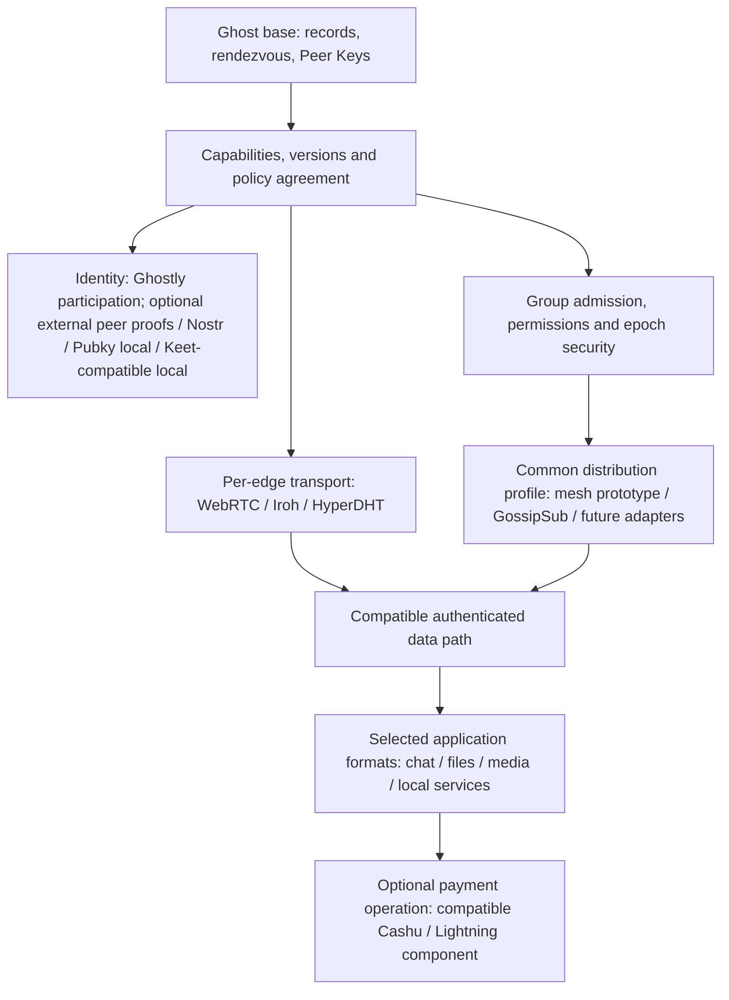

# Composable Ghost architecture

This map is a design map, not a claim that every box exists or that every combination works. Candidate numbers refer to the [working catalogue](README.md).

| Common base | Identity | Per-connection data transport | Group rules | Group distribution | Per-operation payments | Combinable applications |
|---|---|---|---|---|---|---|
| Ghost records / rendezvous (02) | None | WebRTC (101; existing baseline) | Admission / roles (800 and 900) | Bounded mesh (9xx group mesh; implemented, text only) | Cashu (201; app integration exists) | Chat (400) |
| Peer Keys (03) | Nostr (301; experimental implementation) | Iroh (102; proposed) | Membership and epoch security (900; first profile implemented) | GossipSub (901; candidate) | Lightning (203; app integration exists) | Files (500) |
| Capability / transport negotiation (03 and 100; proposed) | Pubky (302; local import experimental) | HyperDHT (103; proposed) | Removal / recovery / history policy (900) | Other adapters, including Pear components: investigate only | Ark integration planned (202); on-chain / Spark research | Voice / video (600) |
| Current record profile exists; modular agreement is new | Keet (303; compatible local import experimental) | Runtime availability differs | Does not select an overlay by itself | Keet distribution API not assumed | External component executes authorized payment | Local services (700) |

- Proofs are zero, one or multiple independently verified bindings; they do not choose transport or authorize money movement.
- Transport is selected per connection, subject to the chosen capability/distribution requirements. A browser extension does not automatically provide native UDP or every adapter.
- A group initially requires a common distribution version, application format and security/admission profile. Pairwise connectivity is insufficient. Bridges are future explicitly validated integrations, never an implicit fallback.
- Distribution routes protected envelopes; it does not own admission or invent cryptography. GossipSub is one candidate. No new custom gossip algorithm is proposed by this map.
- Payment methods must be compatible for that operation, with user consent and an external execution component. Future methods are possibilities, not an implementation commitment.
- Local personas/presets are product choices; a wizard does not need a WISP. A future composition of apps/services (“Ghostly OS”) is outside this increment.

See [group contract](900-group-sessions.md), [GossipSub candidate](901-gossipsub.md), [platform matrix](IMPLEMENTATION.md) and [validation gates](INTEROP.md).

The [proof increment](PROOF-INCREMENT.md) now includes explicit experimental local imports for Pubky and Keet-compatible keys, alongside external-signer Nostr. Multiple proofs coexist per conversation. Ghostly participation remains the default. Pubky Ring and existing Keet account signer bridges remain unavailable; local key control is not evidence of those integrations. All WISPs remain Draft; earlier baseline inspections are historical.

## Contracts and implemented profiles

| Contract | Concrete profiles | Current scope |
|---|---|---|
| [400 Chat](400-chat.md) | [401 paired](401-paired-chat.md), [402 legacy](402-legacy-chat.md), [403 bounded DHT text](403-dht-text.md) | Distinct existing paths; receipts and limits differ |
| [500 Files](500-files.md) | [501 files/2](501-paired-files.md), [502 legacy](502-legacy-files.md) | Live 1:1; no DHT files or resume |
| [600 Media](600-media.md) | [601 WebRTC media](601-webrtc-media.md) | Legacy 1:1 only; runtime capture limits |
| [700 Local Services](700-local-services.md) | [701 HTTP](701-http-services.md) | Legacy hosting with selected contact access; not paired HTTP |
| [800 Invite/Join](800-invite-join.md) | [801 implemented invitations](801-invitation-profiles.md) | Bearer bootstrap exists; global consumable admission proposed |
| [900 Groups](900-group-sessions.md) | [9xx Group Mesh](9xx-group-mesh.md), [901 GossipSub](901-gossipsub.md) | Mesh profile implemented (text, eight members); GossipSub proposed |

Transport100 already separates101/102/103. Payment200 separates201Cashu and203Lightning via Cashu; Ark202 remains implementation work until its substantive contract and evidence are ready. Identity300 separates301/302/303 external proof bindings, currently disabled. Document kinds describe responsibilities, not feature availability.
