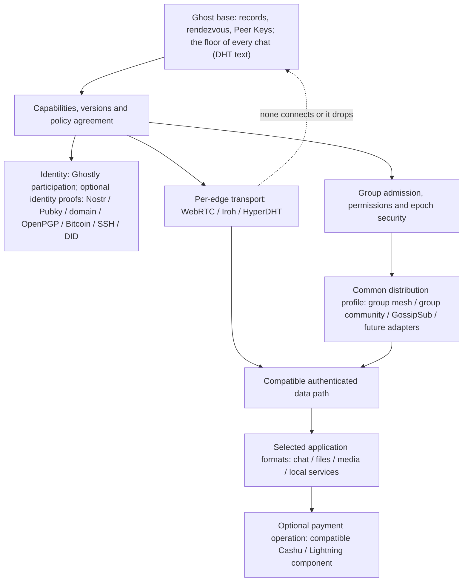

# Composable Ghost architecture

This map is a design map, not a claim that every box exists or that every combination works. Candidate numbers refer to the [working catalogue](README.md). Implementation notes reviewed against `dev` on 2026-09-26.

| Common base | Identity | Per-connection data transport | Group rules | Group distribution | Per-operation payments | Combinable applications |
|---|---|---|---|---|---|---|
| Ghost records / rendezvous (01; the DHT floor of every chat) | None needed: Ghostly participation by default | WebRTC (101; every client but Linux Desktop) | Admission / roles (800 and 900) | Group mesh (9xx; implemented, up to 32, hubs past 16) | Cashu (201; default rail) | Chat (400) |
| Peer Keys (02) | Nostr, Pubky, domain, OpenPGP, Bitcoin address, SSH, DID (300 to 3xx; experimental providers) | Iroh (102; native on Desktop, relayed in browsers) | Membership and epoch security (900; two profiles implemented) | Group community (9xx; implemented, up to 256, hubs) | Lightning (203; several cards per network) | Files (500) |
| Capability / transport negotiation (03 and 100; implemented in every chat, general negotiation proposed) | OpenID Connect and AT Protocol (3xx; built, blocked outside the code) | HyperDHT (103; native on Desktop, browsers only through a relay) | Removal / recovery / history policy (900) | GossipSub (901; candidate, no code); Pear components: investigate only | Arkade (202), Bark (204), Fedimint and Spark (2xx), on-chain and USDT: experimental rails | Voice / video (600) |
| Current record profile exists; modular agreement is new | Keet (303; blocked on a Keet API) | Runtime availability differs | Does not select an overlay by itself | Keet distribution API not assumed | External component executes authorized payment | Local services (700) |

```mermaid
flowchart TB
    Base["Ghost base: records, rendezvous, Peer Keys; the floor of every chat (DHT text)"]
    Agree["Capabilities, versions and policy agreement"]
    Base --> Agree
    Agree --> Proof["Identity: Ghostly participation; optional identity proofs: Nostr / Pubky / domain / OpenPGP / Bitcoin / SSH / DID"]
    Agree --> Edge["Per-edge transport: WebRTC / Iroh / HyperDHT"]
    Agree --> Rules["Group admission, permissions and epoch security"]
    Rules --> Overlay["Common distribution profile: group mesh / group community / GossipSub / future adapters"]
    Edge --> Path["Compatible authenticated data path"]
    Edge -. none connects or it drops .-> Base
    Overlay --> Path
    Path --> Apps["Selected application formats: chat / files / media / local services"]
    Apps --> Pay["Optional payment operation: compatible Cashu / Lightning component"]
```

- Proofs are zero, one or multiple independently verified bindings; they do not choose transport or authorize money movement.
- Every 1:1 chat has the DHT underneath (layer 0: rendezvous and floor) and at most one peer-to-peer transport on top (layer 1). The DHT is never selected; it is what remains when no transport connects ([400](400-chat.md), [100](100-transports.md)).
- Transport is selected per connection, subject to the chosen capability/distribution requirements. A browser extension does not automatically provide native UDP or every adapter.
- A group initially requires a common distribution version, application format and security/admission profile. Pairwise connectivity is insufficient. Bridges are future explicitly validated integrations, never an implicit fallback.
- Distribution routes protected envelopes; it does not own admission or invent cryptography. GossipSub is one candidate. No new custom gossip algorithm is proposed by this map.
- Payment methods must be compatible for that operation, with user consent and an external execution component. Future methods are possibilities, not an implementation commitment.
- Local personas/presets are product choices; a wizard does not need a WISP. A future composition of apps/services (“Ghostly OS”) is outside this increment.

See [group contract](900-group-sessions.md), [GossipSub candidate](901-gossipsub.md), [platform matrix](IMPLEMENTATION.md) and [validation gates](INTEROP.md).

History: the 2026-09-20 [proof increment](PROOF-INCREMENT.md) (external-signer Nostr, local imports of Pubky and Keet-compatible keys) stays off. The rebuilt identity proofs (2026-09-23, [300](300-peer-proofs.md#implementation-2026-09-23-identity-proofs)) replaced it: made once per profile, shared per contact by choice. Ghostly participation remains the default. All WISPs remain Draft.

## Contracts and implemented profiles

| Contract | Concrete profiles | Current scope |
|---|---|---|
| [400 Chat](400-chat.md) | [401 chat session](401-paired-chat.md) (layer 1), [403 DHT text](403-dht-text.md) (layer 0, the floor), [4xx store-and-forward](4xx-store-and-forward.md); [402 compatibility](402-legacy-chat.md) for v0.4 | One chat on two layers in every new chat (#209, #229); 0.4 chats use the compatibility profile |
| [500 Files](500-files.md) | [501 files/2 and files/3](501-paired-files.md), [502 compatibility](502-legacy-files.md) | Layer 1 or a hold; never DHT records; `files/3` of any size with resume (#233) |
| [600 Media](600-media.md) | [601 WebRTC media](601-webrtc-media.md) | Calls in every chat while live (`calls/1`, #207) and in compatibility chats; screen sharing inside a call; Linux Desktop with native media (no screen sharing yet) |
| [700 Local Services](700-local-services.md) | [701 HTTP](701-http-services.md) | Hosting with selected contact access, in every chat (desktop and extension) |
| [800 Invite/Join](800-invite-join.md) | [801 implemented invitations](801-invitation-profiles.md) | One bech32m `ghostly1…` invite for every new chat (#210); global consumable admission proposed |
| [900 Groups](900-group-sessions.md) | [9xx Group Mesh](9xx-group-mesh.md), [9xx Group Community](9xx-group-community.md), [901 GossipSub](901-gossipsub.md) | Mesh profile (32 members) and community profile (a link, 256 members, hubs) implemented, with text, a picture and payments between members; GossipSub proposed |

Transport 100 separates 101, 102 and 103. Payment 200 separates its rails: 201 Cashu, 203 Lightning, 202 Arkade, 204 Bark, 205 Lightning addresses and the 2xx drafts, each its own method. Identity 300 separates its providers (301, 302, 303 and the 3xx drafts) behind one contract. Document kinds describe responsibilities, not feature availability.
